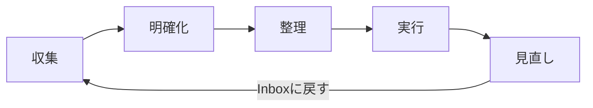

# MindFlow - GTD タスク管理アプリ

GTD（Getting Things Done）手法に基づくタスク管理GUIアプリケーション。重要度×緊急度マトリクスによるタスクの可視化と、5つのGTDフェーズ（収集・明確化・整理・実行・見直し）をサポートする。

## 主な機能

- **収集（Inbox）**: 気になることをすべてInboxに登録。削除・参考資料・いつかやるに分類
- **明確化**: ウィザード形式でアイテムをタスク化。依頼・カレンダー・プロジェクト・即実行・タスクに分類
- **整理**: 重要度（1-10）× 緊急度（1-10）の定量評価。4象限マトリクスで可視化
- **実行**: タスク一覧からステータスを変更。フィルタリング・優先度ソート対応
- **見直し**: 完了タスクとプロジェクトをレビュー。削除またはInboxに再循環

## 必要条件

- Python 3.12 以上
- [uv](https://docs.astral.sh/uv/)（推奨）または pip

## セットアップ

```bash
# リポジトリのクローン
git clone https://github.com/your-username/mindflow.git
cd mindflow

# 依存関係のインストール
uv sync --dev

# アプリ起動
uv run mindflow
```

## 開発コマンド

```bash
# テスト実行
uv run pytest

# テスト（カバレッジ付き）
uv run pytest --cov=src/study_python --cov-report=term-missing

# リンター実行
uv run ruff check .

# フォーマッター実行
uv run ruff format .

# 型チェック
uv run mypy src/
```

## アーキテクチャ

```
src/study_python/gtd/
├── models.py          # データモデル（StrEnum + dataclass）
├── repository.py      # JSON永続化レイヤー
├── app.py             # エントリポイント
├── logic/             # ビジネスロジック（GUI非依存）
│   ├── collection.py      # 収集フェーズ
│   ├── clarification.py   # 明確化フェーズ
│   ├── organization.py    # 整理フェーズ
│   ├── execution.py       # 実行フェーズ
│   └── review.py          # 見直しフェーズ
└── gui/               # PySide6 GUI
    ├── main_window.py     # メインウィンドウ
    ├── styles.py          # QSSスタイル
    ├── widgets/           # 各フェーズのUI
    └── components/        # 再利用コンポーネント
```

### 設計方針

- **GUI/ロジック分離**: ビジネスロジックはGUIに依存しない。ロジック層は100%テストカバレッジ対象
- **3層アーキテクチャ**: Model（models.py） → Logic（logic/） → View（gui/）
- **JSON永続化**: `~/.mindflow/gtd_data.json` にデータを保存

## GTDフロー



### タスク分類（明確化フェーズ）

| 条件 | タグ | ステータス選択肢 |
|------|------|-----------------|
| 自分でやらない | 依頼 | 未着手・連絡待ち・完了 |
| 日時が明確 | カレンダー | 未着手・カレンダー登録済み |
| 2Step以上必要 | プロジェクト | - |
| 数分で可能 | 即実行 | 未着手・完了 |
| その他 | タスク | 未着手・実施中・完了 |

### タスクContext（タスクタグの場合）

- **実施場所**: デスク / 自宅 / 移動中（複数選択可）
- **時間**: 10分以内 / 30分以内 / 1時間以内
- **エネルギー**: 低 / 中 / 高

### 重要度×緊急度マトリクス

| 象限 | 重要度 | 緊急度 | アクション |
|------|--------|--------|-----------|
| Q1 | > 5 | > 5 | 今すぐ実行 |
| Q2 | > 5 | <= 5 | 計画を立てる |
| Q3 | <= 5 | > 5 | 委任を検討 |
| Q4 | <= 5 | <= 5 | 後回し/削除 |

## データ保存先

- デフォルト: `~/.mindflow/gtd_data.json`
- ログ: プロジェクトルートの `logs/` ディレクトリ

## 技術スタック

- **GUI**: PySide6（Qt6）
- **データ永続化**: JSON
- **テスト**: pytest + pytest-qt
- **リンター**: ruff
- **型チェック**: mypy（strict mode）

## ライセンス

MIT
