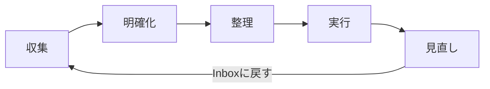

# MindFlow - GTD タスク管理アプリ

GTD（Getting Things Done）手法に基づくWebタスク管理アプリケーション。FastAPI + Jinja2 + HTMX で構築し、モバイル・PC両対応のレスポンシブUIを提供する。重要度×緊急度マトリクスによるタスクの可視化と、5つのGTDフェーズ（収集・明確化・整理・実行・見直し）をサポートする。

## 主な機能

- **収集（Inbox）**: 気になることをすべてInboxに登録。削除・参考資料・いつかやるに分類
- **明確化**: ウィザード形式でアイテムをタスク化。依頼・カレンダー・プロジェクト・即実行・タスクに分類
- **整理**: 重要度（1-10）× 緊急度（1-10）の定量評価。4象限マトリクスで可視化
- **実行**: タスク一覧からステータスを変更。フィルタリング・優先度ソート対応
- **見直し**: 完了タスクとプロジェクトをレビュー。プロジェクトの細分化・削除またはInboxに再循環
- **プロジェクト分解**: プロジェクトをサブタスクに分解。分解元プロジェクトとの紐づき・順序を保持し、Inbox・タスク画面で順序変更可能

## 必要条件

- Python 3.12 以上
- [uv](https://docs.astral.sh/uv/)（推奨）または pip

## セットアップ

```bash
git clone https://github.com/your-username/mindflow.git
cd mindflow
uv sync --dev

# 環境変数を設定
export SECRET_KEY="your-secret-key"
export ADMIN_USERNAME="admin"
export ADMIN_PASSWORD_HASH=$(python -c "import hashlib; print(hashlib.sha256(b'your-password'.encode()).hexdigest())")

# 起動
uv run mindflow-web
# → http://localhost:8000 でアクセス
```

## 開発コマンド

```bash
# テスト実行
uv run pytest

# テスト（カバレッジ付き）
uv run pytest --cov=src/study_python --cov-report=term-missing

# リンター実行
uv run ruff check .

# フォーマッター実行
uv run ruff format .

# 型チェック
uv run mypy src/
```

## アーキテクチャ

```
src/study_python/gtd/
├── models.py              # データモデル（StrEnum + dataclass）
├── repository_protocol.py # リポジトリProtocol（ロジック層の抽象化）
├── logic/                 # ビジネスロジック（Web非依存）
│   ├── collection.py      # 収集フェーズ
│   ├── clarification.py   # 明確化フェーズ
│   ├── organization.py    # 整理フェーズ
│   ├── execution.py       # 実行フェーズ
│   └── review.py          # 見直しフェーズ
└── web/                   # FastAPI Webアプリケーション
    ├── app.py             # FastAPIアプリファクトリ
    ├── config.py          # 環境変数設定
    ├── database.py        # SQLAlchemy engine/session
    ├── db_models.py       # ORMモデル
    ├── db_repository.py   # SQLAlchemy永続化リポジトリ
    ├── auth.py            # 認証（SHA-256）
    ├── dependencies.py    # FastAPI DI
    ├── routers/           # 各フェーズのルーター
    ├── templates/         # Jinja2テンプレート + HTMXパーシャル
    └── static/            # CSS（Catppuccin dark）+ HTMX
```

### 設計方針

- **ロジック層分離**: `GtdRepositoryProtocol` を介してビジネスロジックをWeb層から分離
- **3層アーキテクチャ**: Model（models.py） → Logic（logic/） → Web（web/）
- **SQLite永続化**: SQLAlchemy経由。環境変数 `DATABASE_URL` で設定
- **セッション認証**: 単一ユーザー。環境変数でユーザー名/パスワードハッシュを設定
- **HTMX**: ページ遷移なしのインタラクティブUI

## GTDフロー



### タスク分類（明確化フェーズ）

| 条件 | タグ | ステータス選択肢 |
|------|------|-----------------|
| 自分でやらない | 依頼 | 未着手・連絡待ち・完了 |
| 日時が明確 | カレンダー | 未着手・カレンダー登録済み |
| 2Step以上必要 | プロジェクト | -（見直しフェーズで細分化→サブタスクに分解） |
| 数分で可能 | 即実行 | 未着手・完了 |
| その他 | タスク | 未着手・実施中・完了 |

### タスクContext（タスクタグの場合）

- **実施場所**: デスク / 自宅 / 移動中（複数選択可）
- **時間**: 10分以内 / 30分以内 / 1時間以内
- **エネルギー**: 低 / 中 / 高

### 重要度×緊急度マトリクス

| 象限 | 重要度 | 緊急度 | アクション |
|------|--------|--------|-----------|
| Q1 | > 5 | > 5 | 今すぐ実行 |
| Q2 | > 5 | <= 5 | 計画を立てる |
| Q3 | <= 5 | > 5 | 委任を検討 |
| Q4 | <= 5 | <= 5 | 後回し/削除 |

### プロジェクト分解と順序管理

見直しフェーズでプロジェクトを「細分化」すると、サブタスクがInboxに登録される。各サブタスクは以下の情報を保持する：

- **親プロジェクトID/タイトル**: どのプロジェクトから分解されたか
- **順序（order）**: プロジェクト内での着手順序（0始まり）

Inbox・タスク一覧画面ではカード上に `[プロジェクト名 #順序]` が表示され、▲▼ボタンで順序を変更できる。

## データ保存先

- **データベース**: SQLite（デフォルト: `./mindflow.db`、環境変数 `DATABASE_URL` で変更可能）
- **ログ**: プロジェクトルートの `logs/` ディレクトリ

## デプロイ（Render）

Web版はRenderにデプロイ可能。`render.yaml` でサービス定義済み。

環境変数の設定:
- `SECRET_KEY`: セッション暗号化キー（自動生成）
- `ADMIN_USERNAME`: ログインユーザー名
- `ADMIN_PASSWORD_HASH`: パスワードのSHA-256ハッシュ
- `DATABASE_URL`: SQLiteパス（Render Disk使用時: `sqlite:////opt/render/project/data/mindflow.db`）

## 技術スタック

- **Webフレームワーク**: FastAPI + Jinja2 + HTMX
- **データ永続化**: SQLite + SQLAlchemy
- **テスト**: pytest + httpx
- **リンター**: ruff
- **型チェック**: mypy（strict mode）
- **CI/CD**: GitHub Actions + Render

## ライセンス

MIT
