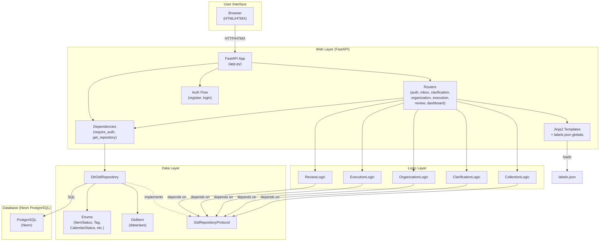
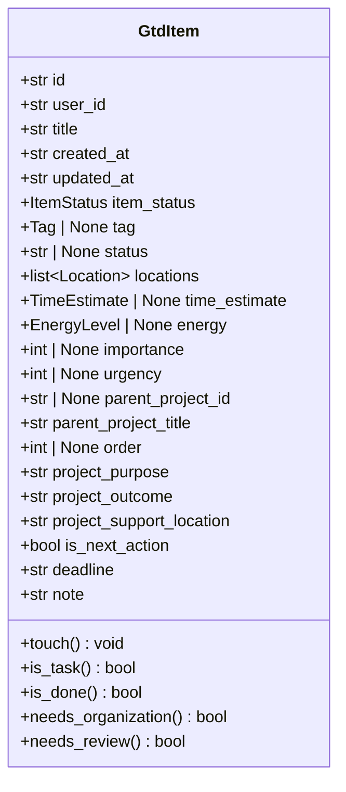
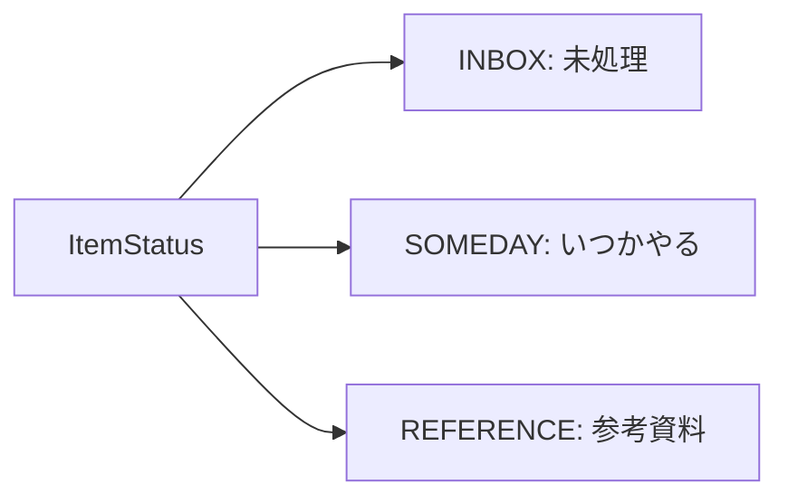
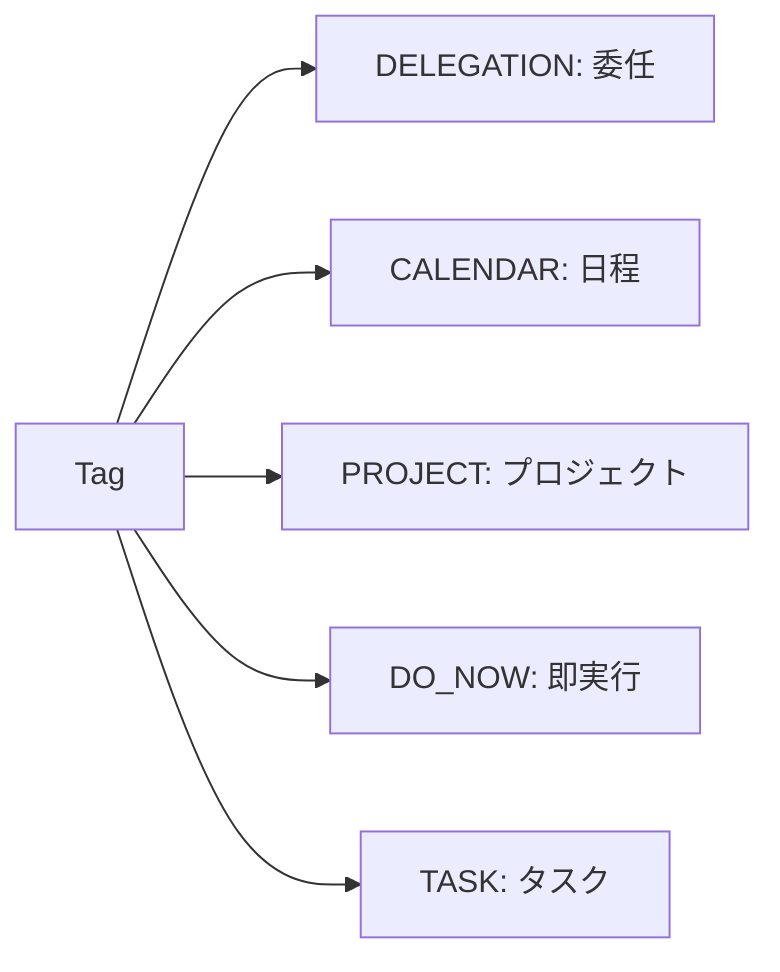
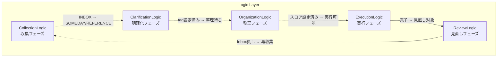
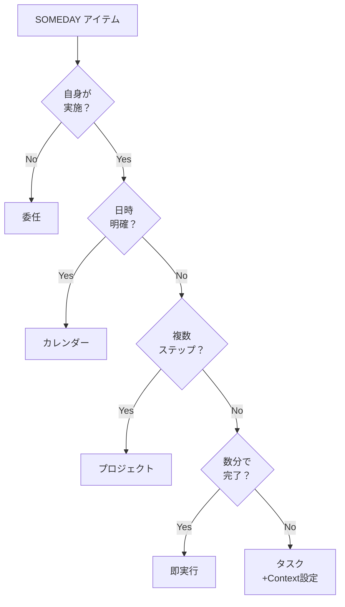
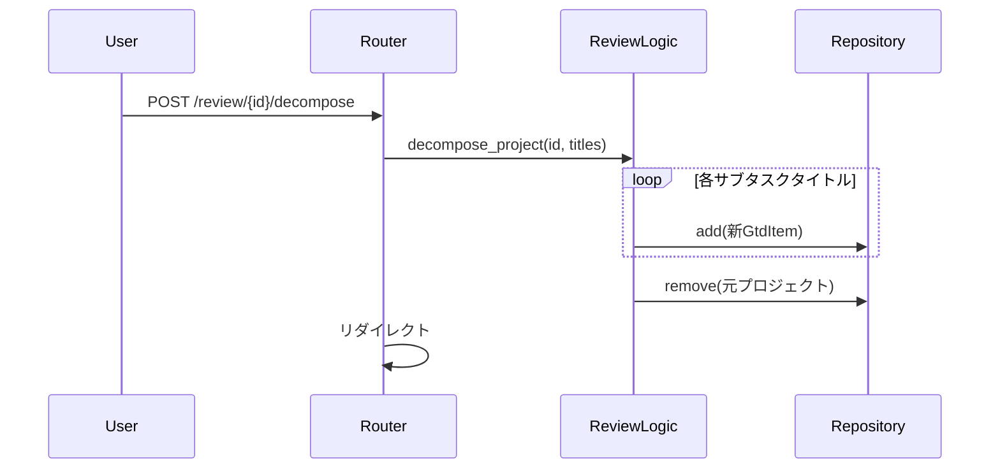

# MindFlow アーキテクチャ設計書

更新日: 2026-04-06

---

## 1. システム概要

MindFlow は GTD（Getting Things Done）手法に基づくタスク管理 Web アプリケーションである。
FastAPI + Jinja2 + HTMX による 3 層アーキテクチャで、収集・明確化・整理・実行・見直しの 5 フェーズを一貫して管理し、
重要度 × 緊急度マトリクスによるタスクの可視化を中核機能として提供する。

### 1.1 設計原則

| 原則 | 説明 |
|------|------|
| 3 層アーキテクチャ | Model → Logic → Web の明確な分離 |
| ロジック非依存 | ビジネスロジックは Web フレームワークに非依存（GtdRepositoryProtocol 経由） |
| 単一責務 | 各ロジッククラスは 1 つの GTD フェーズのみ担当 |
| テスト容易性 | ロジック層は Web なしで 100% テスト可能 |
| マルチテナント対応 | user_id を DI 層で注入し、全リポジトリクエリでフィルタ |
| テキスト一元管理 | labels.json で全ユーザー向けテキストを管理 |

---

## 2. システム構成図

### 2.1 全体アーキテクチャ



### 2.2 レイヤー間の依存関係

```
Web Layer → Logic Layer → Data Layer
   ↓             ↓              ↓
FastAPI依存   Protocol依存   DB非依存
   ↓             ↓              ↓
Router        GtdLogic*    GtdRepositoryProtocol
Template      Validation   DbGtdRepository
             Business        SQLAlchemy
```

- **上位→下位の一方向依存**: Web → Logic → Data
- **逆方向依存の禁止**: Logic が Web を参照しない、Data が Logic を参照しない
- **Protocol による分離**: Logic は GtdRepositoryProtocol に依存し、DB 実装から完全に独立

---

## 3. データ層

### 3.1 コンポーネント構成

| コンポーネント | ファイル | 責務 |
|--------------|---------|------|
| GtdItem | models.py | タスクデータの構造定義 |
| Enum 群 | models.py | 状態・分類の値域定義 |
| GtdRepositoryProtocol | repository_protocol.py | リポジトリのプロトコル定義 |
| DbGtdRepository | web/db_repository.py | PostgreSQL への永続化・CRUD 操作 |
| GtdItemRow | web/db_models.py | SQLAlchemy ORM モデル |

### 3.2 データモデル（GtdItem）



#### フィールド詳細

| フィールド | 型 | デフォルト | 設定フェーズ | 説明 |
|-----------|---|----------|------------|------|
| id | str | uuid4() | 生成時 | 一意識別子 |
| user_id | str | "" | 生成時 | マルチテナント所有者識別子 |
| title | str | "" | 収集 | タスクタイトル |
| created_at | str | now(UTC).iso | 生成時 | 作成日時（ISO 8601） |
| updated_at | str | now(UTC).iso | 更新時 | 更新日時（ISO 8601） |
| item_status | ItemStatus | INBOX | 収集 | 収集フェーズの分類先 |
| tag | Tag \| None | None | 明確化 | GTD 分類タグ |
| status | str \| None | None | 明確化/実行 | タグ別ステータス |
| locations | list[Location] | [] | 明確化 | 実施場所（タスク用） |
| time_estimate | TimeEstimate \| None | None | 明確化 | 所要時間（タスク用） |
| energy | EnergyLevel \| None | None | 明確化 | エネルギーレベル（タスク用） |
| importance | int \| None | None | 整理 | 重要度（1-10） |
| urgency | int \| None | None | 整理 | 緊急度（1-10） |
| parent_project_id | str \| None | None | プロジェクト分解 | 親プロジェクトの ID |
| parent_project_title | str | "" | プロジェクト分解 | 親プロジェクトのタイトル |
| order | int \| None | None | プロジェクト分解 | プロジェクト内の順序（0 始まり） |
| project_purpose | str | "" | 計画 | 目的（ナチュラル・プランニング） |
| project_outcome | str | "" | 計画 | 成果物（ナチュラル・プランニング） |
| project_support_location | str | "" | 計画 | サポート体制（ナチュラル・プランニング） |
| is_next_action | bool | False | 計画 | 次のアクションフラグ |
| deadline | str | "" | 計画 | 期限 |
| note | str | "" | 任意 | 自由メモ |

#### GtdItem メソッド

| メソッド | 戻り値 | 判定ロジック |
|---------|--------|------------|
| touch() | void | updated_at を現在時刻に更新 |
| is_task() | bool | tag が None でない |
| is_done() | bool | tag に対応するステータス Enum の done 値と一致 |
| needs_organization() | bool | tag != None かつ tag != PROJECT かつ importance/urgency が未設定 |
| needs_review() | bool | is_done() == True または tag == PROJECT または tag == CALENDAR かつ status == "registered" |

### 3.3 Enum 体系

MECE に基づく Enum 分類体系。各 Enum は StrEnum を継承し、JSON・DB シリアライズ時に値文字列として保存される。

#### 収集フェーズの分類（ItemStatus）



| メンバ | 値 | 説明 |
|--------|---|------|
| INBOX | "inbox" | 新規収集、未処理 |
| SOMEDAY | "someday" | いつかやるリスト |
| REFERENCE | "reference" | 参考資料、アクション不要 |

#### 明確化フェーズの分類（Tag）



| メンバ | 値 | ステータス Enum | 説明 |
|--------|---|---------------|------|
| DELEGATION | "delegation" | DelegationStatus | 他者に委任 |
| CALENDAR | "calendar" | CalendarStatus | 日時指定 |
| PROJECT | "project" | なし | 複数ステップ |
| DO_NOW | "do_now" | DoNowStatus | 即時実行（数分） |
| TASK | "task" | TaskStatus | 単一アクション |

#### タグ別ステータス Enum

| Enum | メンバ | 対応 Tag |
|------|--------|---------|
| DelegationStatus | NOT_STARTED, WAITING, DONE | DELEGATION |
| CalendarStatus | NOT_STARTED, REGISTERED | CALENDAR |
| DoNowStatus | NOT_STARTED, DONE | DO_NOW |
| TaskStatus | NOT_STARTED, IN_PROGRESS, DONE | TASK |

#### タスクコンテキスト Enum

| Enum | メンバ | 説明 |
|------|--------|------|
| Location | DESK, HOME, COMMUTE | 実施場所（複数選択可） |
| TimeEstimate | WITHIN_10MIN, WITHIN_30MIN, WITHIN_1HOUR | 所要時間 |
| EnergyLevel | LOW, MEDIUM, HIGH | エネルギーレベル |

### 3.4 Tag とステータスのマッピング

```python
TAG_STATUS_MAP = {
    Tag.DELEGATION: DelegationStatus,
    Tag.CALENDAR: CalendarStatus,
    Tag.DO_NOW: DoNowStatus,
    Tag.TASK: TaskStatus,
}
# Tag.PROJECT はステータス Enum を持たない
```

### 3.5 GtdRepositoryProtocol

```python
class GtdRepositoryProtocol(Protocol):
    """ロジック層が依存するリポジトリのインターフェース。"""
    
    @property
    def items(self) -> list[GtdItem]: ...
    
    def add(self, item: GtdItem) -> None: ...
    def remove(self, item_id: str) -> GtdItem | None: ...
    def get(self, item_id: str) -> GtdItem | None: ...
    def get_by_status(self, status: ItemStatus) -> list[GtdItem]: ...
    def get_by_tag(self, tag: Tag) -> list[GtdItem]: ...
    def get_tasks(self) -> list[GtdItem]: ...
```

ロジック層はこのプロトコルのみに依存し、具体的な実装（DbGtdRepository）から完全に分離される。

### 3.6 DbGtdRepository

**責務**: PostgreSQL への user_id フィルタ付き CRUD 操作

#### CRUD 操作

| メソッド | 引数 | 戻り値 | 説明 |
|---------|------|--------|------|
| items (property) | - | list[GtdItem] | user_id でフィルタされた全アイテム |
| add(item) | GtdItem | None | アイテム追加（user_id 自動セット） |
| remove(item_id) | str | GtdItem \| None | ID 指定削除（user_id チェック） |
| get(item_id) | str | GtdItem \| None | ID 指定取得（user_id チェック） |
| get_by_status(status) | ItemStatus | list[GtdItem] | ステータス別取得（user_id フィルタ） |
| get_by_tag(tag) | Tag | list[GtdItem] | タグ別取得（user_id フィルタ） |
| get_tasks() | - | list[GtdItem] | tag != None の全アイテム（user_id フィルタ） |

#### 実装の特徴

- **user_id フィルタリング**: DI 層で user_id を注入され、全クエリで自動フィルタ
- **ORM マッピング**: GtdItemRow (SQLAlchemy) ↔ GtdItem (dataclass) の相互変換
- **JSON 処理**: locations 値は JSON 文字列として DB に保存、取得時にパース
- **flush_to_db()**: 必要に応じて手動フラッシュ（トランザクション制御用）

### 3.7 SQLAlchemy ORM（GtdItemRow）

#### テーブル定義

| カラム | 型 | 制約 | 説明 |
|--------|---|------|------|
| id | VARCHAR(36) | PK | 一意識別子 |
| user_id | VARCHAR(36) | FK, NOT NULL, Index | マルチテナント所有者 |
| title | VARCHAR(500) | NOT NULL | タイトル |
| created_at | VARCHAR(50) | NOT NULL | 作成日時 |
| updated_at | VARCHAR(50) | NOT NULL | 更新日時 |
| note | TEXT | DEFAULT '' | メモ |
| item_status | VARCHAR(20) | DEFAULT 'inbox' | 収集フェーズ分類 |
| tag | VARCHAR(20) | Nullable | 明確化タグ |
| status | VARCHAR(20) | Nullable | タグ別ステータス |
| locations_json | TEXT | DEFAULT '[]' | JSON 配列（Location 値） |
| time_estimate | VARCHAR(20) | Nullable | 所要時間 |
| energy | VARCHAR(20) | Nullable | エネルギーレベル |
| importance | INTEGER | Nullable | 重要度 |
| urgency | INTEGER | Nullable | 緊急度 |
| project_purpose | TEXT | DEFAULT '' | 計画（目的） |
| project_outcome | TEXT | DEFAULT '' | 計画（成果物） |
| project_support_location | TEXT | DEFAULT '' | 計画（サポート） |
| is_next_action | BOOLEAN | DEFAULT FALSE | 次アクションフラグ |
| deadline | VARCHAR(50) | DEFAULT '' | 期限 |
| parent_project_id | VARCHAR(36) | Nullable, FK | 親プロジェクト |
| parent_project_title | VARCHAR(500) | DEFAULT '' | 親プロジェクト名 |
| item_order | INTEGER | Nullable | プロジェクト内順序 |

#### 関連テーブル

**UserRow**:
```sql
CREATE TABLE users (
    id VARCHAR(36) PRIMARY KEY,
    username VARCHAR(100) UNIQUE NOT NULL,
    password_hash VARCHAR(200) NOT NULL,
    created_at VARCHAR(50) NOT NULL
);
```

**NotificationRow**:
```sql
CREATE TABLE notifications (
    id VARCHAR(36) PRIMARY KEY,
    user_id VARCHAR(36) NOT NULL INDEX,
    notification_type VARCHAR(20) NOT NULL,
    title VARCHAR(500) NOT NULL,
    message TEXT DEFAULT '',
    is_read BOOLEAN DEFAULT FALSE,
    created_at VARCHAR(50) NOT NULL
);
```

---

## 4. ロジック層

### 4.1 コンポーネント構成

各ロジッククラスは GTD の 1 フェーズに対応し、コンストラクタで GtdRepositoryProtocol を受け取る。
ロジッククラスは GtdRepositoryProtocol のメソッドのみを使用し、save() は呼ばない。
Web 層で自動的にトランザクション管理される。



### 4.2 CollectionLogic（収集フェーズ）

**責務**: Inbox へのアイテム追加・削除、参考資料/いつかやるへの振り分け

**ファイル**: src/study_python/gtd/logic/collection.py

| メソッド | 引数 | 戻り値 | 説明 |
|---------|------|--------|------|
| add_to_inbox | title, note="" | GtdItem | 新規追加（空タイトルは ValueError） |
| delete_item | item_id | GtdItem \| None | 物理削除 |
| move_to_reference | item_id | GtdItem \| None | 参考資料へ移動 |
| move_to_someday | item_id | GtdItem \| None | いつかやるへ移動 |
| get_inbox_items | - | list[GtdItem] | INBOX アイテム一覧 |
| get_someday_items | - | list[GtdItem] | SOMEDAY アイテム一覧 |
| get_reference_items | - | list[GtdItem] | REFERENCE アイテム一覧 |

### 4.3 ClarificationLogic（明確化フェーズ）

**責務**: GTD 決定木に基づくタスク分類、コンテキスト設定

**ファイル**: src/study_python/gtd/logic/clarification.py

| メソッド | 引数 | 戻り値 | 説明 |
|---------|------|--------|------|
| get_pending_items | - | list[GtdItem] | SOMEDAY かつ tag==None |
| classify_as_delegation | item_id | GtdItem \| None | 委任タグ設定 |
| classify_as_calendar | item_id | GtdItem \| None | カレンダータグ設定 |
| classify_as_project | item_id | GtdItem \| None | プロジェクトタグ設定 |
| classify_as_do_now | item_id | GtdItem \| None | 即実行タグ設定 |
| classify_as_task | item_id, locations, time_estimate, energy | GtdItem \| None | タスクタグ+コンテキスト設定 |
| update_task_context | item_id, locations?, time_estimate?, energy? | GtdItem \| None | コンテキスト部分更新 |

#### GTD 決定木



### 4.4 OrganizationLogic（整理フェーズ）

**責務**: 重要度・緊急度の設定、4 象限マトリクスへの分類

**ファイル**: src/study_python/gtd/logic/organization.py

| メソッド | 引数 | 戻り値 | 説明 |
|---------|------|--------|------|
| get_unorganized_tasks | - | list[GtdItem] | needs_organization() == True |
| set_importance_urgency | item_id, importance, urgency | GtdItem \| None | スコア設定（1-10） |
| get_matrix_quadrants | - | dict[str, list] | 4 象限分類結果 |

#### 4 象限分類ロジック

| 象限 | キー名 | 条件 |
|------|--------|------|
| Q1 | q1_urgent_important | importance > 5 AND urgency > 5 |
| Q2 | q2_not_urgent_important | importance > 5 AND urgency <= 5 |
| Q3 | q3_urgent_not_important | importance <= 5 AND urgency > 5 |
| Q4 | q4_not_urgent_not_important | importance <= 5 AND urgency <= 5 |

### 4.5 ExecutionLogic（実行フェーズ）

**責務**: タスクステータスの更新・遷移管理

**ファイル**: src/study_python/gtd/logic/execution.py

| メソッド | 引数 | 戻り値 | 説明 |
|---------|------|--------|------|
| get_active_tasks | - | list[GtdItem] | tag!=PROJECT かつ is_done()==False |
| update_status | item_id, new_status | GtdItem \| None | ステータス変更（バリデーション付き） |
| get_available_statuses | item_id | list[str] \| None | 有効なステータス値一覧 |

### 4.6 ReviewLogic（見直しフェーズ）

**責務**: 完了タスクの処理、プロジェクトの細分化

**ファイル**: src/study_python/gtd/logic/review.py

| メソッド | 引数 | 戻り値 | 説明 |
|---------|------|--------|------|
| get_review_items | - | list[GtdItem] | needs_review() == True |
| delete_item | item_id | GtdItem \| None | 物理削除 |
| move_to_inbox | item_id | GtdItem \| None | 全フィールドリセットして INBOX へ |
| get_completed_count | - | int | 完了アイテム数 |
| get_project_count | - | int | プロジェクト数 |
| decompose_project | item_id, sub_task_titles | list[GtdItem] | プロジェクト細分化 |

#### プロジェクト細分化フロー



---

## 5. Web 層

### 5.1 FastAPI アプリケーション（app.py）

**責務**: ミドルウェア、ルーター登録、ライフサイクル管理

#### ライフサイクル

```python
@asynccontextmanager
async def lifespan(app: FastAPI) -> AsyncGenerator[None, None]:
    # 起動時: logging, DB 作成, マイグレーション
    setup_logging(level="INFO", log_to_file=True, log_to_console=True)
    engine = get_engine()
    Base.metadata.create_all(engine)
    _migrate_add_project_planning_columns(engine)
    yield
    # シャットダウン: 自動管理（コンテキスト終了時）
```

#### ミドルウェア

| ミドルウェア | 責務 |
|------------|------|
| SessionMiddleware | セッション管理（secret_key, https_only, same_site=lax） |
| security_headers_middleware | X-Content-Type-Options, X-Frame-Options, CSP など |
| auth_redirect_middleware | 未認証 (303) → /login へリダイレクト |

#### ルーター登録

```python
app.include_router(auth.router)          # /register, /login, /logout
app.include_router(dashboard.router)     # /dashboard
app.include_router(inbox.router)         # /inbox
app.include_router(clarification.router) # /clarification
app.include_router(organization.router)  # /organization
app.include_router(execution.router)     # /execution (TaskList)
app.include_router(review.router)        # /review
app.include_router(settings_web.router)  # /settings
app.include_router(iconbar.router)       # /iconbar
```

#### 静的ファイル

```python
app.mount("/static", StaticFiles(directory="src/study_python/gtd/web/static"))
```

### 5.2 依存性注入（dependencies.py）

#### require_auth

```python
def require_auth(request: Request) -> str:
    """request.session["user_id"] を検証して返す。
    
    未認証の場合は HTTPException(status_code=303, headers={"Location": "/login"})
    で auth_redirect_middleware に捕捉される。
    """
```

**使用例**:
```python
@router.get("")
async def page(user_id: str = Depends(require_auth)):
    ...
```

#### get_db_session

```python
def get_db_session() -> Generator[Session, None, None]:
    """SQLAlchemy セッションを生成・管理する。
    
    通常時は commit、例外時は rollback を自動実行。
    """
```

#### get_repository

```python
def get_repository(
    request: Request,
    session: Session = Depends(get_db_session),
    user_id: str = Depends(require_auth),
) -> DbGtdRepository:
    """user_id フィルタ済み DbGtdRepository を返す。
    
    ロジック層・ルーター層がどう呼んでも、
    他ユーザーのデータにはアクセスできない保証。
    """
```

**マルチテナント設計の重要性**:
- user_id は request.session から取得（認証済みのみ）
- DbGtdRepository(session, user_id) で初期化
- リポジトリの全クエリが自動的に user_id でフィルタ
- 仮に Logic が「全ユーザーのアイテムを取得」と呼んでも、取得できるのは当該ユーザーのデータのみ

### 5.3 ルーター

各ルーターはページ（GET）と API エンドポイント（POST/PUT/DELETE）を提供する。
HTMX による非同期更新で部分テンプレートを返す。

#### routers/auth.py

| 経路 | メソッド | 責務 |
|------|--------|------|
| /register | GET | 登録フォーム表示 |
| /register | POST | 登録処理、bcrypt ハッシュ、DB 保存 |
| /login | GET | ログインフォーム表示 |
| /login | POST | 認証、session["user_id"] セット |
| /logout | POST | session クリア、/login へリダイレクト |

**認証フロー**:
```
ユーザー入力 → bcrypt.hashpw() → UserRow 保存
↓
login: bcrypt.checkpw() → セッション生成 → 認証状態へ
```

#### routers/dashboard.py

| 経路 | メソッド | 責務 |
|------|--------|------|
| /dashboard | GET | ダッシュボード表示（サマリー + マトリクス） |

**データソース**:
- OrganizationLogic で 4 象限マトリクスを計算
- CollectionLogic で Inbox カウント

#### routers/inbox.py

| 経路 | メソッド | 責務 |
|------|--------|------|
| /inbox | GET | Inbox ページ表示 |
| /inbox | POST | 新規アイテム追加 |
| /{item_id}/delete | POST | 削除確認 + 削除 |
| /{item_id}/order_up | POST | プロジェクト派生アイテムの順序変更 |
| /{item_id}/order_down | POST | プロジェクト派生アイテムの順序変更 |

#### routers/clarification.py

| 経路 | メソッド | 責務 |
|------|--------|------|
| /clarification | GET | 明確化ページ（ウィザード） |
| /clarification/step | POST | ウィザード各ステップの処理 |
| /{item_id}/classify | POST | 分類確定 |

#### routers/organization.py

| 経路 | メソッド | 責務 |
|------|--------|------|
| /organization | GET | 整理ページ（スライダー評価） |
| /{item_id}/score | POST | 重要度・緊急度設定 |

#### routers/execution.py

| 経路 | メソッド | 責務 |
|------|--------|------|
| /execution | GET | 実行ページ（タスク一覧） |
| /{item_id}/status | POST | ステータス変更 |

#### routers/review.py

| 経路 | メソッド | 責務 |
|------|--------|------|
| /review | GET | 見直しページ |
| /{item_id}/delete | POST | 削除 |
| /{item_id}/to_inbox | POST | Inbox へ戻す |
| /{item_id}/decompose | POST | プロジェクト細分化 |

#### routers/settings_web.py

| 経路 | メソッド | 責務 |
|------|--------|------|
| /settings | GET | 設定ページ |

#### routers/iconbar.py

| 経路 | メソッド | 責務 |
|------|--------|------|
| /iconbar | GET | アイコンバー（HTMX 部分） |

### 5.4 テンプレート・エンジン

**ファイル**: src/study_python/gtd/web/template_engine.py

```python
templates = Jinja2Templates(directory=_TEMPLATE_DIR)
templates.env.globals["labels"] = load_labels()
```

- **共有インスタンス**: 全ルーターが同一の templates を使用
- **labels グローバル変数**: labels.json をロード、全テンプレートで `{{ labels.key }}` でアクセス可能
- **HTMX 対応**: 部分テンプレート (*.jinja) も同エンジンで レンダリング

#### テンプレート構成

```
templates/
├── base.html                 # ベース（sidebar + main + modals）
├── pages/
│   ├── dashboard.html        # ダッシュボード
│   ├── inbox.html            # Inbox
│   ├── clarification.html    # 明確化（ウィザード）
│   ├── organization.html     # 整理
│   ├── execution.html        # 実行（TaskList）
│   ├── review.html           # 見直し
│   ├── settings.html         # 設定
│   ├── login.html            # ログイン
│   └── register.html         # 登録
└── partials/
    ├── iconbar.html          # アイコンバー
    ├── item_card.html        # アイテムカード（Inbox 用）
    ├── matrix_view.html      # マトリクス描画
    └── ...（各ルーター固有の部分テンプレート）
```

### 5.5 セキュリティ設計

#### 認証

- **登録**: bcrypt 10 round でハッシュ化、DB に保存
- **ログイン**: bcrypt.checkpw() で検証、session["user_id"] をセット
- **セッション**: SessionMiddleware で max_age=86400（1 日）

#### マルチテナント隔離

- **user_id 注入**: require_auth() で session から取得
- **リポジトリフィルタ**: DbGtdRepository(session, user_id) で初期化
- **全クエリのフィルタ**: items property, add, remove, get, get_by_status, get_by_tag, get_tasks すべてで user_id チェック
- **防御深度**: Logic 層では user_id を意識せず、Repository 層の必須フィルタで保護

#### セキュリティヘッダー

| ヘッダー | 値 |
|--------|---|
| X-Content-Type-Options | nosniff |
| X-Frame-Options | DENY |
| Referrer-Policy | strict-origin-when-cross-origin |
| Permissions-Policy | camera=(), microphone=(), geolocation=() |
| Content-Security-Policy | default-src 'self'; script-src 'self' 'unsafe-inline'; style-src 'self' 'unsafe-inline'; img-src 'self'; frame-ancestors 'none'; form-action 'self' |
| Strict-Transport-Security | max-age=31536000; includeSubDomains（本番環境のみ） |

---

## 6. テキスト管理層

### 6.1 labels.json

**ファイル**: src/study_python/gtd/web/labels.json

全ユーザー向けテキスト（UI ラベル、ボタン名、メッセージなど）を一元管理。
プロジェクトの UI 文言変更時は、このファイルのみを修正すればテンプレート・ロジック変更は不要。

**構造例**:
```json
{
  "inbox": {
    "title": "Inbox",
    "add_button": "Add Item",
    "delete_button": "Delete"
  },
  "clarification": {
    "q1": "Do you need to do it?",
    "q2": "Is the date fixed?"
  },
  ...
}
```

### 6.2 labels.py

**ファイル**: src/study_python/gtd/web/labels.py

```python
@lru_cache(maxsize=1)
def load_labels() -> dict[str, Any]:
    """labels.json をロード、キャッシュして返す."""
```

- **LRU キャッシュ**: アプリ起動時に 1 度だけロード
- **全テンプレート・ルーターで共有**: `from study_python.gtd.web.labels import load_labels`

### 6.3 template_engine.py の globals 注入

```python
templates.env.globals["labels"] = load_labels()
```

テンプレート内で `{{ labels.inbox.title }}` で直接アクセス可能。

---

## 7. データベース層（Neon PostgreSQL）

### 7.1 接続管理（database.py）

```python
def get_engine(db_url: str | None = None) -> Engine:
    """SQLAlchemy エンジンを取得（シングルトン）。
    
    PostgreSQL の場合は接続プーリング設定:
    - pool_size=5
    - max_overflow=10
    - pool_pre_ping=True
    """

def get_session_factory(engine: Engine | None = None) -> sessionmaker[Session]:
    """セッションファクトリを取得（シングルトン）。
    
    autoflush=False, autocommit=False で明示的なトランザクション制御。
    """
```

### 7.2 マイグレーション戦略

**_migrate_add_project_planning_columns(engine)**:
アプリ起動時（lifespan）に実行。新しいカラムが既存テーブルに存在しない場合のみ ADD COLUMN。

```python
new_columns = {
    "project_purpose": "TEXT DEFAULT ''",
    "project_outcome": "TEXT DEFAULT ''",
    "project_support_location": "TEXT DEFAULT ''",
    "is_next_action": "BOOLEAN DEFAULT FALSE",
    "deadline": "VARCHAR(50) DEFAULT ''",
    "user_id": "VARCHAR(36) NOT NULL DEFAULT ''",
}
```

---

## 8. ディレクトリ構成

```
src/study_python/gtd/
├── __init__.py                              # パッケージ定義
├── models.py                                # データモデル・Enum 定義
├── repository_protocol.py                   # GtdRepositoryProtocol
├── logic/                                   # ビジネスロジック
│   ├── __init__.py
│   ├── collection.py                        # 収集フェーズ
│   ├── clarification.py                     # 明確化フェーズ
│   ├── organization.py                      # 整理フェーズ
│   ├── execution.py                         # 実行フェーズ
│   └── review.py                            # 見直しフェーズ
└── web/                                     # FastAPI Web アプリケーション
    ├── __init__.py
    ├── app.py                               # FastAPI アプリケーション（ライフサイクル、ミドルウェア）
    ├── auth.py                              # bcrypt ハッシュ、認証ロジック
    ├── config.py                            # Settings（環境変数取得）
    ├── database.py                          # SQLAlchemy エンジン・セッション管理
    ├── db_models.py                         # SQLAlchemy ORM モデル（UserRow, GtdItemRow, NotificationRow）
    ├── db_repository.py                     # DbGtdRepository（user_id フィルタ付き CRUD）
    ├── dependencies.py                      # FastAPI DI（require_auth, get_db_session, get_repository）
    ├── labels.py                            # labels.json ロード・キャッシュ
    ├── labels.json                          # テキスト一元管理
    ├── template_engine.py                   # Jinja2Templates + labels globals
    ├── run.py                               # エントリポイント（uvicorn）
    ├── routers/                             # FastAPI ルーター
    │   ├── __init__.py
    │   ├── auth.py                          # /register, /login, /logout
    │   ├── dashboard.py                     # /dashboard
    │   ├── inbox.py                         # /inbox
    │   ├── clarification.py                 # /clarification
    │   ├── organization.py                  # /organization
    │   ├── execution.py                     # /execution
    │   ├── review.py                        # /review
    │   ├── settings_web.py                  # /settings
    │   └── iconbar.py                       # /iconbar
    ├── static/                              # 静的ファイル（CSS, JS, 画像）
    │   ├── css/
    │   ├── js/
    │   └── images/
    └── templates/                           # Jinja2 テンプレート
        ├── base.html                        # ベース（sidebar + main + modals）
        ├── pages/
        │   ├── dashboard.html               # ダッシュボード
        │   ├── inbox.html                   # Inbox
        │   ├── clarification.html           # 明確化
        │   ├── organization.html            # 整理
        │   ├── execution.html               # 実行
        │   ├── review.html                  # 見直し
        │   ├── settings.html                # 設定
        │   ├── login.html                   # ログイン
        │   └── register.html                # 登録
        └── partials/                        # 部分テンプレート
            ├── iconbar.html                 # アイコンバー
            ├── item_card.html               # アイテムカード
            ├── matrix_view.html             # マトリクス描画
            └── ...
```

---

## 9. ログ設計

**ファイル**: src/study_python/logging_config.py

### 9.1 ログ設定

| 項目 | 値 |
|------|---|
| フォーマット | `{timestamp}.{ms} \| {level} \| {module}:{func}:{line} \| {message}` |
| ファイル出力先 | logs/app_YYYY-MM-DD.log |
| ローテーション | 最大 10MB、保持 30 世代 |
| ログレベル | 本番: INFO、開発: DEBUG |
| コンソール出力 | 有効（debug で詳細表示） |

### 9.2 モジュール別ログ出力方針

| モジュール | 主なログ内容 |
|-----------|------------|
| app.py | アプリケーション起動、マイグレーション |
| database.py | エンジン初期化、セッション管理 |
| db_repository.py | CRUD 操作の実行ログ |
| 各 Logic | メソッド実行、ビジネスロジック検証、エラー |
| 各 Router | ルーター処理開始/終了、例外処理 |
| auth.py | ユーザー登録、ログイン試行、認証失敗 |

---

## 10. 開発フロー・設計パターン

### 10.1 新機能追加の流れ

1. **Logic レベルでテスト可能なロジックを実装**（GtdRepositoryProtocol に依存）
2. **ルーターでエンドポイント定義**（Logic を呼び出し、テンプレートを返す）
3. **テンプレート実装**（labels.json を参照、HTMX で非同期更新）
4. **labels.json に UI テキスト追加**（ハードコーディング禁止）

### 10.2 バージョン升記約

**Protocol 経由の粗結合**:
- Logic は GtdRepositoryProtocol のみに依存
- DbGtdRepository の実装変更は Logic に影響しない
- 将来的に別の永続化層（Redis など）への切り替え可能

### 10.3 バリデーション位置

| 層 | 責務 |
|----|------|
| Web ルーター | URL バリデーション、リクエスト形式チェック |
| Logic | ビジネスロジック検証（e.g., tag != PROJECT なら importance/urgency 必須） |
| Repository | DB 制約（NOT NULL など） |

### 10.4 エラーハンドリング

- **Logic**: 具体的な例外（ValueError など）を raise
- **Router**: try-except で捕捉、404/400/500 を HTTPException で返す
- **Middleware**: 認証エラーは 303 → /login へリダイレクト

---

## 11. マルチテナント設計の詳細

### 11.1 DI レイヤーでの user_id 注入

```python
def require_auth(request: Request) -> str:
    user_id = request.session.get("user_id")
    if not user_id:
        raise HTTPException(status_code=303, headers={"Location": "/login"})
    return str(user_id)

def get_repository(
    request: Request,
    session: Session = Depends(get_db_session),
    user_id: str = Depends(require_auth),
) -> DbGtdRepository:
    return DbGtdRepository(session, user_id)
```

### 11.2 DbGtdRepository での強制フィルタ

```python
class DbGtdRepository:
    def __init__(self, session: Session, user_id: str):
        self._session = session
        self._user_id = user_id  # コンストラクタで固定

    @property
    def items(self) -> list[GtdItem]:
        rows = self._session.query(GtdItemRow).filter_by(user_id=self._user_id).all()
        return [self._row_to_item(r) for r in rows]
    
    def get(self, item_id: str) -> GtdItem | None:
        row = self._session.query(GtdItemRow).filter_by(
            id=item_id, user_id=self._user_id  # 常に user_id 制約
        ).one_or_none()
        return self._row_to_item(row) if row else None
```

### 11.3 セキュリティ保証

- **Logic が user_id 意識不要**: Protocol 経由で、Repository に任せる
- **Router も user_id チェック不要**: DI で自動注入、Repository が保証
- **データリーク防止**: 全 CRUD 操作で user_id フィルタ必須
- **バグ対策**: 仮に Logic が「全ユーザーの Inbox」と呼んでも、SQL に user_id=current_user 条件が付く

---

## 12. トランザクション・コミット戦略

### 12.1 dependencies.py の get_db_session

```python
def get_db_session() -> Generator[Session, None, None]:
    session = get_session_factory()()
    try:
        yield session
        session.commit()  # 正常終了時自動コミット
    except Exception:
        session.rollback()  # エラー時ロールバック
    finally:
        session.close()
```

- **FastAPI は DI 結果を自動管理**: route handler から戻った後、yield 後のコードが実行
- **自動コミット**: route handler で exception なければ session.commit()
- **自動ロールバック**: 例外発生時は session.rollback()
- **Logic は save() 不要**: Web 層の DI で自動管理

### 12.2 DbGtdRepository.flush_to_db()

```python
def flush_to_db(self) -> None:
    """明示的にセッションをフラッシュする（トランザクション継続）。
    
    複雑な複数操作の途中で確認が必要な場合のみ。
    """
    self._session.flush()
```

通常は不要。get_db_session の自動コミットで十分。

---

## 附録: コード参考例

### Logic 層（user_id 非依存）

```python
class CollectionLogic:
    def __init__(self, repo: GtdRepositoryProtocol):
        self._repo = repo
    
    def add_to_inbox(self, title: str, note: str = "") -> GtdItem:
        if not title.strip():
            raise ValueError("Title cannot be empty")
        item = GtdItem(title=title, note=note, item_status=ItemStatus.INBOX)
        self._repo.add(item)
        return item
```

### Router 層（user_id DI で自動注入）

```python
@router.get("", response_class=HTMLResponse)
async def inbox_page(
    request: Request,
    repo: DbGtdRepository = Depends(get_repository),  # user_id フィルタ済み
):
    logic = CollectionLogic(repo)
    items = logic.get_inbox_items()  # 自動的に当該ユーザーのデータのみ
    return templates.TemplateResponse("pages/inbox.html", {
        "request": request,
        "items": items,
    })
```

### テンプレート（labels 使用）

```html
<!-- templates/pages/inbox.html -->
<h1>{{ labels.inbox.title }}</h1>
<button hx-post="/inbox" hx-target="body">
    {{ labels.inbox.add_button }}
</button>
```

---

## まとめ

MindFlow の Web アーキテクチャは、**3 層分離** + **Protocol による粗結合** + **DI による user_id 強制フィルタ** により、
以下を実現している：

1. **Logic の再利用**: GUI（PySide6）→ Web（FastAPI）への移行が容易
2. **テスト性**: Logic 層は Web フレームワーク非依存で 100% テスト可能
3. **セキュリティ**: user_id フィルタが DI レイヤーで自動適用、データリークを防止
4. **スケーラビリティ**: マルチテナント対応、PostgreSQL コネクションプーリング対応
5. **保守性**: テキスト一元管理（labels.json）、明確なレイヤー責務分離

