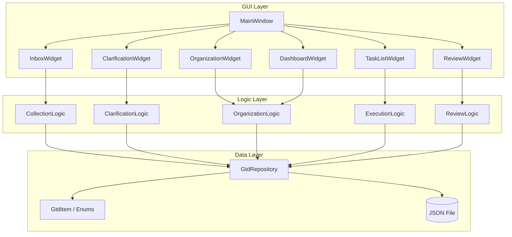
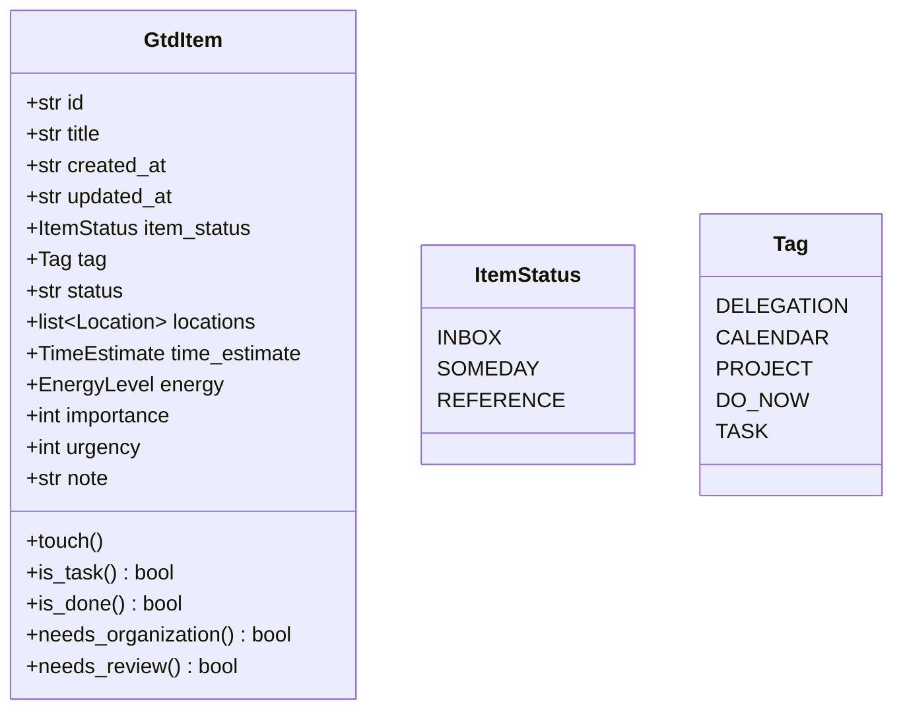

# MindFlow アーキテクチャ設計書

更新日: 2026-03-03

## 概要

MindFlowは、GTD（Getting Things Done）手法に基づくタスク管理GUIアプリケーションである。
重要度×緊急度マトリクスによるタスクの可視化を中核機能とし、5つのGTDフェーズをサポートする。

## システム構成図



## レイヤー設計

### 1. Data Layer (Model)

- **models.py**: StrEnumによる状態定義とdataclassによるGtdItemデータモデル
- **repository.py**: JSONファイルへのCRUD操作。アイテムのシリアライズ/デシリアライズ

### 2. Logic Layer (Controller)

各GTDフェーズに対応するロジッククラス:

| クラス | 責務 |
|--------|------|
| CollectionLogic | Inbox登録、削除、参考資料/いつかやるへの分類 |
| ClarificationLogic | GTD決定木に基づくタスク分類、Context設定 |
| OrganizationLogic | 重要度/緊急度設定、4象限マトリクス分類 |
| ExecutionLogic | タスクステータス変更、バリデーション |
| ReviewLogic | 完了タスクの削除/Inbox戻し |

### 3. GUI Layer (View)

- **MainWindow**: サイドバーナビゲーション + QStackedWidgetによるページ切替
- **各ウィジェット**: 対応するロジッククラスを使用してUI操作を実行
- **components/**: ItemCard, MatrixView, ConfirmDialog等の再利用コンポーネント

## データモデル



## データフロー

### 収集フロー
```
User Input → CollectionLogic.add_to_inbox() → GtdRepository.add() → JSON保存
```

### 明確化フロー
```
GTD決定木 → ClarificationLogic.classify_as_*() → tag/status設定 → JSON保存
```

### 整理フロー
```
スライダー入力 → OrganizationLogic.set_importance_urgency() → JSON保存
```

## 永続化

- 保存先: `~/.mindflow/gtd_data.json`
- エンコーディング: UTF-8
- フォーマット: JSON配列（pretty-print、indent=2）
- 保存タイミング: データ変更時に即時保存（data_changedシグナル経由）
