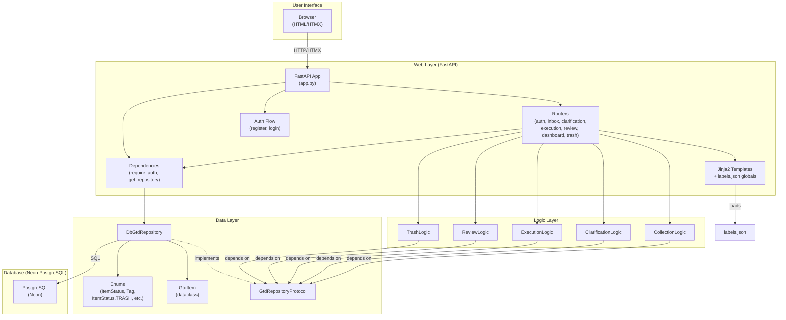
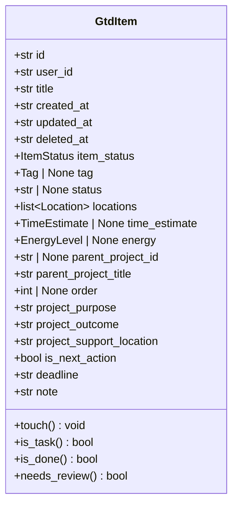
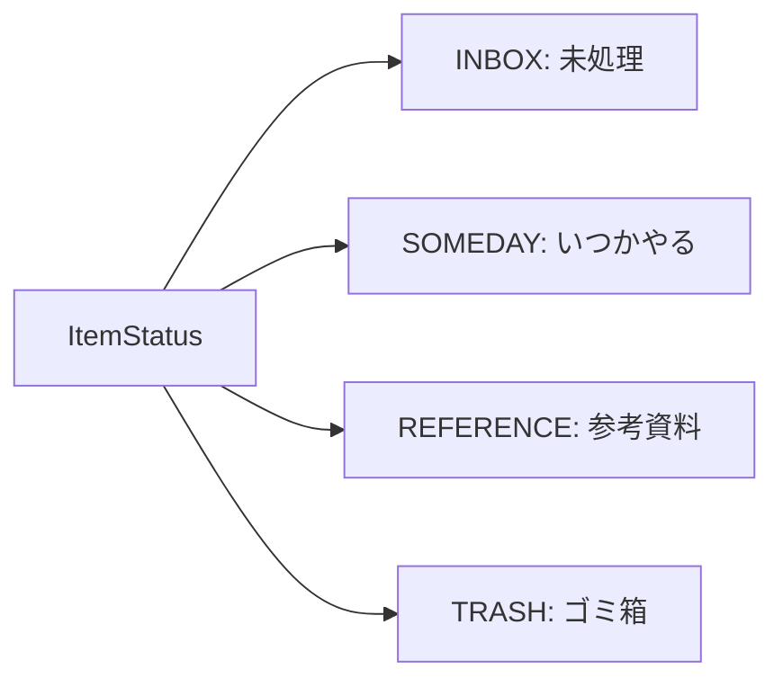
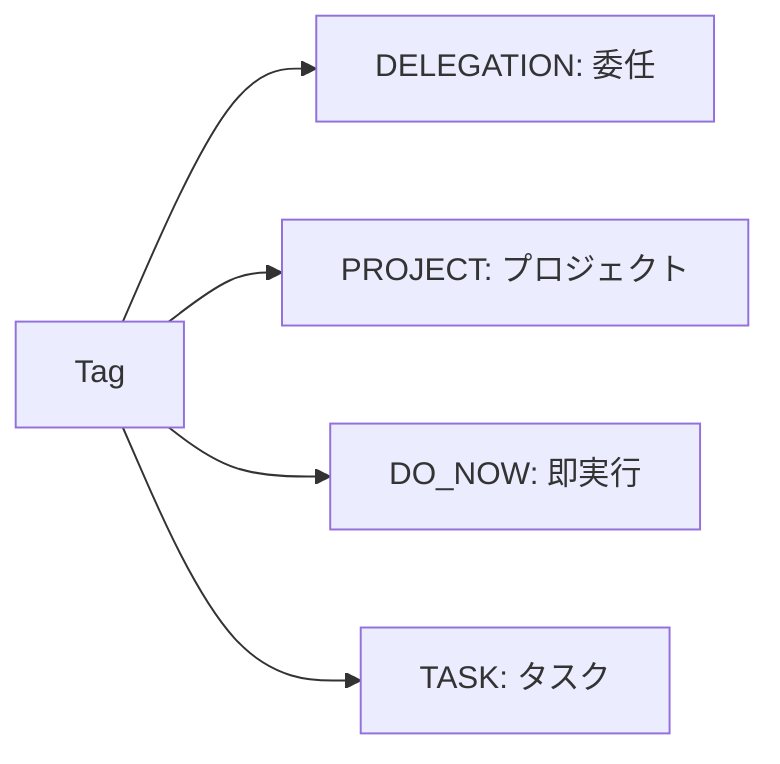
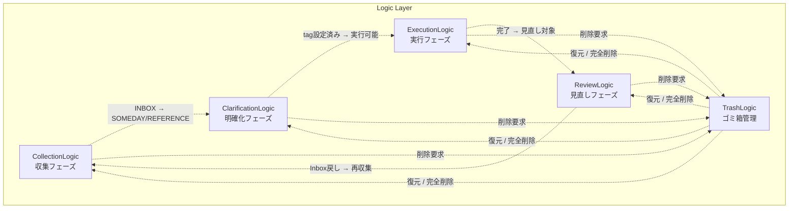
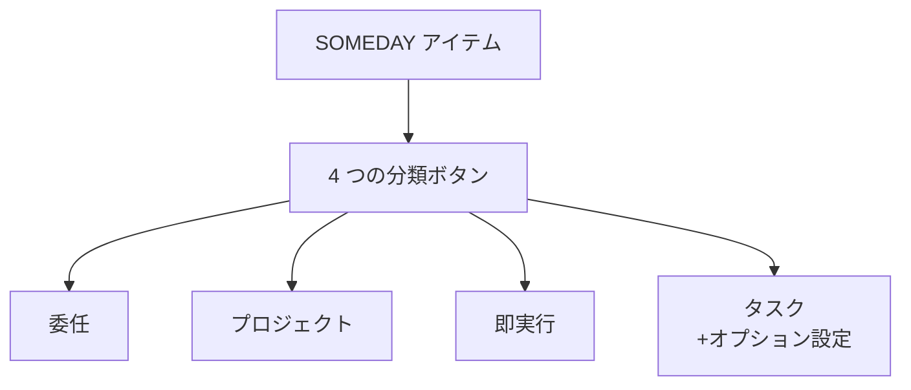
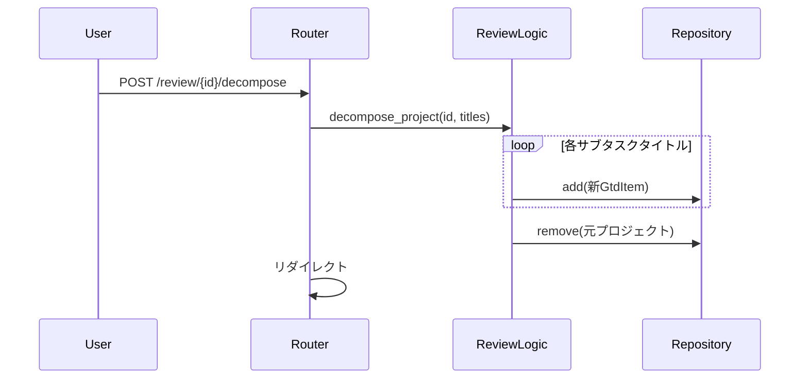

# MindFlow アーキテクチャ設計書

更新日: 2026-04-07

---

## 1. システム概要

MindFlow は GTD（Getting Things Done）手法に基づくタスク管理 Web アプリケーションである。
FastAPI + Jinja2 + HTMX による 3 層アーキテクチャで、収集・明確化・実行・見直しの 4 フェーズを一貫して管理し、
エッセンシャル思考に基づいた本質的なタスク管理を実現する。

### 1.1 設計原則

| 原則 | 説明 |
|------|------|
| 3 層アーキテクチャ | Model → Logic → Web の明確な分離 |
| ロジック非依存 | ビジネスロジックは Web フレームワークに非依存（GtdRepositoryProtocol 経由） |
| 単一責務 | 各ロジッククラスは 1 つの GTD フェーズのみ担当 |
| テスト容易性 | ロジック層は Web なしで 100% テスト可能 |
| マルチテナント対応 | user_id を DI 層で注入し、全リポジトリクエリでフィルタ |
| テキスト一元管理 | labels.json で全ユーザー向けテキストを管理 |
| エッセンシャル思考 | 本質的なタスク管理を重視し、不要な複雑性を排除 |

### 1.2 v2.0.0 での主な変更

v2.0.0 では、エッセンシャル思考に基づき以下の変更を実施した：

- **整理フェーズの廃止**: 重要度・緊急度マトリクスを削除。本質的なタスク分類を優先
- **明確化フェーズの簡素化**: 4 つの分類ボタンで直感的に分類。yes/no 決定木から卒業
- **Trash 機能の追加**: soft delete (deleted_at) による 30 日間の復元期間を設定
- **Direct Classification**: Inbox 追加時にタグを直接指定可能
- **4 フェーズ化**: 収集 → 明確化 → 実行 → 見直しに統一

---

## 2. システム構成図

### 2.1 全体アーキテクチャ



### 2.2 レイヤー間の依存関係

```
Web Layer → Logic Layer → Data Layer
   ↓             ↓              ↓
FastAPI依存   Protocol依存   DB非依存
   ↓             ↓              ↓
Router        GtdLogic*    GtdRepositoryProtocol
Template      Validation   DbGtdRepository
             Business        SQLAlchemy
```

- **上位→下位の一方向依存**: Web → Logic → Data
- **逆方向依存の禁止**: Logic が Web を参照しない、Data が Logic を参照しない
- **Protocol による分離**: Logic は GtdRepositoryProtocol に依存し、DB 実装から完全に独立

---

## 3. データ層

### 3.1 コンポーネント構成

| コンポーネント | ファイル | 責務 |
|--------------|---------|------|
| GtdItem | models.py | タスクデータの構造定義 |
| Enum 群 | models.py | 状態・分類の値域定義 |
| GtdRepositoryProtocol | repository_protocol.py | リポジトリのプロトコル定義 |
| DbGtdRepository | web/db_repository.py | PostgreSQL への永続化・CRUD 操作 |
| GtdItemRow | web/db_models.py | SQLAlchemy ORM モデル |

### 3.2 データモデル（GtdItem）



#### フィールド詳細

| フィールド | 型 | デフォルト | 設定フェーズ | 説明 |
|-----------|---|----------|------------|------|
| id | str | uuid4() | 生成時 | 一意識別子 |
| user_id | str | "" | 生成時 | マルチテナント所有者識別子 |
| title | str | "" | 収集 | タスクタイトル |
| created_at | str | now(UTC).iso | 生成時 | 作成日時（ISO 8601） |
| updated_at | str | now(UTC).iso | 更新時 | 更新日時（ISO 8601） |
| deleted_at | str | "" | 削除時 | 削除日時（soft delete） |
| item_status | ItemStatus | INBOX | 収集 | 収集フェーズの分類先 |
| tag | Tag \| None | None | 明確化 | GTD 分類タグ |
| status | str \| None | None | 明確化/実行 | タグ別ステータス |
| locations | list[Location] | [] | 明確化 | 実施場所（タスク用） |
| time_estimate | TimeEstimate \| None | None | 明確化 | 所要時間（タスク用） |
| energy | EnergyLevel \| None | None | 明確化 | エネルギーレベル（タスク用） |
| parent_project_id | str \| None | None | プロジェクト分解 | 親プロジェクトの ID |
| parent_project_title | str | "" | プロジェクト分解 | 親プロジェクトのタイトル |
| order | int \| None | None | プロジェクト分解 | プロジェクト内の順序（0 始まり） |
| project_purpose | str | "" | 計画 | 目的（ナチュラル・プランニング） |
| project_outcome | str | "" | 計画 | 成果物（ナチュラル・プランニング） |
| project_support_location | str | "" | 計画 | サポート体制（ナチュラル・プランニング） |
| is_next_action | bool | False | 計画 | 次のアクションフラグ |
| deadline | str | "" | 計画 | 期限 |
| note | str | "" | 任意 | 自由メモ |

#### GtdItem メソッド

| メソッド | 戻り値 | 判定ロジック |
|---------|--------|------------|
| touch() | void | updated_at を現在時刻に更新 |
| is_task() | bool | tag が None でない |
| is_done() | bool | tag に対応するステータス Enum の done 値と一致 |
| needs_review() | bool | is_done() == True または tag == PROJECT |

### 3.3 Enum 体系

MECE に基づく Enum 分類体系。各 Enum は StrEnum を継承し、JSON・DB シリアライズ時に値文字列として保存される。

#### 収集フェーズの分類（ItemStatus）



| メンバ | 値 | 説明 |
|--------|---|------|
| INBOX | "inbox" | 新規収集、未処理 |
| SOMEDAY | "someday" | いつかやるリスト |
| REFERENCE | "reference" | 参考資料、アクション不要 |
| TRASH | "trash" | soft delete されたアイテム（30 日で自動削除） |

#### 明確化フェーズの分類（Tag）



| メンバ | 値 | ステータス Enum | 説明 |
|--------|---|---------------|------|
| DELEGATION | "delegation" | DelegationStatus | 他者に委任 |
| PROJECT | "project" | なし | 複数ステップ |
| DO_NOW | "do_now" | DoNowStatus | 即時実行（数分） |
| TASK | "task" | TaskStatus | 単一アクション |

#### タグ別ステータス Enum

| Enum | メンバ | 対応 Tag |
|------|--------|---------|
| DelegationStatus | NOT_STARTED, WAITING, DONE | DELEGATION |
| DoNowStatus | NOT_STARTED, DONE | DO_NOW |
| TaskStatus | NOT_STARTED, IN_PROGRESS, DONE | TASK |

#### タスクコンテキスト Enum

| Enum | メンバ | 説明 |
|------|--------|------|
| Location | DESK, HOME, COMMUTE | 実施場所（複数選択可） |
| TimeEstimate | WITHIN_10MIN, WITHIN_30MIN, WITHIN_1HOUR | 所要時間 |
| EnergyLevel | LOW, MEDIUM, HIGH | エネルギーレベル |

### 3.4 Tag とステータスのマッピング

```python
TAG_STATUS_MAP = {
    Tag.DELEGATION: DelegationStatus,
    Tag.DO_NOW: DoNowStatus,
    Tag.TASK: TaskStatus,
}
# Tag.PROJECT はステータス Enum を持たない
```

### 3.5 GtdRepositoryProtocol

```python
class GtdRepositoryProtocol(Protocol):
    """ロジック層が依存するリポジトリのインターフェース。"""
    
    @property
    def items(self) -> list[GtdItem]: ...
    
    def add(self, item: GtdItem) -> None: ...
    def remove(self, item_id: str) -> GtdItem | None: ...
    def get(self, item_id: str) -> GtdItem | None: ...
    def get_by_status(self, status: ItemStatus) -> list[GtdItem]: ...
    def get_by_tag(self, tag: Tag) -> list[GtdItem]: ...
    def get_tasks(self) -> list[GtdItem]: ...
    def get_active(self) -> list[GtdItem]: ...
    def get_trash(self) -> list[GtdItem]: ...
```

ロジック層はこのプロトコルのみに依存し、具体的な実装（DbGtdRepository）から完全に分離される。

### 3.6 DbGtdRepository

**責務**: PostgreSQL への user_id フィルタ付き CRUD 操作

#### CRUD 操作

| メソッド | 引数 | 戻り値 | 説明 |
|---------|------|--------|------|
| items (property) | - | list[GtdItem] | user_id でフィルタされた全アイテム（trash 除く） |
| add(item) | GtdItem | None | アイテム追加（user_id 自動セット） |
| remove(item_id) | str | GtdItem \| None | soft delete（item_status=TRASH, deleted_at 設定） |
| get(item_id) | str | GtdItem \| None | ID 指定取得（user_id チェック、trash 除く） |
| get_by_status(status) | ItemStatus | list[GtdItem] | ステータス別取得（user_id フィルタ） |
| get_by_tag(tag) | Tag | list[GtdItem] | タグ別取得（user_id フィルタ） |
| get_tasks() | - | list[GtdItem] | tag != None の全アイテム（user_id フィルタ） |
| get_active() | - | list[GtdItem] | item_status != TRASH かつ deleted_at == "" |
| get_trash() | - | list[GtdItem] | item_status == TRASH のアイテム |

#### 実装の特徴

- **user_id フィルタリング**: DI 層で user_id を注入され、全クエリで自動フィルタ
- **ORM マッピング**: GtdItemRow (SQLAlchemy) ↔ GtdItem (dataclass) の相互変換
- **JSON 処理**: locations 値は JSON 文字列として DB に保存、取得時にパース
- **flush_to_db()**: 必要に応じて手動フラッシュ（トランザクション制御用）
- **soft delete**: remove() は物理削除ではなく item_status を TRASH に変更

### 3.7 SQLAlchemy ORM（GtdItemRow）

#### テーブル定義

| カラム | 型 | 制約 | 説明 |
|--------|---|------|------|
| id | VARCHAR(36) | PK | 一意識別子 |
| user_id | VARCHAR(36) | FK, NOT NULL, Index | マルチテナント所有者 |
| title | VARCHAR(500) | NOT NULL | タイトル |
| created_at | VARCHAR(50) | NOT NULL | 作成日時 |
| updated_at | VARCHAR(50) | NOT NULL | 更新日時 |
| deleted_at | VARCHAR(50) | DEFAULT '' | 削除日時（soft delete） |
| note | TEXT | DEFAULT '' | メモ |
| item_status | VARCHAR(20) | DEFAULT 'inbox' | 収集フェーズ分類 |
| tag | VARCHAR(20) | Nullable | 明確化タグ |
| status | VARCHAR(20) | Nullable | タグ別ステータス |
| locations_json | TEXT | DEFAULT '[]' | JSON 配列（Location 値） |
| time_estimate | VARCHAR(20) | Nullable | 所要時間 |
| energy | VARCHAR(20) | Nullable | エネルギーレベル |
| project_purpose | TEXT | DEFAULT '' | 計画（目的） |
| project_outcome | TEXT | DEFAULT '' | 計画（成果物） |
| project_support_location | TEXT | DEFAULT '' | 計画（サポート） |
| is_next_action | BOOLEAN | DEFAULT FALSE | 次アクションフラグ |
| deadline | VARCHAR(50) | DEFAULT '' | 期限 |
| parent_project_id | VARCHAR(36) | Nullable, FK | 親プロジェクト |
| parent_project_title | VARCHAR(500) | DEFAULT '' | 親プロジェクト名 |
| item_order | INTEGER | Nullable | プロジェクト内順序 |

#### 関連テーブル

**UserRow**:
```sql
CREATE TABLE users (
    id VARCHAR(36) PRIMARY KEY,
    username VARCHAR(100) UNIQUE NOT NULL,
    password_hash VARCHAR(200) NOT NULL,
    created_at VARCHAR(50) NOT NULL
);
```

**NotificationRow**:
```sql
CREATE TABLE notifications (
    id VARCHAR(36) PRIMARY KEY,
    user_id VARCHAR(36) NOT NULL INDEX,
    notification_type VARCHAR(20) NOT NULL,
    title VARCHAR(500) NOT NULL,
    message TEXT DEFAULT '',
    is_read BOOLEAN DEFAULT FALSE,
    created_at VARCHAR(50) NOT NULL
);
```

---

## 4. ロジック層

### 4.1 コンポーネント構成

各ロジッククラスは GTD の 1 フェーズに対応し、コンストラクタで GtdRepositoryProtocol を受け取る。
ロジッククラスは GtdRepositoryProtocol のメソッドのみを使用し、save() は呼ばない。
Web 層で自動的にトランザクション管理される。



### 4.2 CollectionLogic（収集フェーズ）

**責務**: Inbox へのアイテム追加・削除、参考資料/いつかやるへの振り分け、trash への移動

**ファイル**: src/study_python/gtd/logic/collection.py

| メソッド | 引数 | 戻り値 | 説明 |
|---------|------|--------|------|
| add_to_inbox | title, note="", tag=None | GtdItem | 新規追加（タグ直接指定可能） |
| move_to_trash | item_id | GtdItem \| None | trash へ移動（soft delete） |
| move_to_reference | item_id | GtdItem \| None | 参考資料へ移動 |
| move_to_someday | item_id | GtdItem \| None | いつかやるへ移動 |
| get_inbox_items | - | list[GtdItem] | INBOX アイテム一覧 |
| get_someday_items | - | list[GtdItem] | SOMEDAY アイテム一覧 |
| get_reference_items | - | list[GtdItem] | REFERENCE アイテム一覧 |

### 4.3 ClarificationLogic（明確化フェーズ）

**責務**: 4 つの分類ボタンによるタスク分類、コンテキスト設定

**ファイル**: src/study_python/gtd/logic/clarification.py

| メソッド | 引数 | 戻り値 | 説明 |
|---------|------|--------|------|
| get_pending_items | - | list[GtdItem] | SOMEDAY かつ tag==None |
| classify_as_delegation | item_id | GtdItem \| None | 委任タグ設定 |
| classify_as_project | item_id | GtdItem \| None | プロジェクトタグ設定 |
| classify_as_do_now | item_id | GtdItem \| None | 即実行タグ設定 |
| classify_as_task | item_id, locations=[], time_estimate=None, energy=None | GtdItem \| None | タスクタグ+コンテキスト設定 |
| update_task_context | item_id, locations?, time_estimate?, energy? | GtdItem \| None | コンテキスト部分更新 |

#### GTD 決定木（v2.0.0）



**特徴**: Yes/No 決定木から卒業。直感的な 4 つボタンで分類。

### 4.4 ExecutionLogic（実行フェーズ）

**責務**: タスクステータスの更新・遷移管理

**ファイル**: src/study_python/gtd/logic/execution.py

| メソッド | 引数 | 戻り値 | 説明 |
|---------|------|--------|------|
| get_active_tasks | - | list[GtdItem] | tag!=PROJECT かつ is_done()==False かつ deleted_at=="" |
| update_status | item_id, new_status | GtdItem \| None | ステータス変更（バリデーション付き） |
| get_available_statuses | item_id | list[str] \| None | 有効なステータス値一覧 |

### 4.5 ReviewLogic（見直しフェーズ）

**責務**: 完了タスクの処理、プロジェクトの細分化

**ファイル**: src/study_python/gtd/logic/review.py

| メソッド | 引数 | 戻り値 | 説明 |
|---------|------|--------|------|
| get_review_items | - | list[GtdItem] | needs_review() == True |
| move_to_inbox | item_id | GtdItem \| None | 全フィールドリセットして INBOX へ |
| get_completed_count | - | int | 完了アイテム数 |
| get_project_count | - | int | プロジェクト数 |
| decompose_project | item_id, sub_task_titles | list[GtdItem] | プロジェクト細分化 |

#### プロジェクト細分化フロー



### 4.6 TrashLogic（ゴミ箱管理）

**責務**: trash アイテムの管理、復元、完全削除、自動清掃

**ファイル**: src/study_python/gtd/logic/trash.py

| メソッド | 引数 | 戻り値 | 説明 |
|---------|------|--------|------|
| get_trash_items | - | list[GtdItem] | trash アイテム一覧 |
| restore | item_id | GtdItem \| None | 元の status に復元 |
| delete_permanently | item_id | GtdItem \| None | 物理削除 |
| days_until_auto_delete | item_id | int \| None | 自動削除までの残り日数 |

#### 自動削除ロジック

- **削除ルール**: deleted_at から 30 日経過したアイテムは自動削除
- **実行タイミング**: app.py lifespan で _cleanup_expired_trash() を呼び出し
- **実装**: SQL で deleted_at < now() - interval 30 day を削除

---

## 5. Web 層

### 5.1 FastAPI アプリケーション（app.py）

**責務**: ミドルウェア、ルーター登録、ライフサイクル管理

#### ライフサイクル

```python
@asynccontextmanager
async def lifespan(app: FastAPI) -> AsyncGenerator[None, None]:
    # 起動時: logging, DB 作成, マイグレーション, 自動削除
    setup_logging(level="INFO", log_to_file=True, log_to_console=True)
    engine = get_engine()
    Base.metadata.create_all(engine)
    _migrate_add_project_planning_columns(engine)
    _migrate_add_deleted_at_column(engine)
    _migrate_calendar_to_task(engine)
    _cleanup_expired_trash(engine)
    yield
    # シャットダウン: 自動管理（コンテキスト終了時）
```

#### ミドルウェア

| ミドルウェア | 責務 |
|------------|------|
| SessionMiddleware | セッション管理（secret_key, https_only, same_site=lax） |
| security_headers_middleware | X-Content-Type-Options, X-Frame-Options, CSP など |
| auth_redirect_middleware | 未認証 (303) → /login へリダイレクト |

#### ルーター登録

```python
app.include_router(auth.router)          # /register, /login, /logout
app.include_router(dashboard.router)     # /dashboard
app.include_router(inbox.router)         # /inbox
app.include_router(clarification.router) # /clarification
app.include_router(execution.router)     # /execution (TaskList)
app.include_router(review.router)        # /review
app.include_router(trash.router)         # /trash (trash 管理)
app.include_router(settings_web.router)  # /settings
app.include_router(iconbar.router)       # /iconbar
```

#### 静的ファイル

```python
app.mount("/static", StaticFiles(directory="src/study_python/gtd/web/static"))
```

### 5.2 依存性注入（dependencies.py）

#### require_auth

```python
def require_auth(request: Request) -> str:
    """request.session["user_id"] を検証して返す。
    
    未認証の場合は HTTPException(status_code=303, headers={"Location": "/login"})
    で auth_redirect_middleware に捕捉される。
    """
```

**使用例**:
```python
@router.get("")
async def page(user_id: str = Depends(require_auth)):
    ...
```

#### get_db_session

```python
def get_db_session() -> Generator[Session, None, None]:
    """SQLAlchemy セッションを生成・管理する。
    
    通常時は commit、例外時は rollback を自動実行。
    """
```

#### get_repository

```python
def get_repository(
    request: Request,
    session: Session = Depends(get_db_session),
    user_id: str = Depends(require_auth),
) -> DbGtdRepository:
    """user_id フィルタ済み DbGtdRepository を返す。
    
    ロジック層・ルーター層がどう呼んでも、
    他ユーザーのデータにはアクセスできない保証。
    """
```

**マルチテナント設計の重要性**:
- user_id は request.session から取得（認証済みのみ）
- DbGtdRepository(session, user_id) で初期化
- リポジトリの全クエリが自動的に user_id でフィルタ
- 仮に Logic が「全ユーザーのアイテムを取得」と呼んでも、取得できるのは当該ユーザーのデータのみ

### 5.3 ルーター

各ルーターはページ（GET）と API エンドポイント（POST/PUT/DELETE）を提供する。
HTMX による非同期更新で部分テンプレートを返す。

#### routers/auth.py

| 経路 | メソッド | 責務 |
|------|--------|------|
| /register | GET | 登録フォーム表示 |
| /register | POST | 登録処理、bcrypt ハッシュ、DB 保存 |
| /login | GET | ログインフォーム表示 |
| /login | POST | 認証、session["user_id"] セット |
| /logout | POST | session クリア、/login へリダイレクト |

**認証フロー**:
```
ユーザー入力 → bcrypt.hashpw() → UserRow 保存
↓
login: bcrypt.checkpw() → セッション生成 → 認証状態へ
```

#### routers/dashboard.py

| 経路 | メソッド | 責務 |
|------|--------|------|
| /dashboard | GET | ダッシュボード表示（サマリー） |

**データソース**:
- CollectionLogic で Inbox/Someday/Reference カウント
- ExecutionLogic で アクティブタスク情報

#### routers/inbox.py

| 経路 | メソッド | 責務 |
|------|--------|------|
| /inbox | GET | Inbox ページ表示 |
| /inbox | POST | 新規アイテム追加（オプション: 直接分類） |
| /{item_id}/delete | POST | trash へ移動 |
| /{item_id}/move_to_someday | POST | いつかやるへ移動 |
| /{item_id}/move_to_reference | POST | 参考資料へ移動 |
| /{item_id}/order_up | POST | プロジェクト派生アイテムの順序変更 |
| /{item_id}/order_down | POST | プロジェクト派生アイテムの順序変更 |

#### routers/clarification.py

| 経路 | メソッド | 責務 |
|------|--------|------|
| /clarification | GET | 明確化ページ（4 ボタンUI） |
| /{item_id}/classify_as_delegation | POST | 委任タグ設定 |
| /{item_id}/classify_as_project | POST | プロジェクトタグ設定 |
| /{item_id}/classify_as_do_now | POST | 即実行タグ設定 |
| /{item_id}/classify_as_task | POST | タスクタグ+コンテキスト設定 |
| /{item_id}/update_context | POST | コンテキスト部分更新 |

#### routers/execution.py

| 経路 | メソッド | 責務 |
|------|--------|------|
| /execution | GET | 実行ページ（タスク一覧） |
| /{item_id}/status | POST | ステータス変更 |

#### routers/review.py

| 経路 | メソッド | 責務 |
|------|--------|------|
| /review | GET | 見直しページ |
| /{item_id}/to_inbox | POST | Inbox へ戻す |
| /{item_id}/decompose | POST | プロジェクト細分化 |

#### routers/trash.py

| 経路 | メソッド | 責務 |
|------|--------|------|
| /trash | GET | ゴミ箱ページ（削除済みアイテム表示） |
| /{item_id}/restore | POST | 復元 |
| /{item_id}/delete_permanently | POST | 完全削除 |

#### routers/settings_web.py

| 経路 | メソッド | 責務 |
|------|--------|------|
| /settings | GET | 設定ページ |

#### routers/iconbar.py

| 経路 | メソッド | 責務 |
|------|--------|------|
| /iconbar | GET | アイコンバー（HTMX 部分） |

### 5.4 テンプレート・エンジン

**ファイル**: src/study_python/gtd/web/template_engine.py

```python
templates = Jinja2Templates(directory=_TEMPLATE_DIR)
templates.env.globals["labels"] = load_labels()
```

- **共有インスタンス**: 全ルーターが同一の templates を使用
- **labels グローバル変数**: labels.json をロード、全テンプレートで `{{ labels.key }}` でアクセス可能
- **HTMX 対応**: 部分テンプレート (*.jinja) も同エンジンで レンダリング

#### テンプレート構成

```
templates/
├── base.html                 # ベース（sidebar + main + modals）
├── pages/
│   ├── dashboard.html        # ダッシュボード
│   ├── inbox.html            # Inbox
│   ├── clarification.html    # 明確化（4 ボタン UI）
│   ├── execution.html        # 実行（TaskList）
│   ├── review.html           # 見直し
│   ├── trash.html            # ゴミ箱
│   ├── settings.html         # 設定
│   ├── login.html            # ログイン
│   └── register.html         # 登録
└── partials/
    ├── iconbar.html          # アイコンバー
    ├── item_card.html        # アイテムカード（Inbox 用）
    ├── trash_item.html       # trash アイテム表示
    └── ...（各ルーター固有の部分テンプレート）
```

### 5.5 セキュリティ設計

#### 認証

- **登録**: bcrypt 10 round でハッシュ化、DB に保存
- **ログイン**: bcrypt.checkpw() で検証、session["user_id"] をセット
- **セッション**: SessionMiddleware で max_age=86400（1 日）

#### マルチテナント隔離

- **user_id 注入**: require_auth() で session から取得
- **リポジトリフィルタ**: DbGtdRepository(session, user_id) で初期化
- **全クエリのフィルタ**: items property, add, remove, get, get_by_status, get_by_tag, get_tasks, get_active, get_trash すべてで user_id チェック
- **防御深度**: Logic 層では user_id を意識せず、Repository 層の必須フィルタで保護

#### セキュリティヘッダー

| ヘッダー | 値 |
|--------|---|
| X-Content-Type-Options | nosniff |
| X-Frame-Options | DENY |
| Referrer-Policy | strict-origin-when-cross-origin |
| Permissions-Policy | camera=(), microphone=(), geolocation=() |
| Content-Security-Policy | default-src 'self'; script-src 'self' 'unsafe-inline'; style-src 'self' 'unsafe-inline'; img-src 'self'; frame-ancestors 'none'; form-action 'self' |
| Strict-Transport-Security | max-age=31536000; includeSubDomains（本番環境のみ） |

---

## 6. テキスト管理層

### 6.1 labels.json

**ファイル**: src/study_python/gtd/web/labels.json

全ユーザー向けテキスト（UI ラベル、ボタン名、メッセージなど）を一元管理。
プロジェクトの UI 文言変更時は、このファイルのみを修正すればテンプレート・ロジック変更は不要。

**構造例**:
```json
{
  "inbox": {
    "title": "Inbox",
    "add_button": "Add Item",
    "delete_button": "Move to Trash"
  },
  "clarification": {
    "button_delegation": "Delegate",
    "button_project": "Create Project",
    "button_do_now": "Do Now",
    "button_task": "Add Task"
  },
  ...
}
```

### 6.2 labels.py

**ファイル**: src/study_python/gtd/web/labels.py

```python
@lru_cache(maxsize=1)
def load_labels() -> dict[str, Any]:
    """labels.json をロード、キャッシュして返す."""
```

- **LRU キャッシュ**: アプリ起動時に 1 度だけロード
- **全テンプレート・ルーターで共有**: `from study_python.gtd.web.labels import load_labels`

### 6.3 template_engine.py の globals 注入

```python
templates.env.globals["labels"] = load_labels()
```

テンプレート内で `{{ labels.inbox.title }}` で直接アクセス可能。

---

## 7. データベース層（Neon PostgreSQL）

### 7.1 接続管理（database.py）

```python
def get_engine(db_url: str | None = None) -> Engine:
    """SQLAlchemy エンジンを取得（シングルトン）。
    
    PostgreSQL の場合は接続プーリング設定:
    - pool_size=5
    - max_overflow=10
    - pool_pre_ping=True
    """

def get_session_factory(engine: Engine | None = None) -> sessionmaker[Session]:
    """セッションファクトリを取得（シングルトン）。
    
    autoflush=False, autocommit=False で明示的なトランザクション制御。
    """
```

### 7.2 マイグレーション戦略

#### _migrate_add_project_planning_columns(engine)

アプリ起動時（lifespan）に実行。新しいカラムが既存テーブルに存在しない場合のみ ADD COLUMN。

```python
new_columns = {
    "project_purpose": "TEXT DEFAULT ''",
    "project_outcome": "TEXT DEFAULT ''",
    "project_support_location": "TEXT DEFAULT ''",
    "is_next_action": "BOOLEAN DEFAULT FALSE",
    "deadline": "VARCHAR(50) DEFAULT ''",
    "user_id": "VARCHAR(36) NOT NULL DEFAULT ''",
}
```

#### _migrate_add_deleted_at_column(engine)

v2.0.0 での新規マイグレーション。soft delete 対応。

```python
new_columns = {
    "deleted_at": "VARCHAR(50) DEFAULT ''",
}
```

#### _migrate_calendar_to_task(engine)

v1.x から v2.0.0 への移行マイグレーション。旧 CALENDAR タグをすべて TASK に変換。

```python
# UPDATE gtd_items SET tag='task' WHERE tag='calendar'
```

#### _cleanup_expired_trash(engine)

app 起動時に実行。deleted_at から 30 日以上経過したアイテムを完全削除。

```python
# DELETE FROM gtd_items WHERE deleted_at != '' AND deleted_at < now() - interval '30 days'
```

---

## 8. ディレクトリ構成

```
src/study_python/gtd/
├── __init__.py                              # パッケージ定義
├── models.py                                # データモデル・Enum 定義
├── repository_protocol.py                   # GtdRepositoryProtocol
├── logic/                                   # ビジネスロジック
│   ├── __init__.py
│   ├── collection.py                        # 収集フェーズ
│   ├── clarification.py                     # 明確化フェーズ
│   ├── execution.py                         # 実行フェーズ
│   ├── review.py                            # 見直しフェーズ
│   └── trash.py                             # ゴミ箱管理
└── web/                                     # FastAPI Web アプリケーション
    ├── __init__.py
    ├── app.py                               # FastAPI アプリケーション（ライフサイクル、ミドルウェア）
    ├── auth.py                              # bcrypt ハッシュ、認証ロジック
    ├── config.py                            # Settings（環境変数取得）
    ├── database.py                          # SQLAlchemy エンジン・セッション管理
    ├── db_models.py                         # SQLAlchemy ORM モデル（UserRow, GtdItemRow, NotificationRow）
    ├── db_repository.py                     # DbGtdRepository（user_id フィルタ付き CRUD）
    ├── dependencies.py                      # FastAPI DI（require_auth, get_db_session, get_repository）
    ├── labels.py                            # labels.json ロード・キャッシュ
    ├── labels.json                          # テキスト一元管理
    ├── template_engine.py                   # Jinja2Templates + labels globals
    ├── run.py                               # エントリポイント（uvicorn）
    ├── routers/                             # FastAPI ルーター
    │   ├── __init__.py
    │   ├── auth.py                          # /register, /login, /logout
    │   ├── dashboard.py                     # /dashboard
    │   ├── inbox.py                         # /inbox
    │   ├── clarification.py                 # /clarification
    │   ├── execution.py                     # /execution
    │   ├── review.py                        # /review
    │   ├── trash.py                         # /trash
    │   ├── settings_web.py                  # /settings
    │   └── iconbar.py                       # /iconbar
    ├── static/                              # 静的ファイル（CSS, JS, 画像）
    │   ├── css/
    │   ├── js/
    │   └── images/
    └── templates/                           # Jinja2 テンプレート
        ├── base.html                        # ベース（sidebar + main + modals）
        ├── pages/
        │   ├── dashboard.html               # ダッシュボード
        │   ├── inbox.html                   # Inbox
        │   ├── clarification.html           # 明確化
        │   ├── execution.html               # 実行
        │   ├── review.html                  # 見直し
        │   ├── trash.html                   # ゴミ箱
        │   ├── settings.html                # 設定
        │   ├── login.html                   # ログイン
        │   └── register.html                # 登録
        └── partials/                        # 部分テンプレート
            ├── iconbar.html                 # アイコンバー
            ├── item_card.html               # アイテムカード
            ├── trash_item.html              # trash アイテムカード
            └── ...
```

---

## 9. ログ設計

**ファイル**: src/study_python/logging_config.py

### 9.1 ログ設定

| 項目 | 値 |
|------|---|
| フォーマット | `{timestamp}.{ms} \| {level} \| {module}:{func}:{line} \| {message}` |
| ファイル出力先 | logs/app_YYYY-MM-DD.log |
| ローテーション | 最大 10MB、保持 30 世代 |
| ログレベル | 本番: INFO、開発: DEBUG |
| コンソール出力 | 有効（debug で詳細表示） |

### 9.2 モジュール別ログ出力方針

| モジュール | 主なログ内容 |
|-----------|------------|
| app.py | アプリケーション起動、マイグレーション、trash 自動削除 |
| database.py | エンジン初期化、セッション管理 |
| db_repository.py | CRUD 操作の実行ログ、soft delete 操作 |
| 各 Logic | メソッド実行、ビジネスロジック検証、エラー |
| 各 Router | ルーター処理開始/終了、例外処理 |
| auth.py | ユーザー登録、ログイン試行、認証失敗 |

---

## 10. 開発フロー・設計パターン

### 10.1 新機能追加の流れ

1. **Logic レベルでテスト可能なロジックを実装**（GtdRepositoryProtocol に依存）
2. **ルーターでエンドポイント定義**（Logic を呼び出し、テンプレートを返す）
3. **テンプレート実装**（labels.json を参照、HTMX で非同期更新）
4. **labels.json に UI テキスト追加**（ハードコーディング禁止）

### 10.2 Protocol 経由の粗結合

**Protocol 経由の粗結合**:
- Logic は GtdRepositoryProtocol のみに依存
- DbGtdRepository の実装変更は Logic に影響しない
- 将来的に別の永続化層（Redis など）への切り替え可能

### 10.3 バリデーション位置

| 層 | 責務 |
|----|------|
| Web ルーター | URL バリデーション、リクエスト形式チェック |
| Logic | ビジネスロジック検証（e.g., 有効な tag か確認） |
| Repository | DB 制約（NOT NULL など）、soft delete ロジック |

### 10.4 エラーハンドリング

- **Logic**: 具体的な例外（ValueError など）を raise
- **Router**: try-except で捕捉、404/400/500 を HTTPException で返す
- **Middleware**: 認証エラーは 303 → /login へリダイレクト

---

## 11. マルチテナント設計の詳細

### 11.1 DI レイヤーでの user_id 注入

```python
def require_auth(request: Request) -> str:
    user_id = request.session.get("user_id")
    if not user_id:
        raise HTTPException(status_code=303, headers={"Location": "/login"})
    return str(user_id)

def get_repository(
    request: Request,
    session: Session = Depends(get_db_session),
    user_id: str = Depends(require_auth),
) -> DbGtdRepository:
    return DbGtdRepository(session, user_id)
```

### 11.2 DbGtdRepository での強制フィルタ

```python
class DbGtdRepository:
    def __init__(self, session: Session, user_id: str):
        self._session = session
        self._user_id = user_id  # コンストラクタで固定

    @property
    def items(self) -> list[GtdItem]:
        rows = self._session.query(GtdItemRow).filter(
            GtdItemRow.user_id == self._user_id,
            GtdItemRow.item_status != ItemStatus.TRASH
        ).all()
        return [self._row_to_item(r) for r in rows]
    
    def get(self, item_id: str) -> GtdItem | None:
        row = self._session.query(GtdItemRow).filter(
            GtdItemRow.id == item_id,
            GtdItemRow.user_id == self._user_id,
            GtdItemRow.item_status != ItemStatus.TRASH
        ).one_or_none()
        return self._row_to_item(row) if row else None
    
    def remove(self, item_id: str) -> GtdItem | None:
        """soft delete: TRASH へ移動、deleted_at 設定"""
        item = self.get(item_id)
        if item:
            item.item_status = ItemStatus.TRASH
            item.deleted_at = now_utc_iso()
            self._session.merge(self._item_to_row(item))
        return item
    
    def get_trash(self) -> list[GtdItem]:
        rows = self._session.query(GtdItemRow).filter(
            GtdItemRow.user_id == self._user_id,
            GtdItemRow.item_status == ItemStatus.TRASH
        ).all()
        return [self._row_to_item(r) for r in rows]
```

### 11.3 セキュリティ保証

- **Logic が user_id 意識不要**: Protocol 経由で、Repository に任せる
- **Router も user_id チェック不要**: DI で自動注入、Repository が保証
- **データリーク防止**: 全 CRUD 操作で user_id フィルタ必須
- **バグ対策**: 仮に Logic が「全ユーザーの Inbox」と呼んでも、SQL に user_id=current_user 条件が付く

---

## 12. トランザクション・コミット戦略

### 12.1 dependencies.py の get_db_session

```python
def get_db_session() -> Generator[Session, None, None]:
    session = get_session_factory()()
    try:
        yield session
        session.commit()  # 正常終了時自動コミット
    except Exception:
        session.rollback()  # エラー時ロールバック
    finally:
        session.close()
```

- **FastAPI は DI 結果を自動管理**: route handler から戻った後、yield 後のコードが実行
- **自動コミット**: route handler で exception なければ session.commit()
- **自動ロールバック**: 例外発生時は session.rollback()
- **Logic は save() 不要**: Web 層の DI で自動管理

### 12.2 DbGtdRepository.flush_to_db()

```python
def flush_to_db(self) -> None:
    """明示的にセッションをフラッシュする（トランザクション継続）。
    
    複雑な複数操作の途中で確認が必要な場合のみ。
    """
    self._session.flush()
```

通常は不要。get_db_session の自動コミットで十分。

---

## 13. Trash 機能の詳細

### 13.1 soft delete の実装

- **削除方法**: item_status を TRASH に設定、deleted_at に削除日時を記録
- **表示フィルタ**: items, get など標準メソッドは deleted_at == "" のみを対象
- **trash アクセス**: get_trash() で item_status == TRASH のアイテムを取得
- **復元**: item_status を元の値（INBOX など）に戻す、deleted_at をクリア

### 13.2 自動削除戦略

**削除ルール**:
```sql
DELETE FROM gtd_items 
WHERE user_id = ? 
  AND item_status = 'trash' 
  AND deleted_at != '' 
  AND deleted_at < now() - interval '30 days'
```

**実行タイミング**: app.py lifespan で app 起動時に 1 度実行

### 13.3 trash router の役割

- **表示**: GET /trash で trash アイテムを表示
- **復元**: POST /trash/{item_id}/restore で復元
- **完全削除**: POST /trash/{item_id}/delete_permanently で物理削除

---

## 14. マイグレーション（v1 → v2）

### 14.1 v1.x から v2.0.0 への移行

app.py lifespan で以下を順次実行：

1. **`Base.metadata.create_all(engine)`**
   - 新規テーブル作成（PostgreSQL/SQLite両対応）

2. **`_migrate_schema(engine)`**
   - 既存テーブルにカラム追加（project_*、deleted_at、user_id 等）
   - 廃止された Tag.CALENDAR を持つアイテムを Tag.TASK に変換（v2.0.0）

3. **`_cleanup_expired_trash(engine)`**
   - 30 日以上前に削除されたアイテムを物理削除（v2.0.0）
   - 全ユーザー横断バッチ（user_id フィルタなし）

### 14.2 バージョン互換性

- **旧 v1 DB**: 上記マイグレーションで自動対応
- **新規ユーザー**: 初期化時から v2.0.0 スキーマで生成
- **ロールバック**: 物理削除はされないため、フェーズ 3 までは復帰可能

---

## 附録: コード参考例

### Logic 層（user_id 非依存）

```python
class CollectionLogic:
    def __init__(self, repo: GtdRepositoryProtocol):
        self._repo = repo
    
    def add_to_inbox(self, title: str, note: str = "", tag: Tag | None = None) -> GtdItem:
        if not title.strip():
            raise ValueError("Title cannot be empty")
        item = GtdItem(
            title=title,
            note=note,
            item_status=ItemStatus.INBOX,
            tag=tag
        )
        self._repo.add(item)
        return item
    
    def move_to_trash(self, item_id: str) -> GtdItem | None:
        return self._repo.remove(item_id)
```

### Trash 操作例

```python
class TrashLogic:
    def __init__(self, repo: GtdRepositoryProtocol):
        self._repo = repo
    
    def restore(self, item_id: str) -> GtdItem | None:
        item = self._repo.get_trash_items()  # trash から探す
        if item:
            item.item_status = ItemStatus.INBOX  # 元のステータスに復元
            item.deleted_at = ""
            # Save through repository
        return item
    
    def days_until_auto_delete(self, item_id: str) -> int | None:
        item = self._repo.get(item_id)
        if item and item.deleted_at:
            deleted_time = parse_iso_datetime(item.deleted_at)
            days_since = (now_utc() - deleted_time).days
            return max(0, 30 - days_since)
        return None
```

### Router 層（user_id DI で自動注入）

```python
@router.get("", response_class=HTMLResponse)
async def inbox_page(
    request: Request,
    repo: DbGtdRepository = Depends(get_repository),  # user_id フィルタ済み
):
    logic = CollectionLogic(repo)
    items = logic.get_inbox_items()  # 自動的に当該ユーザーのデータのみ
    return templates.TemplateResponse("pages/inbox.html", {
        "request": request,
        "items": items,
    })

@router.post("/{item_id}/delete", response_class=HTMLResponse)
async def delete_item(
    item_id: str,
    repo: DbGtdRepository = Depends(get_repository),
):
    logic = CollectionLogic(repo)
    deleted_item = logic.move_to_trash(item_id)
    if not deleted_item:
        raise HTTPException(status_code=404)
    # 部分テンプレートを返す
    return templates.TemplateResponse("partials/notification.html", {
        "message": "Item moved to trash"
    })
```

### テンプレート（labels 使用）

```html
<!-- templates/pages/clarification.html -->
<h1>{{ labels.clarification.title }}</h1>
<div class="button-group">
    <button hx-post="/clarification/{{ item.id }}/classify_as_delegation">
        {{ labels.clarification.button_delegation }}
    </button>
    <button hx-post="/clarification/{{ item.id }}/classify_as_project">
        {{ labels.clarification.button_project }}
    </button>
    <button hx-post="/clarification/{{ item.id }}/classify_as_do_now">
        {{ labels.clarification.button_do_now }}
    </button>
    <button hx-post="/clarification/{{ item.id }}/classify_as_task">
        {{ labels.clarification.button_task }}
    </button>
</div>
```

---

## まとめ

MindFlow v2.0.0 の Web アーキテクチャは、**3 層分離** + **Protocol による粗結合** + **DI による user_id 強制フィルタ** + **エッセンシャル思考** により、以下を実現している：

1. **Logic の再利用**: GUI（PySide6）→ Web（FastAPI）への移行が容易
2. **テスト性**: Logic 層は Web フレームワーク非依存で 100% テスト可能
3. **セキュリティ**: user_id フィルタが DI レイヤーで自動適用、データリークを防止
4. **スケーラビリティ**: マルチテナント対応、PostgreSQL コネクションプーリング対応
5. **保守性**: テキスト一元管理（labels.json）、明確なレイヤー責務分離
6. **シンプルさ**: 不要な複雑性を排除（整理フェーズ廃止、直感的な分類UI）
7. **復元性**: soft delete と 30 日間の復元期間により、誤削除対応が容易
