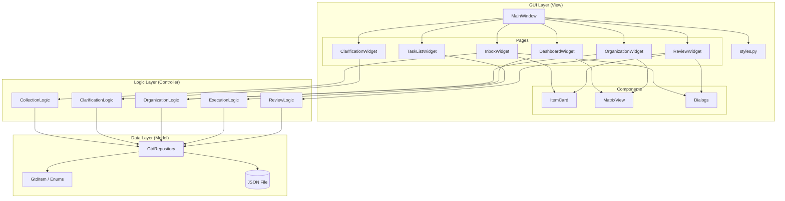
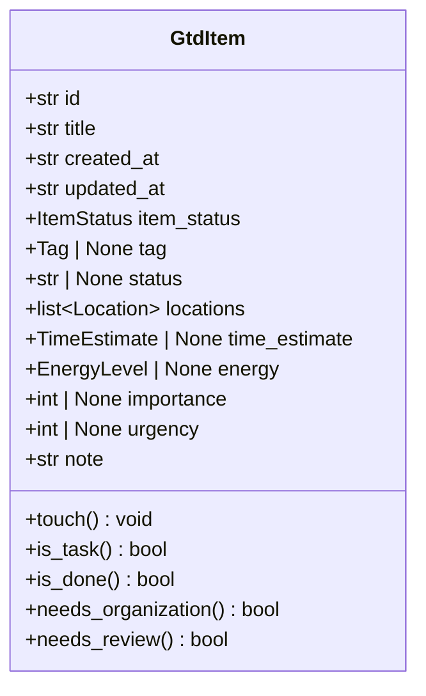
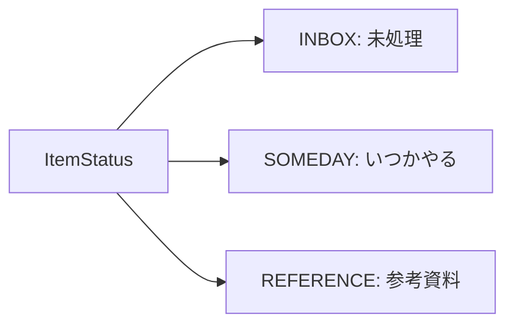
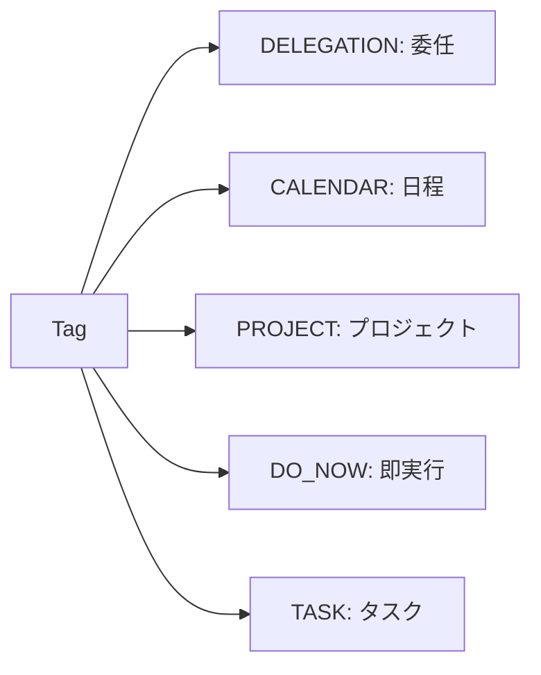
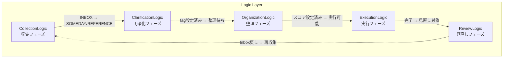
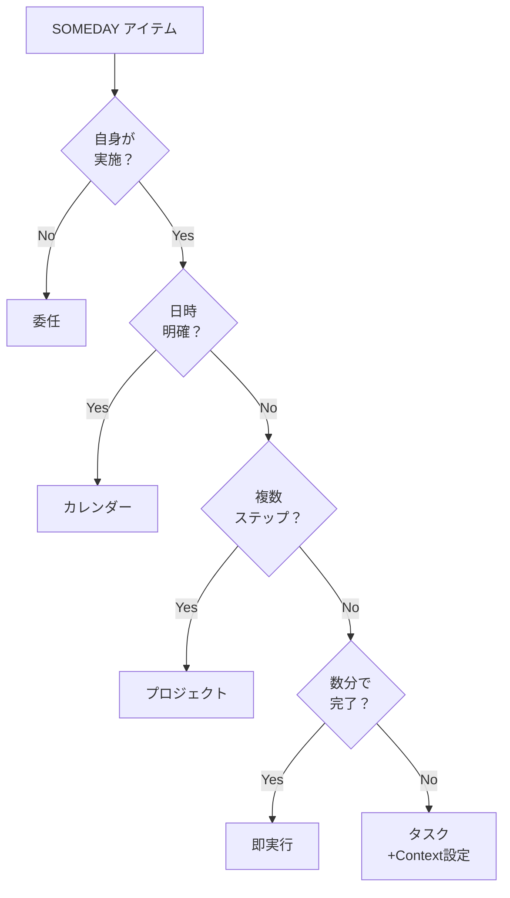
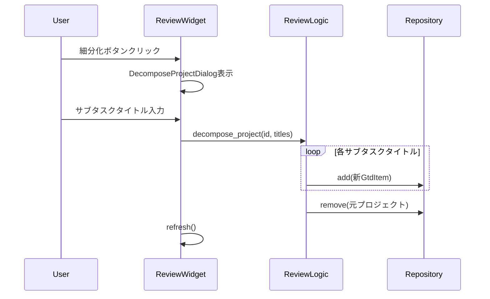
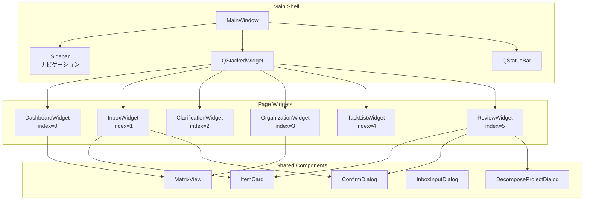
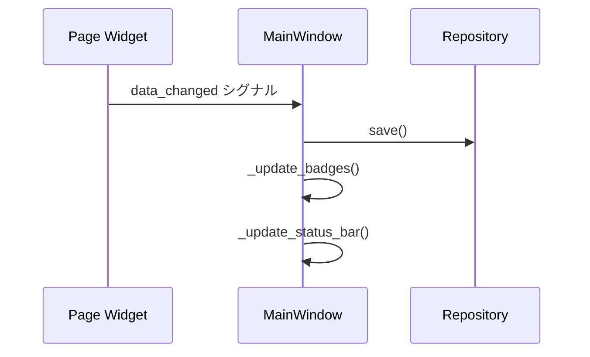

# MindFlow アーキテクチャ設計書

更新日: 2026-03-03

---

## 1. 概要

MindFlow は GTD（Getting Things Done）手法に基づくタスク管理デスクトップアプリケーションである。
PySide6 を使用した GUI で、収集・明確化・整理・実行・見直しの 5 フェーズを一貫して管理し、
重要度×緊急度マトリクスによるタスクの可視化を中核機能として提供する。

### 1.1 設計原則

| 原則 | 説明 |
|------|------|
| 3 層アーキテクチャ | Model → Logic → View の明確な分離 |
| GUI/ロジック分離 | ビジネスロジックは GUI フレームワークに非依存 |
| 単一責務 | 各ロジッククラスは 1 つの GTD フェーズのみ担当 |
| テスト容易性 | ロジック層は GUI なしで 100% テスト可能 |
| MECE | 各レイヤー・各コンポーネントの責務が漏れなくダブりなく設計 |

---

## 2. システム構成図

### 2.1 全体アーキテクチャ



### 2.2 レイヤー間の依存関係

```
GUI Layer → Logic Layer → Data Layer
   ↓              ↓            ↓
 PySide6依存    GUI非依存    フレームワーク非依存
```

- **上位→下位の一方向依存**: GUI は Logic を、Logic は Data を参照する
- **逆方向依存の禁止**: Logic が GUI を、Data が Logic を参照することはない
- **横断的参照の禁止**: 同一レイヤー内のクラスは他のフェーズのクラスを参照しない（DashboardWidget が OrganizationLogic を参照する例外あり）

---

## 3. Data Layer（モデル層）

### 3.1 コンポーネント構成

| コンポーネント | ファイル | 責務 |
|--------------|---------|------|
| GtdItem | models.py | タスクデータの構造定義 |
| Enum 群 | models.py | 状態・分類の値域定義 |
| GtdRepository | repository.py | データの永続化・CRUD 操作 |

### 3.2 データモデル（GtdItem）



#### フィールド詳細

| フィールド | 型 | デフォルト | 設定フェーズ | 説明 |
|-----------|---|----------|------------|------|
| id | str | uuid4() | 生成時 | 一意識別子 |
| title | str | "" | 収集 | タスクタイトル |
| created_at | str | now(UTC).iso | 生成時 | 作成日時（ISO 8601） |
| updated_at | str | now(UTC).iso | 更新時 | 更新日時（ISO 8601） |
| item_status | ItemStatus | INBOX | 収集 | 収集フェーズの分類先 |
| tag | Tag \| None | None | 明確化 | GTD 分類タグ |
| status | str \| None | None | 明確化/実行 | タグ別ステータス |
| locations | list[Location] | [] | 明確化 | 実施場所（タスク用） |
| time_estimate | TimeEstimate \| None | None | 明確化 | 所要時間（タスク用） |
| energy | EnergyLevel \| None | None | 明確化 | エネルギーレベル（タスク用） |
| importance | int \| None | None | 整理 | 重要度（1-10） |
| urgency | int \| None | None | 整理 | 緊急度（1-10） |
| note | str | "" | 任意 | 自由メモ |

#### GtdItem メソッド

| メソッド | 戻り値 | 判定ロジック |
|---------|--------|------------|
| touch() | void | updated_at を現在時刻に更新 |
| is_task() | bool | tag が None でない |
| is_done() | bool | tag のステータス Enum に "done" が存在し、status == "done" |
| needs_organization() | bool | tag != None かつ tag != PROJECT かつ importance/urgency が未設定 |
| needs_review() | bool | is_done() == True または tag == PROJECT |

### 3.3 Enum 体系

MECE に基づく Enum 分類体系。各 Enum は StrEnum を継承し、JSON シリアライズ時に値文字列として保存される。

#### 収集フェーズの分類（ItemStatus）



| メンバ | 値 | 説明 |
|--------|---|------|
| INBOX | "inbox" | 新規収集、未処理 |
| SOMEDAY | "someday" | いつかやるリスト |
| REFERENCE | "reference" | 参考資料、アクション不要 |

#### 明確化フェーズの分類（Tag）



| メンバ | 値 | ステータス Enum | 説明 |
|--------|---|---------------|------|
| DELEGATION | "delegation" | DelegationStatus | 他者に委任 |
| CALENDAR | "calendar" | CalendarStatus | 日時指定 |
| PROJECT | "project" | なし | 複数ステップ |
| DO_NOW | "do_now" | DoNowStatus | 即時実行（数分） |
| TASK | "task" | TaskStatus | 単一アクション |

#### タグ別ステータス Enum

| Enum | メンバ | 対応 Tag |
|------|--------|---------|
| DelegationStatus | NOT_STARTED, WAITING, DONE | DELEGATION |
| CalendarStatus | NOT_STARTED, REGISTERED | CALENDAR |
| DoNowStatus | NOT_STARTED, DONE | DO_NOW |
| TaskStatus | NOT_STARTED, IN_PROGRESS, DONE | TASK |

#### タスクコンテキスト Enum

| Enum | メンバ | 説明 |
|------|--------|------|
| Location | DESK, HOME, COMMUTE | 実施場所（複数選択可） |
| TimeEstimate | WITHIN_10MIN, WITHIN_30MIN, WITHIN_1HOUR | 所要時間 |
| EnergyLevel | LOW, MEDIUM, HIGH | エネルギーレベル |

### 3.4 Tag とステータスのマッピング

```python
TAG_STATUS_MAP = {
    Tag.DELEGATION: DelegationStatus,
    Tag.CALENDAR: CalendarStatus,
    Tag.DO_NOW: DoNowStatus,
    Tag.TASK: TaskStatus,
}
# Tag.PROJECT はステータス Enum を持たない
```

### 3.5 リポジトリ（GtdRepository）

#### 永続化仕様

| 項目 | 値 |
|------|---|
| 保存形式 | JSON |
| ファイルパス | ~/.mindflow/gtd_data.json |
| エンコーディング | UTF-8（ensure_ascii=False） |
| インデント | 2 スペース |
| 保存タイミング | data_changed シグナル発火時に即時保存 |

#### CRUD 操作

| メソッド | 引数 | 戻り値 | 説明 |
|---------|------|--------|------|
| load() | - | list[GtdItem] | JSON 読込（ファイル不在/破損時は空リスト） |
| save() | - | None | 全アイテムを JSON 書出 |
| add(item) | GtdItem | None | アイテム追加 |
| remove(item_id) | str | GtdItem \| None | ID 指定削除 |
| get(item_id) | str | GtdItem \| None | ID 指定取得 |
| get_by_status(status) | ItemStatus | list[GtdItem] | ステータス別取得 |
| get_by_tag(tag) | Tag | list[GtdItem] | タグ別取得 |
| get_tasks() | - | list[GtdItem] | tag != None の全アイテム |

---

## 4. Logic Layer（ロジック層）

### 4.1 コンポーネント構成

各ロジッククラスは GTD の 1 フェーズに対応し、コンストラクタで GtdRepository を受け取る。
ロジッククラスは **save() を呼ばない**（GUI 層の責務）。



### 4.2 CollectionLogic（収集フェーズ）

**責務**: Inbox へのアイテム追加・削除、参考資料/いつかやるへの振り分け

| メソッド | 引数 | 戻り値 | 説明 |
|---------|------|--------|------|
| add_to_inbox | title, note="" | GtdItem | 新規追加（空タイトルは ValueError） |
| delete_item | item_id | GtdItem \| None | 物理削除 |
| move_to_reference | item_id | GtdItem \| None | 参考資料へ移動 |
| move_to_someday | item_id | GtdItem \| None | いつかやるへ移動 |
| get_inbox_items | - | list[GtdItem] | INBOX アイテム一覧 |
| get_someday_items | - | list[GtdItem] | SOMEDAY アイテム一覧 |
| get_reference_items | - | list[GtdItem] | REFERENCE アイテム一覧 |

### 4.3 ClarificationLogic（明確化フェーズ）

**責務**: GTD 決定木に基づくタスク分類、コンテキスト設定

| メソッド | 引数 | 戻り値 | 説明 |
|---------|------|--------|------|
| get_pending_items | - | list[GtdItem] | SOMEDAY かつ tag==None |
| classify_as_delegation | item_id | GtdItem \| None | 委任タグ設定 |
| classify_as_calendar | item_id | GtdItem \| None | カレンダータグ設定 |
| classify_as_project | item_id | GtdItem \| None | プロジェクトタグ設定 |
| classify_as_do_now | item_id | GtdItem \| None | 即実行タグ設定 |
| classify_as_task | item_id, locations, time_estimate, energy | GtdItem \| None | タスクタグ+コンテキスト設定 |
| update_task_context | item_id, locations?, time_estimate?, energy? | GtdItem \| None | コンテキスト部分更新 |

#### GTD 決定木



### 4.4 OrganizationLogic（整理フェーズ）

**責務**: 重要度・緊急度の設定、4 象限マトリクスへの分類

| メソッド | 引数 | 戻り値 | 説明 |
|---------|------|--------|------|
| get_unorganized_tasks | - | list[GtdItem] | needs_organization() == True |
| set_importance_urgency | item_id, importance, urgency | GtdItem \| None | スコア設定（1-10） |
| get_matrix_quadrants | - | dict[str, list] | 4 象限分類結果 |

#### 4 象限分類ロジック

| 象限 | キー名 | 条件 |
|------|--------|------|
| Q1 | q1_urgent_important | importance > 5 AND urgency > 5 |
| Q2 | q2_not_urgent_important | importance > 5 AND urgency <= 5 |
| Q3 | q3_urgent_not_important | importance <= 5 AND urgency > 5 |
| Q4 | q4_not_urgent_not_important | importance <= 5 AND urgency <= 5 |

### 4.5 ExecutionLogic（実行フェーズ）

**責務**: タスクステータスの更新・遷移管理

| メソッド | 引数 | 戻り値 | 説明 |
|---------|------|--------|------|
| get_active_tasks | - | list[GtdItem] | tag!=PROJECT かつ is_done()==False |
| update_status | item_id, new_status | GtdItem \| None | ステータス変更（バリデーション付き） |
| get_available_statuses | item_id | list[str] \| None | 有効なステータス値一覧 |

### 4.6 ReviewLogic（見直しフェーズ）

**責務**: 完了タスクの処理、プロジェクトの細分化

| メソッド | 引数 | 戻り値 | 説明 |
|---------|------|--------|------|
| get_review_items | - | list[GtdItem] | needs_review() == True |
| delete_item | item_id | GtdItem \| None | 物理削除 |
| move_to_inbox | item_id | GtdItem \| None | 全フィールドリセットして INBOX へ |
| get_completed_count | - | int | 完了アイテム数 |
| get_project_count | - | int | プロジェクト数 |
| decompose_project | item_id, sub_task_titles | list[GtdItem] | プロジェクト細分化 |

#### プロジェクト細分化フロー



---

## 5. GUI Layer（ビュー層）

### 5.1 コンポーネント構成



### 5.2 MainWindow

**クラス**: MainWindow（QMainWindow 継承）

| 項目 | 値 |
|------|---|
| 最小サイズ | 1100 x 700 |
| 初期サイズ | 1280 x 800 |
| レイアウト | サイドバー（固定幅 180px） + QStackedWidget |

#### サイドバーナビゲーション

| ボタン | ラベル | スタックインデックス | バッジ表示 |
|--------|-------|-------------------|-----------|
| dashboard | Dashboard | 0 | なし |
| inbox | Inbox | 1 | INBOX アイテム数 |
| clarification | 明確化 | 2 | 分類待ちアイテム数 |
| organization | 整理 | 3 | 整理待ちアイテム数 |
| execution | 実行 | 4 | 未完了タスク数 |
| review | 見直し | 5 | 見直し対象数 |

#### シグナルフロー



#### ステータスバー

表示形式: `"Total: {全件数} | Tasks: {タスク数} | Done: {完了数}"`

### 5.3 ページウィジェット一覧

| ウィジェット | フェーズ | 使用ロジック | data_changed | 主な機能 |
|------------|--------|------------|-------------|---------|
| DashboardWidget | - | OrganizationLogic | No | サマリー表示、マトリクス |
| InboxWidget | 収集 | CollectionLogic | Yes | アイテム追加・振り分け |
| ClarificationWidget | 明確化 | ClarificationLogic | Yes | 決定木ウィザード |
| OrganizationWidget | 整理 | OrganizationLogic | Yes | スライダー評価 |
| TaskListWidget | 実行 | ExecutionLogic | Yes | ステータス変更 |
| ReviewWidget | 見直し | ReviewLogic | Yes | 完了処理・細分化 |

### 5.4 DashboardWidget

**レイアウト**:
- サマリーカード 4 枚（横並び）
- MatrixView（残りスペース）

| カード | ラベル | 色 | データソース |
|--------|-------|---|------------|
| inbox | Inbox | accent_blue | get_by_status(INBOX) |
| tasks | タスク | accent_green | get_tasks() |
| done | 完了 | accent_mauve | is_done() フィルタ |
| q1 | 緊急×重要 | q1_color | get_matrix_quadrants()["q1"] |

### 5.5 InboxWidget

**レイアウト**:
- ヘッダー + 説明文
- 入力行（QLineEdit + 追加ボタン）
- スクロール可能な ItemCard リスト

**アクションボタン**:

| アクション | 表示名 | 処理 |
|-----------|-------|------|
| someday | いつかやる | move_to_someday() |
| reference | 参考資料 | move_to_reference() |
| delete | 削除 | ConfirmDialog → delete_item() |

### 5.6 ClarificationWidget

**ステップ制ウィザード形式（4 ステップ）**:

| ステップ | 質問 | Yes の遷移 | No の遷移 |
|---------|------|----------|----------|
| 0 | 自身が実施しなくてはいけないですか？ | Step 1 | → 委任 |
| 1 | 日時が明確ですか？ | → カレンダー | Step 2 |
| 2 | 2 ステップ以上のアクションが必要ですか？ | → プロジェクト | Step 3 |
| 3 | 数分で実施できますか？ | → 即実行 | Context 入力フォーム表示 |

**Context 入力フォーム（Step 3 で No 選択時）**:

| 項目 | 入力形式 | デフォルト値 | 必須 |
|------|---------|------------|------|
| 実施場所 | チェックボックス（複数選択可） | デスク | 1 つ以上 |
| 所要時間 | コンボボックス | 30 分以内 | 必須 |
| 必要なエネルギー | ラジオボタン | 中 | 必須 |

### 5.7 OrganizationWidget

**レイアウト**: 左右分割

| パネル | 内容 | 最大幅 |
|--------|------|--------|
| 左 | 評価 UI（スライダー） | 500px |
| 右 | MatrixView プレビュー | 残り全幅 |

**スライダー仕様**:

| 項目 | 範囲 | 初期値 | ステップ |
|------|------|--------|---------|
| 重要度 | 1-10 | 5 | 1 |
| 緊急度 | 1-10 | 5 | 1 |

### 5.8 TaskListWidget

**フィルタ**:

| フィルタ値 | 表示名 | 対象 |
|-----------|-------|------|
| all | すべて | tag != PROJECT かつ未完了 |
| delegation | 依頼 | tag == DELEGATION |
| calendar | カレンダー | tag == CALENDAR |
| do_now | 即実行 | tag == DO_NOW |
| task | タスク | tag == TASK |

**ソート**: importance 降順 → urgency 降順（未設定は 0 扱い）

**TaskRow 構成**: タグバッジ + タイトル + スコア + ステータスコンボボックス

### 5.9 ReviewWidget

**アクションボタン（タグにより分岐）**:

| 条件 | アクション | 処理 |
|------|-----------|------|
| tag == PROJECT | 細分化 | DecomposeProjectDialog → decompose_project() |
| tag == PROJECT | 削除 | ConfirmDialog → delete_item() |
| それ以外（完了アイテム） | Inbox に戻す | move_to_inbox() |
| それ以外（完了アイテム） | 削除 | ConfirmDialog → delete_item() |

### 5.10 共有コンポーネント

#### ItemCard

再利用可能なカードウィジェット。アイテムの情報表示とアクションボタンを提供。

| シグナル | パラメータ | 説明 |
|---------|----------|------|
| action_triggered | (item_id: str, action: str) | アクションボタンクリック時 |

| 表示要素 | 条件 |
|---------|------|
| タイトル | 常時表示 |
| タグバッジ | tag != None |
| ステータス | status != None |
| スコア | importance/urgency 両方設定済み |
| ノート | note != "" |

#### MatrixView

QPainter による 4 象限散布図。

| 機能 | 説明 |
|------|------|
| 座標マッピング | X=緊急度(1-10)、Y=重要度(1-10) |
| 象限色分け | Q1=赤、Q2=青、Q3=オレンジ、Q4=灰 |
| 重複対策 | 同一座標のアイテムを Y 方向 18px オフセット |
| ラベル省略 | 12 文字超は "…" で省略 |
| ツールチップ | ドット/ラベルホバーでタイトル・重要度・緊急度を表示 |

#### ダイアログ

| ダイアログ | 用途 | 主要入力 |
|-----------|------|---------|
| ConfirmDialog | 削除確認 | 確認/キャンセル |
| InboxInputDialog | Inbox 入力（未使用） | タイトル + ノート |
| DecomposeProjectDialog | プロジェクト細分化 | 動的行追加（最大 20 行） |

---

## 6. スタイル設計

### 6.1 カラーパレット（Catppuccin Mocha ベース）

| カテゴリ | キー | カラーコード | 用途 |
|---------|------|------------|------|
| 背景 | bg_primary | #1e1e2e | メイン背景 |
| 背景 | bg_secondary | #313244 | サイドバー、カード |
| 背景 | bg_surface | #45475a | 入力フィールド |
| 背景 | bg_hover | #585b70 | ホバー状態 |
| テキスト | text_primary | #cdd6f4 | メインテキスト |
| テキスト | text_secondary | #a6adc8 | サブテキスト |
| テキスト | text_muted | #6c7086 | 薄いテキスト |
| アクセント | accent_blue | #89b4fa | プライマリボタン、タスクタグ |
| アクセント | accent_green | #a6e3a1 | タスクサマリー |
| アクセント | accent_red | #f38ba8 | 危険ボタン、即実行タグ |
| アクセント | accent_yellow | #f9e2af | プロジェクトタグ |
| アクセント | accent_mauve | #cba6f7 | 委任タグ、完了サマリー |
| アクセント | accent_teal | #94e2d5 | カレンダータグ |
| 象限 | q1_color | #f38ba8 | Q1（緊急×重要） |
| 象限 | q2_color | #89b4fa | Q2（重要） |
| 象限 | q3_color | #fab387 | Q3（緊急） |
| 象限 | q4_color | #6c7086 | Q4（その他） |
| ボーダー | border | #585b70 | 枠線 |

### 6.2 表示名マッピング

| マッピング | 用途 | 例 |
|-----------|------|---|
| TAG_DISPLAY_NAMES | タグの日本語名 | "delegation" → "依頼" |
| TAG_COLORS | タグの表示色 | "delegation" → accent_mauve |
| STATUS_DISPLAY_NAMES | ステータスの日本語名 | "not_started" → "未着手" |
| LOCATION_DISPLAY_NAMES | 場所の日本語名 | "desk" → "デスク" |
| TIME_ESTIMATE_DISPLAY_NAMES | 時間の日本語名 | "30min" → "30分以内" |
| ENERGY_DISPLAY_NAMES | エネルギーの日本語名 | "medium" → "中" |

---

## 7. ディレクトリ構成

```
src/study_python/gtd/
├── __init__.py              # パッケージ定義
├── app.py                   # エントリポイント（main関数）
├── models.py                # データモデル・Enum定義
├── repository.py            # JSON永続化
├── logic/                   # ビジネスロジック
│   ├── __init__.py
│   ├── collection.py        # 収集フェーズ
│   ├── clarification.py     # 明確化フェーズ
│   ├── organization.py      # 整理フェーズ
│   ├── execution.py         # 実行フェーズ
│   └── review.py            # 見直しフェーズ
├── gui/                     # GUI
│   ├── __init__.py
│   ├── styles.py            # カラー・QSS・表示名
│   ├── main_window.py       # メインウィンドウ
│   ├── widgets/             # ページウィジェット
│   │   ├── __init__.py
│   │   ├── dashboard.py     # ダッシュボード
│   │   ├── inbox.py         # 収集
│   │   ├── clarification.py # 明確化
│   │   ├── organization.py  # 整理
│   │   ├── task_list.py     # 実行
│   │   └── review.py        # 見直し
│   └── components/          # 共有コンポーネント
│       ├── __init__.py
│       ├── item_card.py     # ItemCard
│       ├── dialogs.py       # ダイアログ群
│       └── matrix_view.py   # マトリクスビュー
```

---

## 8. ログ設計

### 8.1 ログ設定

| 項目 | 値 |
|------|---|
| フォーマット | `{timestamp}.{ms} \| {level} \| {module}:{func}:{line} \| {message}` |
| ファイル出力先 | logs/app_YYYY-MM-DD.log |
| ローテーション | 最大 10MB、保持 30 世代 |
| ログレベル | 本番: INFO、開発: DEBUG |

### 8.2 モジュール別ログ出力方針

| モジュール | 主なログ内容 |
|-----------|------------|
| repository.py | 読込/保存の成否、破損ファイル検知 |
| 各 Logic | メソッド実行、バリデーションエラー、状態遷移 |
| 各 Widget | 未使用（Logic 層で記録） |
