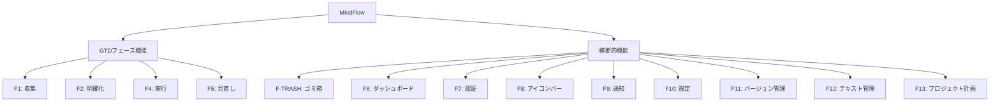

# MindFlow 機能仕様書 (FastAPI Web版)

更新日: 2026-04-07 (v2.0.0)

---

## 1. 概要

本書は MindFlow FastAPI Webアプリケーションの全機能を MECE（漏れなくダブりなく）に仕様化したものである。
GTD の 4 フェーズ（収集・明確化・実行・見直し）と横断的機能（ダッシュボード・認証・通知・アイコンバー・設定・ゴミ箱）を網羅する。

### 1.1 機能分類体系



---

## 2. F1: 収集フェーズ (Collection)

### 2.1 機能概要

ユーザーの頭の中にあるタスク・アイデアをすべて Inbox に登録する。
4 つのクイック分類ボタンで直接分類することも可能。

### 2.2 URL パス

| URL | メソッド | 説明 |
|-----|---------|------|
| `/inbox` | GET | Inbox ページ表示 |
| `/inbox/add` | POST | アイテム追加（HTMX） |
| `/inbox/{item_id}/delete` | POST | アイテム削除（HTMX） |
| `/inbox/{item_id}/order_up` | POST | 順序を上に移動（HTMX） |
| `/inbox/{item_id}/order_down` | POST | 順序を下に移動（HTMX） |
| `/inbox/{item_id}/classify` | POST | クイック分類（HTMX） |
| `/inbox/add_unclassified` | POST | 未分類を追加（HTMX） |
| `/inbox/process_all` | POST | 全アイテムを明確化フェーズへ送信 |

### 2.3 テンプレートファイル

- `inbox.html` - メインページ（4 クイック分類ボタン + アイテムリスト）
- `partials/item_list.html` - アイテムリスト（再利用パーシャル）

### 2.4 ルーターファイル

- `src/study_python/gtd/web/routers/inbox.py`

### 2.5 ロジックファイル

- `src/study_python/gtd/logic/collection.py` (CollectionLogic)
- リポジトリ: `src/study_python/gtd/web/db_repository.py` (DbGtdRepository)

### 2.6 機能詳細

#### F1-1: アイテム追加

**ユーザー操作**:
1. Inbox ページで入力欄にテキストを入力
2. 「追加」ボタンをクリック or Enter キーを押す

**URL**: POST `/inbox/add`

**フォーム入力**:
- `title` (str): アイテムのタイトル（最大 500 文字）

**実行処理**:
1. title をトリム
2. GtdItem を生成（item_status=INBOX）
3. リポジトリに追加、DB 保存

**結果**:
- アイテムリストに新規アイテムが表示される
- 入力欄がクリアされ、フォーカスが戻る
- HTMX で `#item-list` を更新

**バリデーション**:
- タイトルが空白の場合、何も行わない

#### F1-2: アイテム削除

**ユーザー操作**: アイテムカード上の「削除」ボタンをクリック

**URL**: POST `/inbox/{item_id}/delete`

**実行処理**:
1. 指定された item_id のアイテムを削除

**結果**:
- アイテムリストから削除
- HTMX で `#item-list` を更新

#### F1-3: アイテムの順序変更

**ユーザー操作**: プロジェクト派生アイテムの「▲」「▼」ボタンをクリック

**URL**: 
- POST `/inbox/{item_id}/order_up` - 順序を上に
- POST `/inbox/{item_id}/order_down` - 順序を下に

**実行処理**:
- CollectionLogic.reorder_item() で order を更新

**結果**:
- アイテムリストが並び替わる
- HTMX で `#item-list` を更新

#### F1-4: クイック分類ボタン

**表示位置**: Inbox ページのアイテムリスト上部に 4 つのボタン

**4 つの分類ボタン**:

| ボタン | タグ | 説明 |
|--------|------|------|
| 依頼 | DELEGATION | 誰かに委譲する |
| プロジェクト | PROJECT | 2ステップ以上のアクション |
| 今すぐ | DO_NOW | 数分で完了 |
| タスク | TASK | スケジュール予約が必要 |

**URL**: POST `/inbox/{item_id}/classify`

**フォーム入力**:
- `item_id` (str): 分類対象のアイテム ID
- `tag` (str): 分類タグ（delegation/project/do_now/task）

**実行処理**:
1. アイテムに指定タグを設定
2. item_status を SOMEDAY に変更
3. 必要に応じてコンテキスト（locations, time_estimate, energy）を自動設定

**結果**:
- HTMX で `#item-list` を更新
- 分類済みアイテムは分類対象から除外

#### F1-5: 未分類追加ボタン

**URL**: POST `/inbox/add_unclassified`

**説明**: ユーザーが後で明確化フェーズで分類することを選択

**フォーム入力**:
- `title` (str): アイテムのタイトル

**実行処理**:
1. item_status=SOMEDAY でアイテムを生成（tag=None）
2. リポジトリに追加、DB 保存

**結果**:
- アイテムリストに追加
- HTMX で `#item-list` を更新

#### F1-6: 全アイテム処理

**ユーザー操作**: 「全て処理する」ボタンをクリック

**URL**: POST `/inbox/process_all`

**実行処理**:
1. Inbox 内の全アイテムを SOMEDAY ステータスに変更（分類済みはスキップ）
2. 未分類アイテムを明確化フェーズへ送信

**結果**:
- `/clarification` にリダイレクト（HTTP 303）

---

## 3. F2: 明確化フェーズ (Clarification)

### 3.1 機能概要

SOMEDAY かつ tag=None のアイテムを 4 つのボタンベースの分類システムで分類する。
従来の Yes/No 質問フローは廃止され、直接ボタンクリックで分類。

### 3.2 URL パス

| URL | メソッド | 説明 |
|-----|---------|------|
| `/clarification` | GET | 明確化ページ表示 |
| `/clarification/classify` | POST | ボタン分類（HTMX） |
| `/clarification/skip` | POST | このアイテムをスキップ（HTMX） |
| `/clarification/delete` | POST | このアイテムを削除（HTMX） |

### 3.3 テンプレートファイル

- `clarification.html` - メインページ（4 分類ボタン + スキップ/削除）
- `partials/clarification_item.html` - 分類対象アイテム表示（再利用パーシャル）

### 3.4 ルーターファイル

- `src/study_python/gtd/web/routers/clarification.py`

### 3.5 ロジックファイル

- `src/study_python/gtd/logic/clarification.py` (ClarificationLogic)

### 3.6 機能詳細

#### 分類ボタンレイアウト

```
┌─────────────────────────────────────┐
│  アイテム: "[タイトル]"              │
│                                      │
│  [ 依頼 ]  [ プロジェクト ]          │
│  [ 今すぐ ]  [ タスク ]              │
│                                      │
│  [ スキップ ] [ 削除 ]               │
└─────────────────────────────────────┘
```

#### F2-1: 分類ボタン処理

**URL**: POST `/clarification/classify`

**フォーム入力**:
- `item_id` (str): 分類対象のアイテム ID
- `tag` (str): 選択されたタグ（delegation/project/do_now/task）

**実行処理**:
1. タグを設定
2. タグに応じてコンテキスト情報を設定:
   - DELEGATION: locations=[], time_estimate=None, energy=None
   - PROJECT: locations=[], time_estimate=None, energy=None
   - DO_NOW: locations=["desk"], time_estimate="within_10min", energy="low"
   - TASK: locations=["desk"], time_estimate="within_30min", energy="medium"
3. item_status を SOMEDAY のままに保持
4. 次の未分類アイテムを表示

**結果**:
- `partials/clarification_item.html` を HTMX で返す
- 次のアイテムに自動遷移
- すべて完了時は `/execution` にリダイレクト

#### F2-2: スキップ機能

**URL**: POST `/clarification/skip`

**フォーム入力**:
- `item_id` (str): スキップ対象のアイテム ID

**実行処理**:
1. アイテムを tag=None のまま SOMEDAY に保持
2. 次の未分類アイテムを表示

**結果**:
- HTMX で `#clarification_item` を更新
- 次のアイテムへ遷移

#### F2-3: 削除機能

**URL**: POST `/clarification/delete`

**フォーム入力**:
- `item_id` (str): 削除対象のアイテム ID

**実行処理**:
1. アイテムを物理削除
2. 次の未分類アイテムを表示

**結果**:
- HTMX で `#clarification_item` を更新
- 次のアイテムへ遷移

---

## 4. F4: 実行フェーズ (Execution)

### 4.1 機能概要

タグ付け済みの未完了タスクを一覧表示し、ステータスを変更する。

### 4.2 URL パス

| URL | メソッド | 説明 |
|-----|---------|------|
| `/execution` | GET | 実行ページ表示 |
| `/execution/{item_id}/set_status` | POST | ステータス変更（HTMX） |

### 4.3 テンプレートファイル

- `execution.html` - メインページ（タスク一覧）
- `partials/task_list.html` - タスクリスト（再利用パーシャル）

### 4.4 ルーターファイル

- `src/study_python/gtd/web/routers/execution.py`

### 4.5 ロジックファイル

- `src/study_python/gtd/logic/execution.py` (ExecutionLogic)

### 4.6 機能詳細

#### F4-1: タスクリスト表示

**フィルタ対象**:
- tag != None かつ tag != PROJECT
- item_status != REFERENCE
- 未完了アイテム

**ソート順序**:
1. 重要度（降順、未設定は 0）
2. 緊急度（降順、未設定は 0）

**プロジェクト分解表示**:
- 親プロジェクト ID でグループ化
- グループ内を `order` でソート
- グループにプロジェクトタイトルを表示（オプション）
- 各アイテムにバッジ（#1, #2...）表示

**TaskRow 表示要素**:

| 要素 | 幅 | 説明 |
|------|---|------|
| タグバッジ | 固定 80px | タグ色背示名 |
| タイトル | 可変（stretch） | アイテムタイトル |
| スコア | 可変 | "重N 緊N"（設定済み時のみ） |
| ステータス | 可変 | QComboBox（Project 以外） |

#### F4-2: ステータス変更

**URL**: POST `/execution/{item_id}/status`

**フォーム入力**:
- `status` (str): 新しいステータス

**ステータス遷移**:

| タグ | 選択可能ステータス |
|------|-----------------|
| DELEGATION | not_started, waiting, done |
| DO_NOW | not_started, done |
| TASK | not_started, in_progress, done |

注: v2.0.0 で CALENDAR タグは廃止され、TASK に統合されました。

**実行処理**:
1. ExecutionLogic.update_status() でステータスを更新

**結果**:
- `partials/task_list.html` を HTMX で返す
- タスクリストが更新

---

## 5. F5: 見直しフェーズ (Review)

### 5.1 機能概要

完了したタスクとプロジェクトを見直し、
削除（物理削除）・Inbox 戻し・プロジェクト細分化の処理を行う。

### 5.2 URL パス

| URL | メソッド | 説明 |
|-----|---------|------|
| `/review` | GET | 見直しページ表示 |
| `/review/{item_id}/delete` | POST | アイテム物理削除（HTMX） |
| `/review/{item_id}/to_inbox` | POST | Inbox に戻す（HTMX） |
| `/review/{item_id}/decompose` | POST | プロジェクト分解（HTMX） |

### 5.3 テンプレートファイル

- `review.html` - メインページ
- `partials/item_list.html` - アイテムリスト（再利用パーシャル）

### 5.4 ルーターファイル

- `src/study_python/gtd/web/routers/review.py`

### 5.5 ロジックファイル

- `src/study_python/gtd/logic/review.py` (ReviewLogic)

### 5.6 機能詳細

#### F5-1: 完了タスク Inbox 戻し

**URL**: POST `/review/{item_id}/to_inbox`

**実行処理**:
1. すべてのフィールドをリセット
   - item_status = INBOX
   - tag = None
   - status = None
   - locations = []
   - time_estimate = None
   - energy = None
   - parent_project_id / parent_project_title / order は保持（プロジェクト紐付けを維持）

**結果**:
- アイテムが Inbox に戻る
- 見直し対象から削除
- HTMX で `#item-list` を更新

#### F5-2: アイテム物理削除

**URL**: POST `/review/{item_id}/delete`

**実行処理**:
1. アイテムを物理削除（ゴミ箱に移動しない）

**結果**:
- 見直し対象から削除
- HTMX で `#item-list` を更新

#### F5-3: プロジェクト分解

**URL**: POST `/review/{item_id}/decompose`

**フォーム入力**:
- `titles` (str): サブタスクのタイトル（改行区切り）

**実行処理**:
1. 各タイトルで新規 GtdItem（item_status=INBOX）を生成
2. parent_project_id を設定（元プロジェクト ID）
3. order を自動採番
4. 元プロジェクトを削除

**バリデーション**:
- タイトルは 1 件以上、最大 20 件

**結果**:
- プロジェクトが消える
- サブタスクが Inbox に登録される
- HTMX で `#item-list` を更新

---

## 6. F-TRASH: ゴミ箱 (Trash)

### 6.1 機能概要

削除されたアイテムを一時的に保管し、30 日後に自動削除。
復元または永久削除の操作が可能。

### 6.2 URL パス

| URL | メソッド | 説明 |
|-----|---------|------|
| `/trash` | GET | ゴミ箱ページ表示 |
| `/trash/{item_id}/restore` | POST | アイテム復元（HTMX） |
| `/trash/{item_id}/delete_permanently` | POST | 永久削除（HTMX） |

### 6.3 テンプレートファイル

- `trash.html` - メインページ（ゴミ箱リスト）
- `partials/trash_item.html` - ゴミ箱アイテム表示（再利用パーシャル）

### 6.4 ルーターファイル

- `src/study_python/gtd/web/routers/trash.py`

### 6.5 ロジックファイル

- `src/study_python/gtd/logic/trash.py` (TrashLogic)

### 6.6 機能詳細

#### F-TRASH-1: ゴミ箱リスト表示

**表示対象**:
- item_status = TRASH のアイテム

**ソート順序**:
- 削除日時（新しい順）

**表示要素**:

| 要素 | 説明 |
|------|------|
| タイトル | アイテムのタイトル |
| 削除日 | ISO 形式の削除日時 |
| 残り日数 | 自動削除までの残り日数（最大 30 日） |
| 復元ボタン | アイテムを復元 |
| 削除ボタン | 永久削除 |

#### F-TRASH-2: アイテム復元

**URL**: POST `/trash/{item_id}/restore`

**実行処理**:
1. item_status を復元前のステータスに戻す
   - 情報がない場合は INBOX

**結果**:
- アイテムがゴミ箱から復元
- 元のフェーズに戻る
- HTMX で `#trash-list` を更新

#### F-TRASH-3: 永久削除

**URL**: POST `/trash/{item_id}/delete_permanently`

**実行処理**:
1. データベースからアイテムを完全削除

**結果**:
- ゴミ箱から削除
- HTMX で `#trash-list` を更新

#### F-TRASH-4: 30 日自動削除

**実行スケジュール**: バックグラウンドジョブ（cron など）で実行

**処理**:
1. created_at から 30 日以上経過したアイテム（item_status=TRASH）を検索
2. データベースから完全削除

---

## 7. F6: ダッシュボード (Dashboard)

### 7.1 機能概要

アプリケーション全体のサマリーと次のアクション ガイドを表示するトップページ。

### 7.2 URL パス

| URL | メソッド | 説明 |
|-----|---------|------|
| `/` | GET | ダッシュボード表示 |

### 7.3 テンプレートファイル

- `dashboard.html` - メインページ

### 7.4 ルーターファイル

- `src/study_python/gtd/web/routers/dashboard.py`

### 7.5 機能詳細

#### F6-1: サマリーカード

**4 つのカード**（シンプル統計のみ、Eisenhower マトリクスなし）:

| カード | ラベル | 値 |
|--------|-------|---|
| inbox | Inbox | INBOX ステータスの件数 |
| tasks | アクティブタスク | tag != None かつ tag != PROJECT の件数 |
| completed | 完了 | 完了済みアイテムの件数 |
| total | 総数 | 全アイテムの件数 |

#### F6-2: Next Action Guide

**優先度ロジック**（上から順に判定）:

1. **Inbox あり**: "N件 収集してください" → `/inbox`
2. **明確化待ち**: "N件 分類してください" → `/clarification`
3. **見直し待ち**: "N件 見直してください" → `/review`
4. **アクティブタスク なし**: "やることがなくなりました" → `/inbox`
5. **Q1 タスク あり**: "次のアクション: [最優先タスク名]" → `/execution`
6. **その他**: "N個のアクティブタスク" → `/execution`

---

## 8. F7: 認証 (Authentication)

### 8.1 機能概要

ユーザーの登録・ログイン・セッション管理を行う。

### 8.2 URL パス

| URL | メソッド | 説明 |
|-----|---------|------|
| `/login` | GET | ログインページ表示 |
| `/login` | POST | ログイン処理 |
| `/register` | GET | 登録ページ表示 |
| `/register` | POST | 登録処理 |
| `/logout` | GET | ログアウト |

### 8.3 テンプレートファイル

- `login.html` - ログインページ
- `register.html` - 登録ページ

### 8.4 ルーターファイル

- `src/study_python/gtd/web/routers/auth.py`

### 8.5 セキュリティ仕様

**パスワードハッシング**: bcrypt

**セッション**:
- SameSite=Lax
- HTTPS Only (本番環境)
- Max Age: 86400 秒（24 時間）

**レート制限**:
- ログイン試行: 5 回 / 5 分（クライアント IP ごと）
- 制限時: HTTP 429 + エラーメッセージ表示

**バリデーション**:
- ユーザー名: 3-50 文字、英数字とアンダースコアのみ
- パスワード: 8 文字以上、英大小+数字+特殊文字を含む

---

## 9. F8: アイコンバー (Icon Bar)

### 9.1 機能概要

トップバーに 6 つのアイコンボタンを表示し、各種モーダルを開く。
新しく「ゴミ箱」アイコンが追加された。

### 9.2 URL パス（アイコンバー API）

| URL | メソッド | 説明 |
|-----|---------|------|
| `/api/iconbar/notifications` | GET | 通知一覧（HTMX） |
| `/api/iconbar/notifications/{notif_id}` | GET | 通知詳細（HTMX） |
| `/api/iconbar/badge_count` | GET | 通知バッジ数 |
| `/api/iconbar/achievements` | GET | 実績ページ（HTMX） |
| `/api/iconbar/contact` | GET | お問い合わせページ（HTMX） |
| `/api/iconbar/releases` | GET | リリース情報ページ |

### 9.3 アイコン仕様

| 位置 | アイコン | タイトル | 説明 |
|------|---------|---------|------|
| 1 | 本 | チュートリアル | GTD フロー + 4 ステップ説明（F3 削除） |
| 2 | ? | ヘルプ | About + FAQ |
| 3 | 受信箱 | 通知 | 通知一覧（バッジ付き） |
| 4 | 問い合わせ | お問い合わせ | Coming Soon |
| 5 | 実績 | 実績 | マイルストーン表示 |
| 6 | ゴミ箱 | ゴミ箱 | ゴミ箱ページへのリンク（/trash） |

### 9.4 チュートリアルモーダル (`modal-tutorial.html`)

**2 タブ構成**:

1. **Overview タブ**
   - GTD フロー（4 フェーズ）の説明（F3: 整理は削除）
   - 各フェーズのアイコン + 簡単な説明文

2. **How-to タブ**
   - 4 ステップ説明（従来 5 ステップ）
   - 各ステップのスクリーンショット + テキスト

### 9.5 ヘルプモーダル (`modal_help.html`)

**2 タブ構成**:

1. **About タブ**
   - セキュリティ情報
   - 開発哲学（"脳内デフラグ"、"高機能をシンプルに"）
   - 開発者リンク
   - 更新ボタン（releases.json 確認）

2. **FAQ タブ**
   - 5 Q&A（labels.json から動的に読み込み）

---

## 10. F9: 通知 (Notifications)

### 10.1 機能概要

リリース情報と実績達成を自動で通知する。

### 10.2 URL パス

（F8 の `/api/iconbar/notifications` 参照）

### 10.3 通知タイプ

| タイプ | 説明 | トリガー |
|-------|------|---------|
| system | システム通知 | releases.json 更新 |
| achievement | 実績通知 | タスク/プロジェクト完了時 |

### 10.4 実績マイルストーン

| マイルストーン | 条件 | 説明 |
|-------------|------|------|
| first_task | completed_count >= 1 | 初めてのタスク完了 |
| ten_tasks | completed_count >= 10 | 10 個完了 |
| fifty_tasks | completed_count >= 50 | 50 個完了 |
| hundred_tasks | completed_count >= 100 | 100 個完了 |
| inbox_clear | inbox_count == 0 | Inbox クリア |

### 10.5 通知表示

**通知一覧**:
- 時系列（新しい順）
- 既読/未読 ステータス
- 未読バッジ数表示

**通知詳細**:
- タイプバッジ（色分け）
- 日時
- メッセージ

---

## 11. F10: 設定 (Settings)

### 11.1 機能概要

アプリケーション設定を管理する。

### 11.2 URL パス

| URL | メソッド | 説明 |
|-----|---------|------|
| `/settings` | GET | 設定ページ表示 |

### 11.3 テンプレートファイル

- `settings.html` - メインページ

### 11.4 ルーターファイル

- `src/study_python/gtd/web/routers/settings_web.py`

### 11.5 設定項目

#### 外観

- **ダークモード**: Catppuccin Mocha テーマ（デフォルト）
- **ライトモード**: （未実装オプション）

#### 通知設定

- **リリース通知**: ON/OFF トグル
- **実績通知**: ON/OFF トグル

#### アプリ情報

- **バージョン**: releases.json から取得
- **最終更新**: releases.json の最新リリース日時
- **テック スタック**: FastAPI, SQLAlchemy, HTMX, Catppuccin

---

## 12. F11: バージョン管理 (Release Management)

### 12.1 機能概要

releases.json を単一の情報源として、バージョン情報を一元管理する。

### 12.2 ファイルパス

- `src/study_python/gtd/web/static/releases.json`

### 12.3 releases.json スキーマ

```json
{
  "current_version": "2.0.0",
  "releases": [
    {
      "version": "2.0.0",
      "date": "2026-04-07T00:00:00Z",
      "title": "Clarification UI Redesign",
      "summary": "F2 明確化フェーズを 4 ボタン分類に変更。F3 整理フェーズを削除。ゴミ箱機能追加。",
      "highlight": "4-button clarification, trash feature, simplified dashboard"
    }
  ]
}
```

### 12.4 バージョン表示

| 場所 | 表示内容 |
|------|---------|
| 設定ページ | 現在のバージョン + 最終更新日 |
| ヘルプモーダル | 更新ボタン（releases.json 確認） |
| システム通知 | リリース情報の自動配信 |

---

## 13. F12: テキスト管理

### 13.1 機能概要

すべてのユーザー向けテキストを labels.json で管理。
コード内にハードコーディングしない。

### 13.2 ファイルパス

- `src/study_python/gtd/web/static/labels.json`

### 13.3 labels.json 構造

```json
{
  "app": {
    "name": "MindFlow"
  },
  "nav": {
    "dashboard": "ダッシュボード",
    "inbox": "収集",
    "clarification": "明確化",
    ...
  },
  "inbox": {
    "title": "収集 - Inbox",
    "description": "気になることをすべて書き出しましょう",
    "placeholder": "新しいアイテムを入力...",
    "add_button": "追加",
    "delete_button": "削除",
    "classify_buttons": {
      "delegation": "依頼",
      "project": "プロジェクト",
      "do_now": "今すぐ",
      "task": "タスク"
    }
  },
  ...
}
```

### 13.4 テンプレートでの使用

```html
<h2 class="page-title">{{ labels.inbox.title }}</h2>
<p class="page-desc">{{ labels.inbox.description }}</p>
```

### 13.5 Python での使用

```python
from study_python.gtd.web.labels import load_labels

L = load_labels()
message = L["inbox"]["title"]
```

---

## 14. F13: プロジェクト計画 (Project Planning Wizard)

### 14.1 機能概要

完了したプロジェクトをさらに詳細に計画する（Natural Planning Model）。
F5 見直しフェーズの一部として機能。

### 14.2 URL パス

| URL | メソッド | 説明 |
|-----|---------|------|
| `/review/{item_id}/plan` | GET | プロジェクト計画ウィザード表示 |
| `/review/{item_id}/plan_step` | POST | ステップ処理（HTMX） |

### 14.3 テンプレートファイル

- `partials/plan_step.html` - 計画ステップ表示（再利用パーシャル）

### 14.4 ロジックファイル

- `src/study_python/gtd/logic/review.py` (ReviewLogic の一部)

### 14.5 機能詳細

#### F13-1: プロジェクト計画（Natural Planning Model）

**6 ステップウィザード**:

| ステップ | タイトル | 入力 |
|---------|---------|------|
| 1 | Purpose（目的） | テキストエリア |
| 2 | Outcome（成果） | テキストエリア |
| 3 | Brainstorm（ブレーンストーム） | テキストエリア（アイデア羅列） |
| 4 | Organize（整理） | サブタスク入力（改行区切り） |
| 5 | Support Location（支援拠点） | テキストエリア（リソース・場所） |
| 6 | Next Actions（次のアクション） | サブタスク入力（改行区切り） |

**テンプレート**: `partials/plan_step.html`

---

## 15. UI 共通仕様

### 15.1 ナビゲーション

**サイドバー**:
- MindFlow ロゴ
- 4 つの主要ページリンク（ダッシュボード・収集・明確化・実行・見直し）※整理フェーズは v2.0.0 で削除
- 設定 + ログアウトリンク

**トップバー**:
- ハンバーガーメニュー（モバイル）
- 6 つのアイコンボタン（通知・ヘルプ・ゴミ箱等）

### 15.2 レスポンシブデザイン

- **デスクトップ**: サイドバー常時表示
- **モバイル**: ハンバーガーメニュー（オーバーレイ）

### 15.3 スタイル・カラー

**テーマ**: Catppuccin Mocha
- bg_surface: #313244
- bg_secondary: #1e1e2e
- accent_blue: #89b4fa
- accent_red: #f38ba8
- accent_green: #a6e3a1
- accent_mauve: #cba6f7

### 15.4 モーダル

**構造**:
- オーバーレイ（クリックで閉じる）
- ヘッダー（タイトル + 閉じるボタン）
- ボディ（コンテンツ）

**HTMX 統合**: `openModalAndLoad(modalId, url)` で非同期ロード

---

## 16. HTMX 統合パターン

### 16.1 フォーム POST

```html
<form hx-post="/inbox/add" hx-target="#item-list" hx-swap="innerHTML">
    <input name="title" ...>
    <button type="submit">追加</button>
</form>
```

### 16.2 パーシャル更新

```html
<div id="item-list">
    
</div>
```

**サーバー返却**: HTML フラグメント（`partials/item_list.html` をレンダリング）

### 16.3 リダイレクト

```python
return RedirectResponse(url="/clarification", status_code=303)
```

### 16.4 バッジ更新

```html
<span id="inbox-badge"></span>
<script>
    fetch('/api/iconbar/badge_count').then(r => r.text()).then(html => {
        document.getElementById('inbox-badge').innerHTML = html;
    });
</script>
```

---

## 17. データベーススキーマ（参考）

### 17.1 GtdItemRow

| カラム | 型 | 説明 |
|--------|---|------|
| id | VARCHAR(36) | PK |
| user_id | VARCHAR(36) | FK（マルチテナント分離） |
| title | VARCHAR(500) | アイテムタイトル |
| item_status | VARCHAR(20) | inbox/someday/reference/trash |
| tag | VARCHAR(20) | delegation/project/do_now/task（v2.0.0 で calendar 廃止） |
| status | VARCHAR(20) | not_started/in_progress/waiting/done |
| locations_json | TEXT | ["desk", "home"] |
| time_estimate | VARCHAR(20) | 10min/30min/1hour |
| energy | VARCHAR(20) | low/medium/high |
| project_purpose | TEXT | プロジェクト計画: 目的 |
| project_outcome | TEXT | プロジェクト計画: 望ましい結果 |
| project_support_location | TEXT | プロジェクト計画: サポート資料の場所 |
| is_next_action | BOOLEAN | プロジェクト計画: ネクストアクションフラグ |
| deadline | VARCHAR(50) | 期限（ISO 形式） |
| parent_project_id | VARCHAR(36) | プロジェクト派生時の親 ID |
| parent_project_title | VARCHAR(500) | 親プロジェクト名 |
| order (item_order) | INT | グループ内の並び順 |
| note | TEXT | メモ |
| created_at | VARCHAR(50) | ISO 形式 |
| updated_at | VARCHAR(50) | ISO 形式 |
| deleted_at | VARCHAR(50) | ゴミ箱移動日時（trash 時のみ設定、ISO 形式） |

注: v2.0.0 で `importance`, `urgency` カラムは廃止されました。

### 17.2 NotificationRow

| カラム | 型 | 説明 |
|--------|---|------|
| id | VARCHAR(36) | PK |
| user_id | VARCHAR(36) | FK |
| notification_type | VARCHAR(20) | system/achievement |
| title | VARCHAR(500) | 通知タイトル |
| message | TEXT | 通知メッセージ |
| is_read | BOOLEAN | 既読フラグ |
| created_at | VARCHAR(50) | ISO 形式 |

---

## 18. エラーハンドリング

### 18.1 HTTP ステータスコード

| コード | 状況 |
|--------|------|
| 200 | 成功 |
| 302 | リダイレクト（ページ遷移） |
| 303 | リダイレクト（POST 後） |
| 400 | バリデーション エラー |
| 401 | 未認証 |
| 429 | レート制限（ログイン試行） |
| 500 | サーバー エラー |

### 18.2 エラーメッセージ

- バリデーション エラー: フォーム入力でメッセージ表示
- レート制限: "ログイン試行回数が上限に達しました"
- 404: 指定リソースが見つかりません

---

## 19. 完了条件チェックリスト

- [x] 4 フェーズ（収集・明確化・実行・見直し）の URL/テンプレート/ロジック仕様を記載
- [x] F2 明確化フェーズを 4 ボタン分類に完全変更
- [x] F3 整理フェーズを削除
- [x] F-TRASH ゴミ箱機能を追加
- [x] F1 Inbox にクイック分類ボタンを追加
- [x] ダッシュボード・認証・通知・アイコンバー・設定・ゴミ箱の URL/機能仕様を記載
- [x] HTMX パーシャル更新パターンを記載
- [x] プロジェクト分解・計画ウィザードを記載
- [x] レート制限・セッション管理・パスワードハッシングを記載
- [x] 通知マイルストーン・実績バッジを記載
- [x] labels.json・releases.json の管理仕様を記載
- [x] アイコンバーにゴミ箱アイコンを追加（位置 6）

---

## 20. ドキュメント更新履歴

| 日時 | 変更内容 |
|------|---------|
| 2026-04-07 | v2.0.0: F2 明確化フェーズを 4 ボタン分類に完全変更。F3 整理フェーズ削除。F-TRASH ゴミ箱機能追加。F1 クイック分類ボタン追加。アイコンバー 6 番目にゴミ箱追加。ダッシュボードから Eisenhower マトリクス削除。フェーズ数を 5 から 4 に変更。|
| 2026-04-06 | FastAPI Web版に完全置き換え。PySide6 デスクトップ版から Web アーキテクチャに変更。 |
| 2026-03-03 | （前版） |
