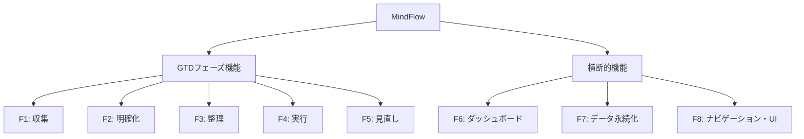

# MindFlow 機能仕様書

更新日: 2026-03-03

---

## 1. 概要

本書は MindFlow アプリケーションの全機能を MECE（漏れなくダブりなく）に仕様化したものである。
GTD の 5 フェーズ（収集・明確化・整理・実行・見直し）と横断的機能（ダッシュボード・永続化・UI）を網羅する。

### 1.1 機能分類体系

---

## 2. F1: 収集フェーズ

### 2.1 機能概要

ユーザーの頭の中にあるタスク・アイデアをすべて Inbox に登録し、
不要なものを参考資料やいつかやるリストへ振り分ける。

### 2.2 画面仕様

**画面名**: 収集 - Inbox

**構成要素**:

| 要素 | タイプ | 説明 |
|------|-------|------|
| ヘッダー | ラベル | "収集 - Inbox" |
| 説明文 | ラベル | "気になることをすべて書き出しましょう" |
| タイトル入力 | QLineEdit | プレースホルダ: "新しいアイテムを入力..." |
| 追加ボタン | QPushButton | "追加" |
| アイテムリスト | QScrollArea + ItemCard | INBOX アイテムの一覧 |

### 2.3 機能詳細

#### F1-1: アイテム追加

| 項目 | 仕様 |
|------|------|
| トリガー | 追加ボタンクリック または Enter キー |
| 入力 | タイトル（文字列） |
| 前提条件 | タイトルが空白でないこと |
| 処理 | 1. タイトルの前後空白をトリム 2. GtdItem 生成（item_status=INBOX） 3. リポジトリに追加 |
| 結果 | アイテムリストに新規カードが表示される。入力欄がクリアされる |
| エラー | タイトルが空白の場合、何も行わない |

#### F1-2: いつかやるへ移動

| 項目 | 仕様 |
|------|------|
| トリガー | カードの「いつかやる」ボタンクリック |
| 処理 | item_status を SOMEDAY に変更 |
| 結果 | カードが Inbox リストから消える。明確化フェーズの対象になる |

#### F1-3: 参考資料へ移動

| 項目 | 仕様 |
|------|------|
| トリガー | カードの「参考資料」ボタンクリック |
| 処理 | item_status を REFERENCE に変更 |
| 結果 | カードが Inbox リストから消える。以後どのフェーズにも表示されない |

#### F1-4: アイテム削除

| 項目 | 仕様 |
|------|------|
| トリガー | カードの「削除」ボタンクリック |
| 確認 | ConfirmDialog で「本当に削除しますか？」を表示 |
| 処理 | リポジトリから物理削除 |
| 結果 | カードが消える |
| キャンセル | ConfirmDialog でキャンセル時、何も行わない |

---

## 3. F2: 明確化フェーズ

### 3.1 機能概要

SOMEDAY アイテムを GTD の決定木に従って分類する。
4 段階の質問に Yes/No で回答することで、アイテムのタグを決定する。

### 3.2 画面仕様

**画面名**: 明確化

**構成要素**:

| 要素 | タイプ | 説明 |
|------|-------|------|
| ヘッダー | ラベル | "明確化 - 分類" |
| 進捗表示 | ラベル | "N / M 件" |
| アイテム表示 | ラベル | 現在処理中のアイテムタイトル |
| 質問文 | ラベル | 現在のステップの質問 |
| Yes ボタン | QPushButton | 肯定回答 |
| No ボタン | QPushButton | 否定回答 |
| Context 入力フォーム | QWidget | タスク分類時のコンテキスト入力 |
| 完了表示 | ラベル | 全件処理後の完了メッセージ |

### 3.3 機能詳細

#### F2-1: 委任分類（Step 0 → No）

| 項目 | 仕様 |
|------|------|
| 質問 | "自身が実施しなくてはいけないですか？" |
| 回答 | No |
| 処理 | tag=DELEGATION, status="not_started" を設定 |
| 結果 | 次のアイテムに進む |

#### F2-2: カレンダー分類（Step 1 → Yes）

| 項目 | 仕様 |
|------|------|
| 質問 | "日時が明確ですか？" |
| 回答 | Yes |
| 処理 | tag=CALENDAR, status="not_started" を設定 |
| 結果 | 次のアイテムに進む |

#### F2-3: プロジェクト分類（Step 2 → Yes）

| 項目 | 仕様 |
|------|------|
| 質問 | "2ステップ以上のアクションが必要ですか？" |
| 回答 | Yes |
| 処理 | tag=PROJECT, status=None を設定 |
| 結果 | 次のアイテムに進む。整理フェーズの対象外となる |

#### F2-4: 即実行分類（Step 3 → Yes）

| 項目 | 仕様 |
|------|------|
| 質問 | "数分で実施できますか？" |
| 回答 | Yes |
| 処理 | tag=DO_NOW, status="not_started" を設定 |
| 結果 | 次のアイテムに進む |

#### F2-5: タスク分類 + Context 設定（Step 3 → No → フォーム入力）

| 項目 | 仕様 |
|------|------|
| 質問 | "数分で実施できますか？" |
| 回答 | No |
| 表示 | Yes/No ボタンを非表示にし、Context 入力フォームを表示 |
| 入力フォーム | 下表参照 |

**Context 入力フォーム仕様**:

| 項目 | 入力形式 | 選択肢 | デフォルト | 必須 | バリデーション |
|------|---------|-------|----------|------|-------------|
| 実施場所 * | チェックボックス（複数選択可） | デスク, 自宅, 移動中 | デスク | 1 つ以上 | 未選択時エラー |
| 所要時間 * | コンボボックス | 10 分以内, 30 分以内, 1 時間以内 | 30 分以内 | 1 つ | 常に値あり |
| 必要なエネルギー * | ラジオボタン | 低, 中, 高 | 中 | 1 つ | 常に値あり |

**バリデーション仕様**:

| 条件 | エラーメッセージ |
|------|----------------|
| 実施場所が未選択 | "実施場所を1つ以上選択してください" |
| エネルギーが未選択 | "必要なエネルギーを選択してください" |

**必須入力の視覚表示**:
- ラベルに赤色の `*` マークを表示
- フォーム下部に「* は必須項目です」の注記を表示
- バリデーションエラー時はエラーメッセージを赤色で表示

**登録後の動作**:
- Context フォームの値をデフォルト値にリセット（クリアではない）
- 次のアイテムに進む

---

## 4. F3: 整理フェーズ

### 4.1 機能概要

タグ付け済み（PROJECT 以外）のアイテムに対して重要度と緊急度を設定し、
4 象限マトリクスで視覚化する。

### 4.2 画面仕様

**画面名**: 整理 - 重要度×緊急度

**レイアウト**: 左右 2 パネル

| パネル | 内容 | 幅 |
|--------|------|---|
| 左パネル | 評価 UI | 最大 500px |
| 右パネル | マトリクスプレビュー | 残り全幅 |

**左パネル構成要素**:

| 要素 | タイプ | 説明 |
|------|-------|------|
| ヘッダー | ラベル | "整理 - 重要度×緊急度" |
| 進捗表示 | ラベル | "N / M 件" |
| アイテムタイトル | ラベル | 大きめフォントで表示 |
| タグバッジ | ラベル | タグ色+表示名 |
| 重要度スライダー | QSlider | 1-10、初期値 5 |
| 緊急度スライダー | QSlider | 1-10、初期値 5 |
| 設定ボタン | QPushButton | "設定して次へ" |

### 4.3 機能詳細

#### F3-1: 重要度・緊急度設定

| 項目 | 仕様 |
|------|------|
| トリガー | 「設定して次へ」ボタンクリック |
| 入力 | 重要度（1-10）、緊急度（1-10） |
| バリデーション | 値が 1-10 の範囲内（スライダーの物理制約で保証） |
| 処理 | importance, urgency を設定 |
| 結果 | マトリクスプレビュー更新。次のアイテムに進む |

#### F3-2: マトリクスプレビュー

| 項目 | 仕様 |
|------|------|
| 表示対象 | importance, urgency が設定済みの全アイテム |
| 更新タイミング | アイテム評価後にリアルタイム更新 |

---

## 5. F4: 実行フェーズ

### 5.1 機能概要

タグ付け済みの未完了タスクを一覧表示し、ステータスを変更する。

### 5.2 画面仕様

**画面名**: 実行 - タスク一覧

**構成要素**:

| 要素 | タイプ | 説明 |
|------|-------|------|
| ヘッダー行 | レイアウト | ヘッダーラベル + フィルタコンボボックス |
| 件数表示 | ラベル | "N 件" |
| タスク一覧 | QScrollArea + TaskRow | フィルタ・ソート済みリスト |

### 5.3 機能詳細

#### F4-1: タスクフィルタ

| フィルタ | 表示名 | 条件 |
|---------|-------|------|
| all | すべて | tag != None かつ tag != PROJECT かつ未完了 |
| delegation | 依頼 | tag == DELEGATION かつ未完了 |
| calendar | カレンダー | tag == CALENDAR かつ未完了 |
| do_now | 即実行 | tag == DO_NOW かつ未完了 |
| task | タスク | tag == TASK かつ未完了 |

#### F4-2: タスクソート

| 優先順位 | キー | 方向 | 未設定時 |
|---------|------|------|---------|
| 1 | importance | 降順 | 0 扱い |
| 2 | urgency | 降順 | 0 扱い |

#### F4-3: ステータス変更

| 項目 | 仕様 |
|------|------|
| トリガー | TaskRow のステータスコンボボックス変更 |
| バリデーション | タグのステータス Enum に含まれる値のみ選択可能 |
| 処理 | status を変更 |
| 結果 | ステータス変更が反映される。完了時は見直し対象になる |

**タグ別ステータス遷移**:

| タグ | 選択可能ステータス |
|------|-----------------|
| DELEGATION | 未着手 → 連絡待ち → 完了 |
| CALENDAR | 未着手 → カレンダー登録済み |
| DO_NOW | 未着手 → 完了 |
| TASK | 未着手 → 実施中 → 完了 |

**TaskRow 表示仕様**:

| 要素 | 幅 | 説明 |
|------|---|------|
| タグバッジ | 固定 80px | タグ色背景+表示名 |
| タイトル | 可変（stretch） | アイテムタイトル |
| スコア | 可変 | "重N 緊N"（設定済み時のみ） |
| ステータス | 可変 | QComboBox（PROJECT 以外） |

---

## 6. F5: 見直しフェーズ

### 6.1 機能概要

完了したタスクとプロジェクトを見直し、
削除・Inbox 戻し・プロジェクト細分化の処理を行う。

### 6.2 画面仕様

**画面名**: 見直し

**構成要素**:

| 要素 | タイプ | 説明 |
|------|-------|------|
| ヘッダー | ラベル | "見直し" |
| 説明文 | ラベル | 見直しフェーズの説明 |
| 件数表示 | ラベル | "完了: N 件  プロジェクト: N 件" |
| アイテムリスト | QScrollArea + ItemCard | 見直し対象一覧 |
| 空状態表示 | ラベル | アイテムなし時 "見直し対象のアイテムはありません" |

### 6.3 機能詳細

#### F5-1: 完了タスクの Inbox 戻し

| 項目 | 仕様 |
|------|------|
| 対象 | tag != PROJECT の完了アイテム |
| トリガー | カードの「Inbox に戻す」ボタンクリック |
| 処理 | 全フィールドをリセット: item_status=INBOX, tag=None, status=None, locations=[], time_estimate=None, energy=None, importance=None, urgency=None |
| 結果 | アイテムが Inbox に戻り、収集フェーズから再開 |

#### F5-2: アイテム削除

| 項目 | 仕様 |
|------|------|
| 対象 | すべての見直し対象アイテム |
| トリガー | カードの「削除」ボタンクリック |
| 確認 | ConfirmDialog で確認 |
| 処理 | リポジトリから物理削除 |

#### F5-3: プロジェクト細分化

| 項目 | 仕様 |
|------|------|
| 対象 | tag == PROJECT のアイテム |
| トリガー | カードの「細分化」ボタンクリック |
| ダイアログ | DecomposeProjectDialog を表示 |
| 入力 | サブタスクのタイトル（1 件以上、最大 20 件） |
| 処理 | 1. 各タイトルで新規 GtdItem（INBOX）を生成 2. リポジトリに追加 3. 元プロジェクトを物理削除 |
| 結果 | プロジェクトが消え、サブタスクが Inbox に登録される |
| キャンセル | ダイアログでキャンセル時、何も行わない |

**DecomposeProjectDialog 仕様**:

| 要素 | 仕様 |
|------|------|
| プロジェクト名 | 読み取り専用で表示 |
| サブタスク入力行 | 初期 1 行、動的追加可能 |
| 最大行数 | 20 行 |
| 行追加ボタン | "＋ 行を追加"（最大行数で無効化） |
| 行削除ボタン | "×"（最後の 1 行は削除不可） |
| 確認ボタン | 空でないタイトルが 1 件以上で有効 |

---

## 7. F6: ダッシュボード

### 7.1 機能概要

アプリケーション全体のサマリーを表示するトップページ。

### 7.2 画面仕様

**画面名**: ダッシュボード

**構成要素**:

| 要素 | タイプ | 説明 |
|------|-------|------|
| ヘッダー | ラベル | "ダッシュボード" |
| サマリーカード | QLabel × 4 | 数値サマリー |
| マトリクスビュー | MatrixView | 4 象限散布図 |

### 7.3 サマリーカード仕様

| カード | ラベル | アクセント色 | データ |
|--------|-------|-----------|--------|
| inbox | Inbox | accent_blue | INBOX アイテム数 |
| tasks | タスク | accent_green | アクティブタスク数 |
| done | 完了 | accent_mauve | 完了タスク数 |
| q1 | 緊急×重要 | q1_color | Q1 象限アイテム数 |

### 7.4 マトリクスビュー仕様

| 項目 | 仕様 |
|------|------|
| 最小サイズ | 400 x 400 px |
| X 軸 | 緊急度（左=1、右=10） |
| Y 軸 | 重要度（下=1、上=10） |
| 座標計算 | nx = (urgency-1)/9, ny = 1-(importance-1)/9 |
| マージン | 50px（各辺） |

**ドット描画仕様**:

| 項目 | 仕様 |
|------|------|
| ドット半径 | 6px |
| ドット色 | 象限別（Q1=赤, Q2=青, Q3=オレンジ, Q4=灰） |
| 重複対策 | 同一座標は Y 方向 18px ずつオフセット |
| ラベル表示 | ドット右隣、最大 12 文字（超過時 "…" 省略） |
| ツールチップ | ドット/ラベルホバーで「タイトル、重要度: N  緊急度: N」表示 |

**象限背景色**:

| 象限 | 位置 | 色 | 透明度 |
|------|------|---|--------|
| Q1 | 右上 | q1_color (#f38ba8) | alpha=30 |
| Q2 | 左上 | q2_color (#89b4fa) | alpha=30 |
| Q3 | 右下 | q3_color (#fab387) | alpha=30 |
| Q4 | 左下 | q4_color (#6c7086) | alpha=25 |

**象限ラベル**:

| 象限 | テキスト |
|------|---------|
| Q1 | "Q1: 重要・緊急" |
| Q2 | "Q2: 重要・非緊急" |
| Q3 | "Q3: 非重要・緊急" |
| Q4 | "Q4: 非重要・非緊急" |

---

## 8. F7: データ永続化

### 8.1 機能概要

アプリケーションデータを JSON ファイルで永続化する。

### 8.2 仕様

#### 保存仕様

| 項目 | 仕様 |
|------|------|
| ファイルパス | ~/.mindflow/gtd_data.json |
| 形式 | JSON 配列 |
| エンコーディング | UTF-8（ensure_ascii=False） |
| インデント | 2 スペース |
| ディレクトリ | 自動作成（存在しない場合） |

#### 保存タイミング

| トリガー | 説明 |
|---------|------|
| data_changed シグナル | ページウィジェットでデータ変更が発生した時 |
| MainWindow._on_data_changed() | シグナルを受けて repo.save() を呼び出す |

#### 読込仕様

| 項目 | 仕様 |
|------|------|
| 読込タイミング | アプリケーション起動時に 1 回 |
| ファイル不在時 | 空リスト（エラーなし） |
| JSON 破損時 | 空リスト（エラーログ出力） |
| 型変換エラー時 | 空リスト（エラーログ出力） |

#### シリアライズ仕様

| フィールド型 | JSON 表現 |
|-------------|----------|
| str | 文字列 |
| int | 数値 |
| StrEnum | 値文字列（e.g., "inbox"） |
| list[StrEnum] | 文字列配列（e.g., ["desk", "home"]） |
| None | null |

---

## 9. F8: ナビゲーション・UI

### 9.1 メインウィンドウ

| 項目 | 仕様 |
|------|------|
| 最小サイズ | 1100 x 700 px |
| 初期サイズ | 1280 x 800 px |
| ウィンドウタイトル | "MindFlow - GTD Task Manager" |
| テーマ | ダークテーマ（Catppuccin Mocha ベース） |

### 9.2 サイドバー

| 項目 | 仕様 |
|------|------|
| 幅 | 固定 180px |
| タイトル | "MindFlow"（accent_blue、18px bold） |
| ボタン形式 | チェック可能 QPushButton（排他グループ） |
| 初期選択 | Dashboard |

**バッジ仕様**:

バッジはボタンテキストの末尾に件数を括弧で表示する。

| ページ | バッジ計算 |
|--------|----------|
| Inbox | len(repo.get_by_status(INBOX)) |
| 明確化 | len(clarification_logic.get_pending_items()) |
| 整理 | len(organization_logic.get_unorganized_tasks()) |
| 実行 | len(execution_logic.get_active_tasks()) |
| 見直し | len([i for i in repo.get_tasks() if i.needs_review()]) |

**バッジ表示形式**: `"{ラベル} ({件数})"` （件数 > 0 の場合のみ括弧付き表示）

### 9.3 ステータスバー

| 項目 | 仕様 |
|------|------|
| 位置 | ウィンドウ下部 |
| 表示形式 | "Total: {全件} \| Tasks: {タスク件数} \| Done: {完了件数}" |
| 更新タイミング | データ変更時 |

### 9.4 ページ遷移

| イベント | 処理 |
|---------|------|
| サイドバーボタンクリック | QStackedWidget のインデックス切替 + 対象ページ refresh() |
| data_changed シグナル | repo.save() → バッジ更新 → ステータスバー更新 |

---

## 10. 共通仕様

### 10.1 ItemCard 仕様

再利用可能なカードコンポーネント。InboxWidget と ReviewWidget で使用。

**表示要素**:

| 要素 | 表示条件 | 説明 |
|------|---------|------|
| タイトル | 常時 | 14px bold |
| タグバッジ | tag != None | タグ色背景+日本語名 |
| ステータス | status != None | 日本語名 |
| スコア | importance/urgency 両方設定済み | "重要度: N  緊急度: N" |
| ノート | note != "" | ワードラップ表示 |
| アクションボタン | actions 指定時 | delete は danger=True |

### 10.2 ConfirmDialog 仕様

| 項目 | 仕様 |
|------|------|
| モーダル | Yes |
| ボタン | 確認ボタン + キャンセルボタン |
| デフォルトテキスト | 確認="OK"、キャンセル="キャンセル" |

### 10.3 フォントファミリー

優先順位: Segoe UI → Yu Gothic UI → Meiryo UI → sans-serif

### 10.4 共通スタイルルール

| 要素 | ボーダー半径 | 背景色 |
|------|------------|--------|
| カード | 8px | bg_secondary |
| ボタン | 6px | accent_blue（primary） |
| 入力フィールド | 6px | bg_surface |
| コンボボックス | 6px | bg_surface |
| チェックボックス indicator | 4px | bg_surface / accent_blue |
| ラジオボタン indicator | 9px（円形） | bg_surface / accent_blue |
