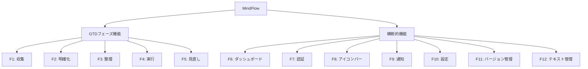

# MindFlow 機能仕様書 (FastAPI Web版)

更新日: 2026-04-06

---

## 1. 概要

本書は MindFlow FastAPI Webアプリケーションの全機能を MECE（漏れなくダブりなく）に仕様化したものである。
GTD の 5 フェーズ（収集・明確化・整理・実行・見直し）と横断的機能（ダッシュボード・認証・通知・アイコンバー・設定）を網羅する。

### 1.1 機能分類体系



---

## 2. F1: 収集フェーズ (Collection)

### 2.1 機能概要

ユーザーの頭の中にあるタスク・アイデアをすべて Inbox に登録する。

### 2.2 URL パス

| URL | メソッド | 説明 |
|-----|---------|------|
| `/inbox` | GET | Inbox ページ表示 |
| `/inbox/add` | POST | アイテム追加（HTMX） |
| `/inbox/{item_id}/delete` | POST | アイテム削除（HTMX） |
| `/inbox/{item_id}/order_up` | POST | 順序を上に移動（HTMX） |
| `/inbox/{item_id}/order_down` | POST | 順序を下に移動（HTMX） |
| `/inbox/process_all` | POST | 全アイテムを明確化フェーズへ送信 |

### 2.3 テンプレートファイル

- `inbox.html` - メインページ
- `partials/item_list.html` - アイテムリスト（再利用パーシャル）

### 2.4 ルーターファイル

- `src/study_python/gtd/web/routers/inbox.py`

### 2.5 ロジックファイル

- `src/study_python/gtd/logic/collection.py` (CollectionLogic)
- リポジトリ: `src/study_python/gtd/web/db_repository.py` (DbGtdRepository)

### 2.6 機能詳細

#### F1-1: アイテム追加

**ユーザー操作**:
1. Inbox ページで入力欄にテキストを入力
2. 「追加」ボタンをクリック or Enter キーを押す

**URL**: POST `/inbox/add`

**フォーム入力**:
- `title` (str): アイテムのタイトル（最大 500 文字）

**実行処理**:
1. title をトリム
2. GtdItem を生成（item_status=INBOX）
3. リポジトリに追加、DB 保存

**結果**:
- アイテムリストに新規アイテムが表示される
- 入力欄がクリアされ、フォーカスが戻る
- HTMX で `#item-list` を更新

**バリデーション**:
- タイトルが空白の場合、何も行わない

#### F1-2: アイテム削除

**ユーザー操作**: アイテムカード上の「削除」ボタンをクリック

**URL**: POST `/inbox/{item_id}/delete`

**実行処理**:
1. 指定された item_id のアイテムを削除

**結果**:
- アイテムリストから削除
- HTMX で `#item-list` を更新

#### F1-3: アイテムの順序変更

**ユーザー操作**: プロジェクト派生アイテムの「▲」「▼」ボタンをクリック

**URL**: 
- POST `/inbox/{item_id}/order_up` - 順序を上に
- POST `/inbox/{item_id}/order_down` - 順序を下に

**実行処理**:
- CollectionLogic.reorder_item() で order を更新

**結果**:
- アイテムリストが並び替わる
- HTMX で `#item-list` を更新

#### F1-4: 全アイテム処理

**ユーザー操作**: 「全て処理する」ボタンをクリック

**URL**: POST `/inbox/process_all`

**実行処理**:
1. Inbox 内の全アイテムを SOMEDAY ステータスに変更
2. 明確化フェーズへ送信

**結果**:
- `/clarification` にリダイレクト（HTTP 303）

---

## 3. F2: 明確化フェーズ (Clarification)

### 3.1 機能概要

SOMEDAY アイテムを GTD の決定木に従って分類する。
4 段階の Yes/No 質問に回答することで、アイテムのタグを決定する。

### 3.2 URL パス

| URL | メソッド | 説明 |
|-----|---------|------|
| `/clarification` | GET | 明確化ページ表示 |
| `/clarification/answer` | POST | ウィザード回答処理（HTMX） |

### 3.3 テンプレートファイル

- `clarification.html` - メインページ（ウィザード表示）
- `partials/clarification_step.html` - ウィザード ステップ（再利用パーシャル）

### 3.4 ルーターファイル

- `src/study_python/gtd/web/routers/clarification.py`

### 3.5 ロジックファイル

- `src/study_python/gtd/logic/clarification.py` (ClarificationLogic)

### 3.6 機能詳細

#### 質問フロー

```
Step 0: "自身が実施しなくてはいけないですか？"
  ├─ No → DELEGATION タグ設定 → 次へ
  └─ Yes → Step 1

Step 1: "日時が明確ですか？"
  ├─ Yes → CALENDAR タグ設定 → 次へ
  └─ No → Step 2

Step 2: "2ステップ以上のアクションが必要ですか？"
  ├─ Yes → PROJECT タグ設定 → 次へ
  └─ No → Step 3

Step 3: "数分で実施できますか？"
  ├─ Yes → DO_NOW タグ設定 → 次へ
  └─ No → コンテキスト フォーム表示
    ├─ 実施場所 (複数選択)
    ├─ 所要時間 (単一選択)
    ├─ 必要なエネルギー (単一選択)
    └─ 登録 → TASK タグ設定 → 次へ
```

#### F2-1: 回答処理

**URL**: POST `/clarification/answer`

**フォーム入力**:
- `item_id` (str): 処理中のアイテム ID
- `step` (int): 現在のステップ（0-3）
- `choice` (str): 回答（"yes" or "no"）
- `locations` (list[str]): 実施場所（タグ設定時）
- `time_estimate` (str): 所要時間（タグ設定時）
- `energy` (str): 必要なエネルギー（タグ設定時）

**実行処理**:
1. 選択肢に応じてロジックを実行
2. タグ・ステータスを設定
3. 次のステップまたは次のアイテムへ

**結果**:
- `partials/clarification_step.html` を HTMX で返す
- ステップが進む、または次のアイテムに移動

#### F2-2: コンテキスト入力フォーム

**表示条件**: Step 3 で "No" が選ばれた場合

**入力フィールド**:

| 項目 | 入力形式 | 選択肢 | デフォルト | 必須 |
|------|---------|-------|----------|------|
| 実施場所 * | チェックボックス（複数選択可） | desk, home, mobile | desk | 1 つ以上 |
| 所要時間 * | プルダウン | within_10min, within_30min, within_1hour | within_30min | はい |
| 必要なエネルギー * | ラジオボタン | low, medium, high | medium | はい |

**バリデーション**:
- 実施場所が未選択 → エラーメッセージ表示
- エネルギーレベルが未選択 → エラーメッセージ表示

---

## 4. F3: 整理フェーズ (Organization)

### 4.1 機能概要

タグ付け済み（PROJECT 以外）のアイテムに対して重要度と緊急度を設定し、
Eisenhower マトリクスで視覚化する。

### 4.2 URL パス

| URL | メソッド | 説明 |
|-----|---------|------|
| `/organization` | GET | 整理ページ表示 |
| `/organization/set_scores` | POST | スコア設定（HTMX） |

### 4.3 テンプレートファイル

- `organization.html` - メインページ（左右 2 パネル）
- `partials/organization_form.html` - スコア設定フォーム（再利用パーシャル）

### 4.4 ルーターファイル

- `src/study_python/gtd/web/routers/organization.py`

### 4.5 ロジックファイル

- `src/study_python/gtd/logic/organization.py` (OrganizationLogic)

### 4.6 UI レイアウト

**左パネル**（最大 500px）:
- アイテム表示（タイトル + タグバッジ）
- 重要度スライダー（1-10、初期値 5）
- 緊急度スライダー（1-10、初期値 5）
- 「設定して次へ」ボタン

**右パネル**（残り全幅）:
- Eisenhower マトリクス（散布図）
- Q1-Q4 象限の表示
- 全アイテムの位置をプロット

### 4.7 機能詳細

#### F3-1: スコア設定

**URL**: POST `/organization/set_scores`

**フォーム入力**:
- `item_id` (str): アイテム ID
- `importance` (int): 重要度（1-10、デフォルト 5）
- `urgency` (int): 緊急度（1-10、デフォルト 5）

**実行処理**:
1. OrganizationLogic.set_importance_urgency() で スコアを設定
2. アイテム importance, urgency を更新

**結果**:
- `partials/organization_form.html` を HTMX で返す
- マトリクスがリアルタイム更新
- 次のアイテムに進む

#### F3-2: Eisenhower マトリクス表示

**象限定義**:

| 象限 | 重要度 | 緊急度 | 説明 |
|------|-------|-------|------|
| Q1 | 6-10 | 6-10 | 重要・緊急（赤） |
| Q2 | 6-10 | 1-5 | 重要・非緊急（青） |
| Q3 | 1-5 | 6-10 | 非重要・緊急（オレンジ） |
| Q4 | 1-5 | 1-5 | 非重要・非緊急（灰） |

**表示要素**:
- ドット（色分け、半径 6px）
- ラベル（最大 12 文字、超過時 "…" 省略）
- ツールチップ（ホバー時にタイトル + スコア表示）
- 象限背景色（透明度 25-30%）

---

## 5. F4: 実行フェーズ (Execution)

### 5.1 機能概要

タグ付け済みの未完了タスクを一覧表示し、ステータスを変更する。

### 5.2 URL パス

| URL | メソッド | 説明 |
|-----|---------|------|
| `/execution` | GET | 実行ページ表示 |
| `/execution?tag={tag}` | GET | タグフィルタ表示 |
| `/execution/{item_id}/set_status` | POST | ステータス変更（HTMX） |

### 5.3 テンプレートファイル

- `execution.html` - メインページ（タスク一覧 + フィルタ）
- `partials/task_list.html` - タスクリスト（再利用パーシャル）

### 5.4 ルーターファイル

- `src/study_python/gtd/web/routers/execution.py`

### 5.5 ロジックファイル

- `src/study_python/gtd/logic/execution.py` (ExecutionLogic)

### 5.6 機能詳細

#### F4-1: タグフィルタ

**フィルタ選択肢**:

| フィルタ値 | 表示名 | 条件 |
|----------|-------|------|
| all | すべて | tag != None かつ tag != PROJECT かつ未完了 |
| delegation | 依頼 | tag == DELEGATION かつ未完了 |
| calendar | カレンダー | tag == CALENDAR かつ未完了 |
| do_now | 即実行 | tag == DO_NOW かつ未完了 |
| task | タスク | tag == TASK かつ未完了 |

**UI**: ドロップダウンメニュー（query parameter で `tag` を指定）

#### F4-2: タスクリスト表示

**ソート順序**:
1. 重要度（降順、未設定は 0）
2. 緊急度（降順、未設定は 0）

**プロジェクト分解表示**:
- 親プロジェクト ID でグループ化
- グループ内を `order` でソート
- グループにプロジェクトタイトルを表示（オプション）
- 各アイテムにバッジ（#1, #2...）表示

**TaskRow 表示要素**:

| 要素 | 幅 | 説明 |
|------|---|------|
| タグバッジ | 固定 80px | タグ色背景+表示名 |
| タイトル | 可変（stretch） | アイテムタイトル |
| スコア | 可変 | "重N 緊N"（設定済み時のみ） |
| ステータス | 可変 | QComboBox（Project 以外） |

#### F4-3: ステータス変更

**URL**: POST `/execution/{item_id}/set_status`

**フォーム入力**:
- `status` (str): 新しいステータス

**ステータス遷移**:

| タグ | 選択可能ステータス |
|------|-----------------|
| DELEGATION | not_started, waiting, registered |
| CALENDAR | not_started, registered |
| DO_NOW | not_started, registered |
| TASK | not_started, in_progress, registered |

**実行処理**:
1. ExecutionLogic.set_status() でステータスを更新
2. CALENDAR の "registered" → 自動削除（オプション）

**結果**:
- `partials/task_list.html` を HTMX で返す
- タスクリストが更新

---

## 6. F5: 見直しフェーズ (Review)

### 6.1 機能概要

完了したタスクとプロジェクトを見直し、
削除・Inbox 戻し・プロジェクト細分化の処理を行う。

### 6.2 URL パス

| URL | メソッド | 説明 |
|-----|---------|------|
| `/review` | GET | 見直しページ表示 |
| `/review/{item_id}/delete` | POST | アイテム削除（HTMX） |
| `/review/{item_id}/to_inbox` | POST | Inbox に戻す（HTMX） |
| `/review/{item_id}/decompose` | POST | プロジェクト分解（HTMX） |

### 6.3 テンプレートファイル

- `review.html` - メインページ
- `partials/item_list.html` - アイテムリスト（再利用パーシャル）

### 6.4 ルーターファイル

- `src/study_python/gtd/web/routers/review.py`

### 6.5 ロジックファイル

- `src/study_python/gtd/logic/review.py` (ReviewLogic)

### 6.6 機能詳細

#### F5-1: 完了タスク Inbox 戻し

**URL**: POST `/review/{item_id}/to_inbox`

**実行処理**:
1. すべてのフィールドをリセット
   - item_status = INBOX
   - tag = None
   - status = None
   - locations = []
   - time_estimate = None
   - energy = None
   - importance = None
   - urgency = None
   - project_* = None

**結果**:
- アイテムが Inbox に戻る
- 見直し対象から削除
- HTMX で `#item-list` を更新

#### F5-2: アイテム削除

**URL**: POST `/review/{item_id}/delete`

**実行処理**:
1. アイテムを物理削除

**結果**:
- 見直し対象から削除
- HTMX で `#item-list` を更新

#### F5-3: プロジェクト分解

**URL**: POST `/review/{item_id}/decompose`

**フォーム入力**:
- `titles` (str): サブタスクのタイトル（改行区切り）

**実行処理**:
1. 各タイトルで新規 GtdItem（item_status=INBOX）を生成
2. parent_project_id を設定（元プロジェクト ID）
3. order を自動採番
4. 元プロジェクトを削除

**バリデーション**:
- タイトルは 1 件以上、最大 20 件

**結果**:
- プロジェクトが消える
- サブタスクが Inbox に登録される
- HTMX で `#item-list` を更新

#### F5-4: プロジェクト計画（Natural Planning Model）

**概要**: 完了したプロジェクトをさらに詳細に計画

**6 ステップウィザード**:

| ステップ | タイトル | 入力 |
|---------|---------|------|
| 1 | Purpose（目的） | テキストエリア |
| 2 | Outcome（成果） | テキストエリア |
| 3 | Brainstorm（ブレーンストーム） | テキストエリア（アイデア羅列） |
| 4 | Organize（整理） | サブタスク入力（改行区切り） |
| 5 | Support Location（支援拠点） | テキストエリア（リソース・場所） |
| 6 | Next Actions（次のアクション） | サブタスク入力（改行区切り） |

**テンプレート**: `partials/plan_step.html`

---

## 7. F6: ダッシュボード (Dashboard)

### 7.1 機能概要

アプリケーション全体のサマリーと次のアクション ガイドを表示するトップページ。

### 7.2 URL パス

| URL | メソッド | 説明 |
|-----|---------|------|
| `/` | GET | ダッシュボード表示 |

### 7.3 テンプレートファイル

- `dashboard.html` - メインページ

### 7.4 ルーターファイル

- `src/study_python/gtd/web/routers/dashboard.py`

### 7.5 機能詳細

#### F6-1: サマリーカード

**4 つのカード**:

| カード | ラベル | 値 |
|--------|-------|---|
| inbox | Inbox | INBOX ステータスの件数 |
| tasks | アクティブタスク | tag != None かつ tag != PROJECT の件数 |
| completed | 完了 | 完了済みアイテムの件数 |
| total | 総数 | 全アイテムの件数 |

#### F6-2: Next Action Guide

**優先度ロジック**（上から順に判定）:

1. **Inbox あり**: "N件 収集してください" → `/inbox`
2. **明確化待ち**: "N件 分類してください" → `/clarification`
3. **整理待ち**: "N件 優先順位をつけてください" → `/organization`
4. **見直し待ち**: "N件 見直してください" → `/review`
5. **アクティブタスク なし**: "やることがなくなりました" → `/inbox`
6. **Q1 タスク あり**: "次のアクション: [最優先タスク名]" → `/execution`
7. **その他**: "N個のアクティブタスク" → `/execution`

#### F6-3: Eisenhower マトリクス表示

（F3 と同仕様）

---

## 8. F7: 認証 (Authentication)

### 8.1 機能概要

ユーザーの登録・ログイン・セッション管理を行う。

### 8.2 URL パス

| URL | メソッド | 説明 |
|-----|---------|------|
| `/login` | GET | ログインページ表示 |
| `/login` | POST | ログイン処理 |
| `/register` | GET | 登録ページ表示 |
| `/register` | POST | 登録処理 |
| `/logout` | GET | ログアウト |

### 8.3 テンプレートファイル

- `login.html` - ログインページ
- `register.html` - 登録ページ

### 8.4 ルーターファイル

- `src/study_python/gtd/web/routers/auth.py`

### 8.5 セキュリティ仕様

**パスワードハッシング**: bcrypt

**セッション**:
- SameSite=Lax
- HTTPS Only (本番環境)
- Max Age: 86400 秒（24 時間）

**レート制限**:
- ログイン試行: 5 回 / 5 分（クライアント IP ごと）
- 制限時: HTTP 429 + エラーメッセージ表示

**バリデーション**:
- ユーザー名: 3-50 文字、英数字とアンダースコアのみ
- パスワード: 8 文字以上、英大小+数字+特殊文字を含む

---

## 9. F8: アイコンバー (Icon Bar)

### 9.1 機能概要

トップバーに 5 つのアイコンボタンを表示し、各種モーダルを開く。

### 9.2 URL パス（アイコンバー API）

| URL | メソッド | 説明 |
|-----|---------|------|
| `/api/iconbar/notifications` | GET | 通知一覧（HTMX） |
| `/api/iconbar/notifications/{notif_id}` | GET | 通知詳細（HTMX） |
| `/api/iconbar/badge_count` | GET | 通知バッジ数 |
| `/api/iconbar/achievements` | GET | 実績ページ（HTMX） |
| `/api/iconbar/contact` | GET | お問い合わせページ（HTMX） |
| `/api/iconbar/releases` | GET | リリース情報ページ |

### 9.3 アイコン仕様

| 位置 | アイコン | タイトル | モーダル ID | 説明 |
|------|---------|---------|-----------|------|
| 1 | 本 | チュートリアル | modal-tutorial | GTD フロー + 5 ステップ説明 |
| 2 | ? | ヘルプ | modal-help | About + FAQ |
| 3 | 受信箱 | 通知 | modal-inbox | 通知一覧（バッジ付き） |
| 4 | 問い合わせ | お問い合わせ | modal-contact | Coming Soon |
| 5 | 実績 | 実績 | modal-achievements | マイルストーン表示 |

### 9.4 チュートリアルモーダル (`modal-tutorial.html`)

**2 タブ構成**:

1. **Overview タブ**
   - GTD フロー（5 フェーズ）の説明
   - 各フェーズのアイコン + 簡単な説明文

2. **How-to タブ**
   - 5 ステップ説明
   - 各ステップのスクリーンショット + テキスト

### 9.5 ヘルプモーダル (`modal_help.html`)

**2 タブ構成**:

1. **About タブ**
   - セキュリティ情報
   - 開発哲学（"脳内デフラグ"、"高機能をシンプルに"）
   - 開発者リンク
   - 更新ボタン（releases.json 確認）

2. **FAQ タブ**
   - 5 Q&A（labels.json から動的に読み込み）

---

## 10. F9: 通知 (Notifications)

### 10.1 機能概要

リリース情報と実績達成を自動で通知する。

### 10.2 URL パス

（F8 の `/api/iconbar/notifications` 参照）

### 10.3 通知タイプ

| タイプ | 説明 | トリガー |
|-------|------|---------|
| system | システム通知 | releases.json 更新 |
| achievement | 実績通知 | タスク/プロジェクト完了時 |

### 10.4 実績マイルストーン

| マイルストーン | 条件 | 説明 |
|-------------|------|------|
| first_task | completed_count >= 1 | 初めてのタスク完了 |
| ten_tasks | completed_count >= 10 | 10 個完了 |
| fifty_tasks | completed_count >= 50 | 50 個完了 |
| hundred_tasks | completed_count >= 100 | 100 個完了 |
| inbox_clear | inbox_count == 0 | Inbox クリア |

### 10.5 通知表示

**通知一覧**:
- 時系列（新しい順）
- 既読/未読 ステータス
- 未読バッジ数表示

**通知詳細**:
- タイプバッジ（色分け）
- 日時
- メッセージ

---

## 11. F10: 設定 (Settings)

### 11.1 機能概要

アプリケーション設定を管理する。

### 11.2 URL パス

| URL | メソッド | 説明 |
|-----|---------|------|
| `/settings` | GET | 設定ページ表示 |

### 11.3 テンプレートファイル

- `settings.html` - メインページ

### 11.4 ルーターファイル

- `src/study_python/gtd/web/routers/settings_web.py`

### 11.5 設定項目

#### 外観

- **ダークモード**: Catppuccin Mocha テーマ（デフォルト）
- **ライトモード**: （未実装オプション）

#### 通知設定

- **リリース通知**: ON/OFF トグル
- **実績通知**: ON/OFF トグル

#### アプリ情報

- **バージョン**: releases.json から取得
- **最終更新**: releases.json の最新リリース日時
- **テック スタック**: FastAPI, SQLAlchemy, HTMX, Catppuccin

---

## 12. F11: バージョン管理 (Release Management)

### 12.1 機能概要

releases.json を単一の情報源として、バージョン情報を一元管理する。

### 12.2 ファイルパス

- `src/study_python/gtd/web/static/releases.json`

### 12.3 releases.json スキーマ

```json
{
  "current_version": "1.0.0",
  "releases": [
    {
      "version": "1.0.0",
      "date": "2026-04-06T00:00:00Z",
      "title": "Initial Release",
      "summary": "MindFlow FastAPI Web版の初版リリース",
      "highlight": "Full GTD support with HTMX"
    }
  ]
}
```

### 12.4 バージョン表示

| 場所 | 表示内容 |
|------|---------|
| 設定ページ | 現在のバージョン + 最終更新日 |
| ヘルプモーダル | 更新ボタン（releases.json 確認） |
| システム通知 | リリース情報の自動配信 |

---

## 13. F12: テキスト管理

### 13.1 機能概要

すべてのユーザー向けテキストを labels.json で管理。
コード内にハードコーディングしない。

### 13.2 ファイルパス

- `src/study_python/gtd/web/static/labels.json`

### 13.3 labels.json 構造

```json
{
  "app": {
    "name": "MindFlow"
  },
  "nav": {
    "dashboard": "ダッシュボード",
    "inbox": "収集",
    "clarification": "明確化",
    ...
  },
  "inbox": {
    "title": "収集 - Inbox",
    "description": "気になることをすべて書き出しましょう",
    "placeholder": "新しいアイテムを入力...",
    "add_button": "追加",
    "delete_button": "削除"
  },
  ...
}
```

### 13.4 テンプレートでの使用

```html
<h2 class="page-title">{{ labels.inbox.title }}</h2>
<p class="page-desc">{{ labels.inbox.description }}</p>
```

### 13.5 Python での使用

```python
from study_python.gtd.web.labels import load_labels

L = load_labels()
message = L["inbox"]["title"]
```

---

## 14. UI 共通仕様

### 14.1 ナビゲーション

**サイドバー**:
- MindFlow ロゴ
- 6 つの主要ページリンク
- 設定 + ログアウトリンク

**トップバー**:
- ハンバーガーメニュー（モバイル）
- 5 つのアイコンボタン（通知・ヘルプ等）

### 14.2 レスポンシブデザイン

- **デスクトップ**: サイドバー常時表示
- **モバイル**: ハンバーガーメニュー（オーバーレイ）

### 14.3 スタイル・カラー

**テーマ**: Catppuccin Mocha
- bg_surface: #313244
- bg_secondary: #1e1e2e
- accent_blue: #89b4fa
- accent_red: #f38ba8
- accent_green: #a6e3a1
- accent_mauve: #cba6f7

### 14.4 モーダル

**構造**:
- オーバーレイ（クリックで閉じる）
- ヘッダー（タイトル + 閉じるボタン）
- ボディ（コンテンツ）

**HTMX 統合**: `openModalAndLoad(modalId, url)` で非同期ロード

---

## 15. HTMX 統合パターン

### 15.1 フォーム POST

```html
<form hx-post="/inbox/add" hx-target="#item-list" hx-swap="innerHTML">
    <input name="title" ...>
    <button type="submit">追加</button>
</form>
```

### 15.2 パーシャル更新

```html
<div id="item-list">
    
</div>
```

**サーバー返却**: HTML フラグメント（`partials/item_list.html` をレンダリング）

### 15.3 リダイレクト

```python
return RedirectResponse(url="/clarification", status_code=303)
```

### 15.4 バッジ更新

```html
<span id="inbox-badge"></span>
<script>
    fetch('/api/iconbar/badge_count').then(r => r.text()).then(html => {
        document.getElementById('inbox-badge').innerHTML = html;
    });
</script>
```

---

## 16. データベーススキーマ（参考）

### 16.1 GtdItemRow

| カラム | 型 | 説明 |
|--------|---|------|
| id | VARCHAR(36) | PK |
| user_id | VARCHAR(36) | FK |
| title | VARCHAR(500) | アイテムタイトル |
| item_status | VARCHAR(20) | inbox/someday/reference |
| tag | VARCHAR(20) | delegation/calendar/project/do_now/task |
| status | VARCHAR(20) | not_started/in_progress/waiting/registered |
| importance | INT | 1-10 |
| urgency | INT | 1-10 |
| locations_json | TEXT | ["desk", "home"] |
| time_estimate | VARCHAR(20) | within_10min/within_30min/within_1hour |
| energy | VARCHAR(20) | low/medium/high |
| parent_project_id | VARCHAR(36) | プロジェクト派生時の親 ID |
| order | INT | グループ内の並び順 |
| deadline | VARCHAR(50) | 期限（ISO 形式） |
| created_at | VARCHAR(50) | ISO 形式 |
| updated_at | VARCHAR(50) | ISO 形式 |

### 16.2 NotificationRow

| カラム | 型 | 説明 |
|--------|---|------|
| id | VARCHAR(36) | PK |
| user_id | VARCHAR(36) | FK |
| notification_type | VARCHAR(20) | system/achievement |
| title | VARCHAR(500) | 通知タイトル |
| message | TEXT | 通知メッセージ |
| is_read | BOOLEAN | 既読フラグ |
| created_at | VARCHAR(50) | ISO 形式 |

---

## 17. エラーハンドリング

### 17.1 HTTP ステータスコード

| コード | 状況 |
|--------|------|
| 200 | 成功 |
| 302 | リダイレクト（ページ遷移） |
| 303 | リダイレクト（POST 後） |
| 400 | バリデーション エラー |
| 401 | 未認証 |
| 429 | レート制限（ログイン試行） |
| 500 | サーバー エラー |

### 17.2 エラーメッセージ

- バリデーション エラー: フォーム入力でメッセージ表示
- レート制限: "ログイン試行回数が上限に達しました"
- 404: 指定リソースが見つかりません

---

## 18. 完了条件チェックリスト

- [x] 5 フェーズ（収集・明確化・整理・実行・見直し）の URL/テンプレート/ロジック仕様を記載
- [x] ダッシュボード・認証・通知・アイコンバー・設定の URL/機能仕様を記載
- [x] HTMX パーシャル更新パターンを記載
- [x] バッジ計算ロジックを記載
- [x] Eisenhower マトリクス表示仕様を記載
- [x] プロジェクト分解・計画ウィザードを記載
- [x] レート制限・セッション管理・パスワードハッシングを記載
- [x] 通知マイルストーン・実績バッジを記載
- [x] labels.json・releases.json の管理仕様を記載

---

## 19. ドキュメント更新履歴

| 日時 | 変更内容 |
|------|---------|
| 2026-04-06 | FastAPI Web版に完全置き換え。PySide6 デスクトップ版から Web アーキテクチャに変更。 |
| 2026-03-03 | （前版） |
